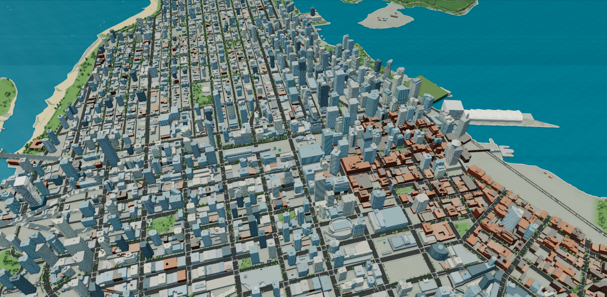

# Vancouver · Living Atlas

An original, explorable browser reconstruction of Vancouver: the entire Downtown peninsula, Stanley Park, English Bay and False Creek through Science World. The city follows public coastlines, street geometry and actual terrain relief, with original procedural architecture and landscape detail.

**[Open the atlas](https://vancouver-living-atlas-yita.web.app)** · [Data and accuracy](DATA_SOURCES.md) · [Manager-loop development record](docs/PROGRESS.md)

The five-language application is publicly hosted on Firebase Hosting. This repository is public, and the application can also run locally.



## Languages

English is the default for a first visit. The header language menu also offers Français, Español, 中文（繁體） and 中文（简体）. A selection updates the interface and map labels without resetting the scene, and is remembered on that browser.

## Explore / 操作

- **鳥瞰 / Orbit:** drag to rotate, wheel or +/− to zoom, right-drag to pan. Eight landmark viewpoints, north-up reset, clickable minimap and an automatic city tour are included.
- **步行 / Walk:** drag the person in the mode bar onto the main map, or select Walk and click an open ground location. Zoom in before dropping for greater precision. W/S move, A/D turn, drag to look, Shift moves faster.
- **駕車 / Drive:** drag the car onto the map, or select Drive and click near a road. The preview shows the actual snapped road position before starting; distant roads, water and building interiors are rejected. W/S throttle/reverse, A/D steer, Space brakes. Bridge decks and ground-level underpasses remain separate.
- **重新放置 / Choose a new start:** use the button in street controls to return to a nearby aerial view and place again. Esc cancels placement. Mouse/touch map drags adjust the view without dropping; a tap places. Keyboard users can select a mode, focus the map and press Enter to start at its centre, or activate Start here for the previewed point. Gastown, Robson and Beach Avenue remain explicit quick starts.
- **時間 / Time:** the separate clock button shows the current scene time. Time flows by default at 30× (one real minute is 30 city minutes; a full day takes 48 minutes). Choose 1×, 10×, 30×, 60×, 120× or 300×, set any minute of the day, or turn off “Let time flow” to fix the light at that moment. Walking, driving, traffic and water animation retain their normal speed. Scene time pauses while the tab is hidden.
- **圖層 / Layers:** control trees, buildings, moving traffic and labels. Choose detailed shadows or a lighter rendering mode.
- **風景 / Capture:** export the current rendered view as PNG, or hide the interface for an immersive view. Esc restores controls and returns street modes to orbit.

## What is built

- **7,630 geographic building solids**, rendered as **7,806 polygon parts**, including measured 2009 City geometry and reconciled OSM tower heights.
- A **257 × 273 terrain grid** (roughly 20 m), interpolated from official 2002 contours. Stanley Park reaches about **76 m**, with real Downtown relief rather than a flat base.
- Actual coastlines, park boundaries, lakes, beaches and street lines; 810 park trail features and regional North Shore landforms.
- **36,201 rendered trees** from public street-tree positions plus original forest infill; spatially chunked canopy detail changes with viewing distance.
- Original Science World, Canada Place, BC Place, Harbour Centre and Vancouver House models; Burrard, Granville, Cambie and Lions Gate bridge structures.
- Original façade patterns, Gastown shopfronts and steam clock, rooftop equipment, cars, ferries, sailboats and simulated night lighting.

No Unreal Engine, finished third-party city model, Google imagery or copied reference-project code is used.

## Accuracy and scope

This is a geographic visualization, not a photographic reconstruction or a certified digital twin. Source dates differ: core contours and shoreline date to 2002, measured building parts to 2009, supplemented by OSM records retrieved in September 2026. Terrain interpolation, procedural façades, representative signs, tree canopy, bridge heights and road widths are visual approximations. Buildings are seated on the displayed terrain; stored source base elevations remain available in the data. Outer North Shore and south-shore terrain provides coarse regional context.

Street navigation is an exploration feature: simplified collision and vehicle motion are included, rather than a full traffic or driving simulation. Frame rates depend on GPU, viewport and settings. Final local Chrome reviews measured approximately 31–53 FPS across detailed street, bridge and peninsula views. See [source provenance and qualifications](DATA_SOURCES.md).

## Run locally

Requires Node.js **22.13+**, npm, and a browser with WebGL 2.

```sh
npm ci
npm run dev
```

Open the local URL printed in the terminal. The application serves its own geographic assets; no map API key is required. A web server is necessary because the app loads geographic files with HTTP requests.

```sh
npm run check   # TypeScript
npm test        # geography, height intervals, coast classification and bridge continuity
npm run build   # production Worker and client assets
npm start      # local production preview through Wrangler
```

The renderer is in `lib/city/`; geographic data are in `public/data/`; original surface textures are in `public/textures/`. `tools/README.md` describes source-data preparation and the raw inputs needed to rebuild datasets.

## Manager loop

Implementation → independent geographic/architecture review → browser inspection → correction → validation → commit and push. Each stage is preserved in public Git history, with findings in [docs/PROGRESS.md](docs/PROGRESS.md). The reference attachments are visual benchmarks only and are not included in the repository.

## License

Original application code, original procedural geometry and generated surface artwork: **MIT**, see [LICENSE](LICENSE).

Geographic data retain their source terms: **Open Government Licence – Vancouver**, **Open Database License 1.0**, and the applicable Canadian/USGS terrain terms. The combined geographic database includes OSM-derived records and is distributed under ODbL with City attribution. These data are not relicensed as MIT. See [DATA_SOURCES.md](DATA_SOURCES.md).

## Firebase Hosting

The Firebase build exports a static site, including the geographic data, textures and locally bundled fonts. It does not require Cloud Functions or a server runtime.

```sh
npm ci
npm run check
npm test
npm run build:firebase
firebase deploy --only hosting --project vancouver-living-atlas-yita
```

`firebase.json` publishes only `dist/client`. The build verifier checks English initial HTML, all five locale bundles and the main geographic assets. `.firebaserc` selects the owner's dedicated `vancouver-living-atlas-yita` project. To publish your own copy, pass your own project ID explicitly. The existing `npm run build` still builds the Sites-compatible version.
