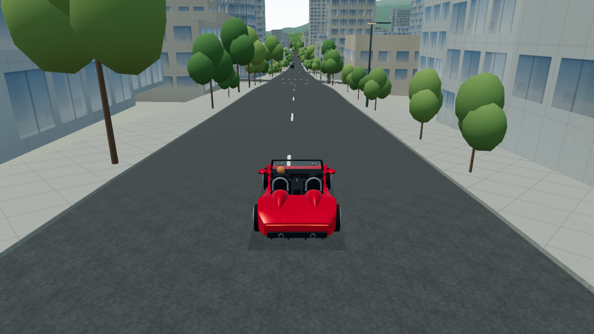

# Auto 畫質與移動景觀穩定性 — 2026-10

## 需求與範圍

新增預設 Auto，兼顧全城遠景、步行近景、開車及飛行。保留手動 Balanced / High / Ultra；手動值不會因幀率或飛行被 Auto 改寫。這次接在 City Life 整合分支之上；沒有實作夜間店面、窗光、警察或新增大眾運輸功能。

## 調查結果

原本的 High / Ultra 決定 DPR、陰影與近景細節距離，缺乏持續幀時間回饋。樹木每移動 18 m、立面 20 m、街景 12 m、建築裝飾 30 m 重選，邊界缺乏保留區间；街景版本更換先撤舊頁再建新頁。各細節系統雖有自己的分批建置，但在同一幀仍可能合計過量。一般圖層設定還會重設整個繪圖解析度，造成不必要的畫面 buffer 重配置。

## Auto 政策

- 預設 Balanced、解析度倍率 1；Auto 最多升到 High。Ultra 保留手動，避免自動載入最重的近景資產。
- 使用實際前景 RAF 間隔，涵蓋 CPU、渲染、GC 與一般卡頓；不是 GPU 計時器，也無法判定瓶頸種類。最近最多 6 秒 / 240 筆，每 500 ms 計算 p50 / p95；兩秒暖機後才判斷。
- 步行 / 城市遠景政策目標 35 FPS；開車 / 航行 / 飛行 45 FPS。這是控制門檻，沒有保證裝置能達到該幀率。穩定 30 Hz 的步行 / 遠景會留在死區，不為追逐數字不停降低解析度。
- 持續慢幀至少 2.5 秒才降級；變更後至少 4 秒冷卻。單次 120 ms 卡頓仍列入真實統計，但不單憑這一筆降畫質。
- 開車 / 航行在 High 先把解析度降到 0.8，再降為 Balanced，必要時降到 0.65。步行 / 遠景先撤 High 額外細節，再降低解析度。
- 所有 Auto 飛行立即限制 Balanced，保留完整城市基礎地形、建築與便宜的遠景樹木。近景新細節在快速飛行或高於地面 80 m 且移動時暫停加入；已準備的細節依保留距離漸進退出。垂直爬升也納入速度。
- 解析度倍率是線性尺寸：0.8 約為原本像素量 64%，0.65 約為 42.25%。以當前 tier / viewport / 裝置 DPR 的既有安全上限為基礎，沒有提高最大畫布尺寸。
- 升回解析度要求 p95 有約 10% 幀時間餘裕、連續 8 秒；移動中的車 / 船 / 飛機要求 12 秒。升 High 要求靜止 18 秒或移動 24 秒餘裕，且 p95 至少有約 20% 餘裕。
- High 試升後若持續負載退回，下一次 High 試升退避 60 / 120 / 240 秒，避免同一街區反覆升降。只計有效前景時間；背景、切回 Auto 或 BFCache 不會跳過等待。
- 相容圖形模式的 Auto 最多 Balanced，仍可調解析度。
- 背景、恢復、相機轉場及首次 RAF 重設取樣，排除隱藏期間的時間差；保留已選畫質與解析度。一般圖層選項不會清空學習結果。

## 景觀穩定性與建置預算

1. 移動速度帶入共用 motion state。開車 / 航行最多提前 90 m，步行最多 8 m；相機切換 / 瞬移會重設提前量。只改選取與準備順序，不改導航、碰撞或玩家位置。
2. 重選仍須達原本移動距離，另外加入 120 / 220 / 350 ms 的靜止 / 移動 / 快速重選間隔。已有近景優先保留，沒有在每一幀掃全城候選。
3. 樹木距離保留帶增加 36 m；Ultra 枝葉細節 200 m 進、240 m 出，成熟樹 40 m 進、58 m 出。原有遠景 instance 在近景尚未完成時持續顯示。
4. 街景 cell 增加 40 m 退出帶，單件增加 24 m；近 LOD 使用不同的進出距離。立面與建築裝飾也保留先前 cell，提早準備前方候選；保持原有數量與快取上限。
5. 街景替換先完成新頁建置，成功才同步撤掉舊頁並顯示新頁。建置失敗或暫停準備時保留原頁；源幾何 fallback 仍可用。
6. 每幀共用實際執行時間預算：靜止 1.25 ms、移動 0.65 ms、快速 0.2 ms；新工作 admission 最多 2 / 2 / 1 個。快速或高處 Auto 飛行的新 admission 為 0。樹池、立面 builder、街景頁、建築裝飾、地標提交、地標 GPU 預熱與場景準備共同計數。
7. 既有 generator 可在餘裕內繼續步進；單個不可拆分的分配、GLB 解碼或 driver compile 可能超時，會記錄 overrun，再跳過後續準備。此為軟預算，不是硬即時排程；非同步資產完成與主渲染成本也不受這個預算完全控制。
8. DPR 未變時不呼叫 renderer / composer 的 setPixelRatio；viewport 變更仍由 ResizeObserver 更新尺寸，FXAA 解析度同步更新。

## 控制介面與相容性

畫質選項新增「自動」，並顯示當前有效細節畫質；十種語言都有對應文字。有效畫質標籤不顯示內部判斷原因或承諾 FPS。品質偏好 `qualityMode` 與 `quality` 分開；未提供 `qualityMode` 的舊呼叫視為手動。既有固定畫質 QA 明確指定 manual，避免基準被 Auto 接管。

自動變更只調整有效 tier / 解析度。原有遠景、航行物理、行人數量上限、道路碰撞、來源地圖與夜間燈光邏輯維持各自既有職責。手動品質仍享有邊界保留與分批準備，但不受 Auto 的 tier / 解析度限制。

## 驗證與證據

- 整套 **881 / 881** runtime、geometry、導航與離線資產回歸通過；TypeScript 與 Firebase production build / worker / 資產隔離驗證通過。
- 新增 65 項回歸：17 純 Auto、20 移動／共享預算、9 真實 engine 方法、8 細節 consumer、6 地標生命週期、4 介面契約、1 十語新增文字契約。舊 local-map 與 QA lease fixture 接入新依賴；生命週期與圖層行為仍受原測試約束。
- Consumer 測試使用確定時鐘，避免並行測試／GC 把單幀軟 deadline 耗盡後，錯把合法延期誤認為遲滯錯誤。實際 CPU 計時、token、超時與 throw/reentrant 計數另有真實 callback 測試。
- 新程式／回歸 scoped lint 通過。全 repo lint 仍有 **211 項既有診斷**，與本輪起點相同，沒有宣稱全 repo lint 通過。
- Production gate 額外拒絕 Auto QA 三種標記；fixture 注入每種標記皆確實失敗。正常公開輸出沒有 local QA 控制／追蹤器，不含額外候選來源模型。
- GitHub：[PR #7](https://github.com/YiTaChen/vancouver-living-atlas/pull/7)，base 為尚未合併的 [PR #6](https://github.com/YiTaChen/vancouver-living-atlas/pull/6)。本輪沒有合併或部署。

實際測試使用同一台 AMD Radeon Pro 560X / ANGLE Metal、Chromium 154、Three r185；viewport 1280 × 720、固定 14:00。公開品質 radio 切換 High / Ultra / Auto，導航仍保持原交通方式；路段與直升機均使用實際導航／物理 controller，沒有以逐幀傳送相機模擬移動。

| 場景 | 畫質／畫布 | 移動樣本中位幀間隔 | p95 |
| --- | --- | ---: | ---: |
| Robson Auto 開車 | Balanced / 1280 × 720 | 18.60 ms | 24.30 ms |
| 同一起點手動 High 開車 | High / 1600 × 900 | 31.35 ms | 38.80 ms |
| Auto 步行 | Balanced / 1280 × 720 | 18.60 ms | 25.80 ms |
| Auto 水平巡航（約 40 m/s） | Balanced / 1280 × 720 | 16.80 ms | 18.70 ms |
| 手動 Ultra 水平巡航 | Ultra / 2560 × 1440 | 28.70 ms | 32.90 ms |

取樣為開始後 5–25 秒、speed > 1.2 m/s 的真實可見 render 完成間隔；中位數取中間平均、p95 nearest rank。控制器使用 RAF timestamp，兩者取樣位置不同。每份原始 JSON 保留完整逐幀資料與 controller snapshot。[summary.json](auto-quality/qa/summary.json) 可核對推導、樣本數與條件；[manifest.json](auto-quality/qa/manifest.json) 核對 14 個檔案的 bytes / SHA-256。

此表是本機 smoke 觀測。開車起點與輸入相同，但車流、LOD 快取及採樣數不同；Auto 與 High 本來就有品質／pixel cost 差異。飛行兩份在巡航迴圈不同位置，只證明其真實模式、畫布與穩定觀測，不能直接推導等位置的加速比例。無法據此保證所有裝置或每個街區的 FPS。

另外在起飛期間故意並行跑完整 Node 測試，形成外部 CPU 壓力。Auto 起始倍率為 0.65，起飛 trace 約 47.34 秒升到 0.8，後續 checkpoint 回到 1；新錄的正常巡航全程倍率 1，沒有反覆 tier 切換。壓力 trace 的 5–25 秒 p95 約 136.6 ms，因此沒有把壓力測試假稱為流暢。正常巡航高速／高處的新近景 admission 為 0；手動 Ultra 相同交通方式下仍允許細節，始終保持 Ultra 與全解析度。

執行碼 revision `323161d` 的完整值以 JSON 記錄為準，source fingerprint 為 `2c68691eaba415d720a0756ae201b535ed40c256461831d4277a4a7fa2bb92b5`。本節證據整理階段的後續提交只整理測試時鐘、報告與證據；其後追加的警停行為變更另見下節，未重新錄製這些 GPU 觀測。QA 截圖與 JSON 存於 [auto-quality/qa/](auto-quality/qa/)；triangles / calls 是 Three 的幀內提交統計，可能含多 pass，geometry count 不等於 GPU VRAM。

## 追加：警車攔停的遞增門檻

Downtown 地面駕駛仍須連續五秒超過速度門檻才觸發警停。每個門檻只觸發一次，依序為 **100 → 200 → 400 → 800 km/h**，之後逐次加倍。事件開始即消耗該門檻；對話結束、取消、障礙導致中止或切換交通模式都保留下一門檻。未觸發前的短暫超速不消耗門檻；重新載入場景回到 100 km/h，不新增跨載入儲存。

目前 Roadster 極速 259.2 km/h，因此正常駕駛最多觸發兩次。八項警停回歸涵蓋連續五秒／門檻邊界、完整事件後不重複、各階段取消、連續倍增、目前車速上限，以及實際警停物件的模式／地面限制。Auto 策略、車輛物理與警停動畫不變。

## 已知限制與下一步

Auto 不能消除 OS / GC、同步 shader compile、資料載入或所有 LOD 切換。提升 FPS、降低變更頻率與避免撤舊空窗是可驗證目標；不能以解析度降低等同 CPU 卡頓已解決。若目標裝置仍明顯卡頓，下一步應以 profiler 分離主渲染、陰影、解碼與單次 geometry 建置成本，再對重工序做更細的拆分或 Worker 移轉。

夜間店面／窗光仍屬先前標記的暫緩工作。
