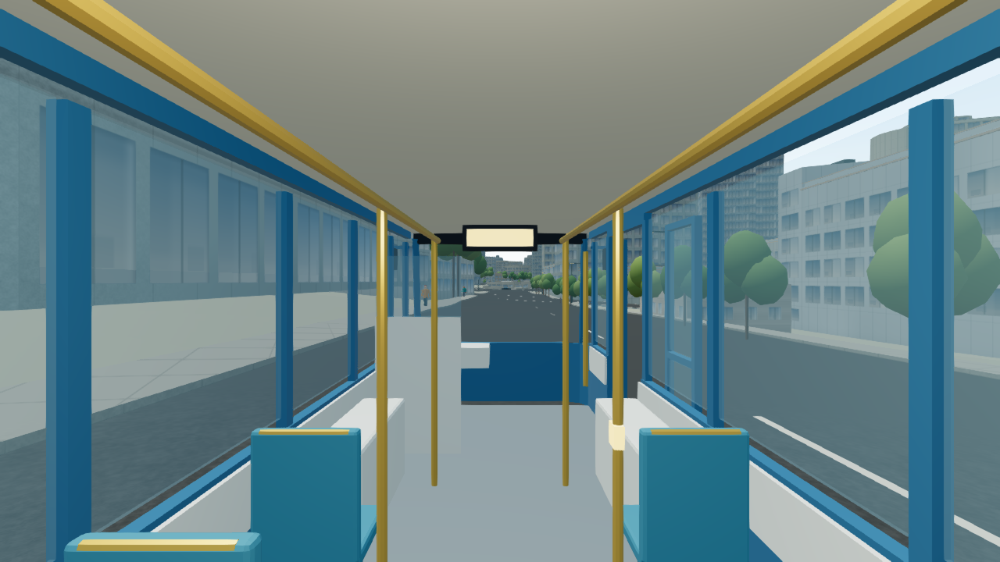
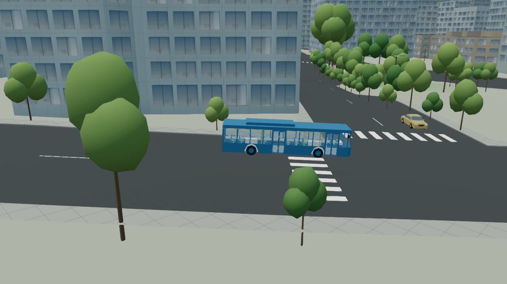

# 新版公車內裝整合（2026-10-08）

本次將 repo 既有 `boardable-bus` v1.0.0 資產接入主城。沿用原作者的 GLB、車門動畫、座位與地板資料，沒有重新製作模型。這一版提供近景車流模型，以及一台停放公車的車廂參觀；實際公車路線、班次、站點停靠與移動乘車仍屬後續開發。

## 使用方式

1. 主城載入後按「參觀停放公車」。系統會在範圍內既有道路尋找平坦、可放置車體且前後門外有合法地面的路段，將步行者帶到前門。
2. 車門開啟後，選擇座位或站立區，按「上車」。共有 10 個座位及 2 個站立錨點。
3. 拖曳畫面或使用方向鍵環顧；車內選單可預覽其他座位視角。預覽只移動相機，不改變已佔用的乘客位置。
4. 按「下車」回到後門外經重新驗證的地面；關閉、切換探索模式或前往另一地點也必須先成功下車。若出口不合法，保留乘客位置並阻止切換。
5. 「圖層」內的 Auto／平衡／高／Ultra 選項持續可用。

## 成本控制

| 場景 | 模型與上限 | 載入方式 |
| --- | --- | --- |
| 遠景／尚未載入／近景超額 | 原本的廉價 instanced 公車 | 延續原車流 |
| 近景車流 | 外殼 LOD1 + 內裝 LOD1；每台 2,618 三角形；最多 4 台，相容模式 2 台 | 首次有合格的 80 公尺內車輛，且 Auto 允許新細節時才載入 |
| 距離遲滯 | 80 公尺進入、110 公尺退出 | 降低距離邊界反覆切換 |
| 停放公車參觀 | 外殼 LOD0 + 內裝 LOD0；6,070 三角形；最多 1 台 | 使用者進入時才載入；關閉釋放 instance，重用有界模板快取 |

近景的 28 個原始 primitive 合為 8 個材質角色的共享批次；雙面透明玻璃在主畫面通常需要額外一個繪製 pass，不能把「8 批次」當作所有效果合計的 draw calls。近景兩檔共 259,556 bytes，完整參觀兩檔共 515,700 bytes；實際使用最多 4 個模板。透明玻璃、原始 PBR 與車門 clip 保留。原始 GLB 沒有 `COLOR_0`，runtime 對缺失頂點色彩補中性白色，避免共用材質將內裝渲染成黑色。

冷啟動遠景不請求公車 manifest 或 GLB、不建立近景批次。Auto 在高速飛行暫停新細節時也暫停新的近景公車載入／加入，已存在的合格車輛可保留；未被新版代表的路線回到原 renderer。一般車流的車門保持關閉，這裡沒有新增 moving-service boarding。

## 資產與部署

- 正式資產：`public/models/blender/bus/` 的 5 個 GLB 與縮減 runtime manifest。
- 來源：`tools/assets/boardable-bus/`；原 `.blend`、GLB 與 manifest 維持原雜湊。
- 來源幾何 revision：`c9d184a4a176aefecf2aaf2b8341ba4f406f4ee9`。
- 來源 manifest SHA-256：`32a35e7fdaa0f82600f8d161212b952177fae8515ca8095b2d55be118503076e`。
- 新增 `tools/verify-bus-adoption.mjs`，由 Firebase build 強制檢查精確檔案清單、來源／部署雜湊、metadata 投影及隔離；不允許略過。
- 原始授權與作者來源保留於 metadata／scene provenance。

## 驗收

- `npm run check`：通過。
- `npm test`：943／943 通過，0 fail／skip。涵蓋原 GLB、延遲載入、載入失敗重試、動畫門洞、地面轉移、取消／晚到／回收，以及探索入口的受阻切換。
- 新增 runtime／資產驗證器／公車測試的 scoped oxlint：通過。整個 repo 仍有既有 lint 診斷，沒有宣稱全 repo lint 清零。
- `npm run build:firebase`：通過；Blender adopted inventory 25 檔、保護 176 candidate hashes，公車 6 檔的獨立部署閘門亦通過。正式 JS 的 QA 面板、`integrated-bus-checkpoint-v1`、離線資產入口字串為 0。
- 實際本機 WebGL：確認冷遠景 0 公車模板／0 批次，真門開啟後上車，白天／23:00 車內渲染，座位預覽保留乘客錨點，正式 Ultra→Auto，後門下車與車內切換駕車。
- 三次公開參觀流程；近景 fleet 實際渲染成功。快取最高 4 個模板、停放 owner 最高 1，關閉後為 0，沒有 WebGL warning／error。
- 再以無 QA 功能的正式 static build 開啟新頁面，公開入口→開門→上車→下車→關閉通過；QA 面板 DOM 數量為 0，車廂材質顯示正常，console 無 warning／error。
- 390×844 與 844×390 responsive viewport 操作驗證；車內搖桿隱藏，短橫向下車按鈕在畫面內、沒有橫向溢出。這是桌面瀏覽器的 viewport 驗證，沒有宣稱實機手機／長時間壓力測試或 FPS 提升比例。

GPU 證據保存在 [qa/bus-interior-20261008](qa/bus-interior-20261008/browser-summary.json)：11 個未改寫的 runtime checkpoint JSON、3 張原始畫布 PNG。各檔的 `revision` 是測試時的 parent `6f1e463f32d5fc85abad49e455efedf60192c2c8`；驗收對象是當時未提交的實際來源，統一 source fingerprint 為 `54ce5ba3e7323d3cb11daa4b68c59a8164f60348cc62aab94675f2518959b050`。不要把 parent revision 當成本次實作的 commit。

## 後續界限

停放／上下車檢查驗證靜態地面、完整車體範圍、坡差、門洞與乘客轉移，不宣稱已完成移動車流碰撞或樹幹／街道家具的佔用檢查。其他 ambient 車流仍按原展示方式行駛。

車廂採單一無陰影局部光源。城市店家、路燈與建築窗戶的夜間照明仍按先前要求暫不施作。SkyTrain 站內結構、站台與正式乘車流程也不在這次公車資產整合中。
