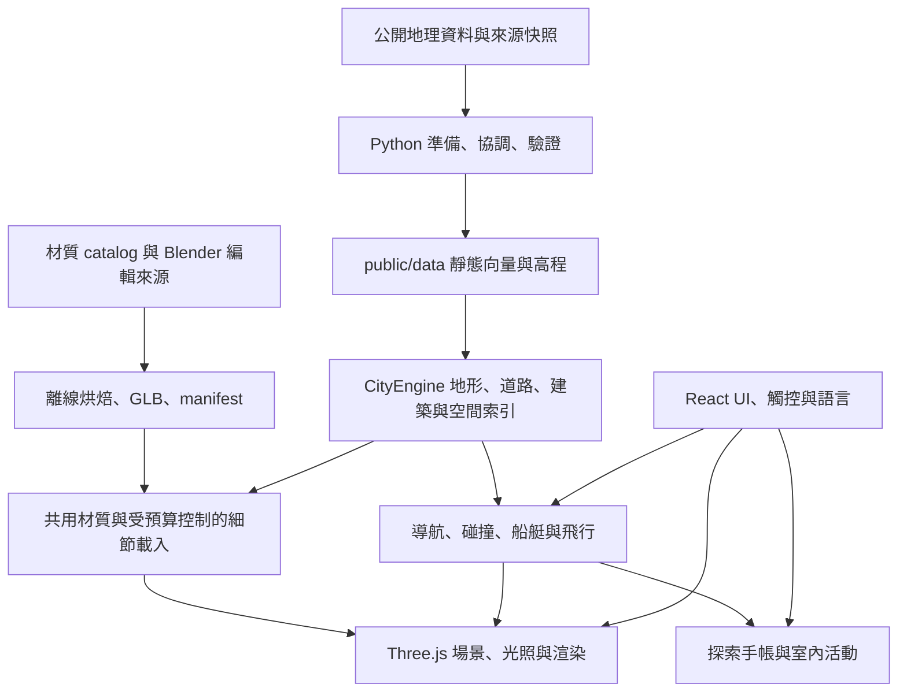

# Vancouver Living Atlas 專案規格與後續開發計畫

**2026-10-02 城市明亮度檢查點：** 修正平屋頂一律使用深色瀝青、外牆原有明度被 atlas 替換、玻璃天空色再次受漫反射照明等問題。加入來源 seed 穩定的三種代表性平屋頂，沿用既有 Blender atlas；城市幾何、碰撞、地形、全域曝光及日夜光照設定未改。開場改為 **10:00、持續 300 倍速**，第一分鐘仍是白天，約 126 秒進入夜間。完成 **20 組同相機前後配對、40 份有效 GPU 畫面紀錄，660/660 tests、TypeScript、正式 Firebase build／worker／QA 隔離**；陰天屋頂、外牆及步行／駕車近景已檢查，auto 極光正常。短測沒有 FPS 提升證據，配色亦不是實測材料分類。完整原因、成本、測試建構方法與後續規劃見 [城市明亮度規格](CITY_READABILITY_2026_10.md)及 [實際畫面與數據](visual-quality/city-readability/README.md)。

**2026-10-02 素材整合檢查點：** 已找到並驗證新的 [Blender 素材列表](BLENDER_ASSET_HANDOFF_2026_10.md)，273 個列管檔案完整性通過。在實際城市 renderer 完成 43 份有效人物、窗台、葉片與 PBR 試片紀錄後，正式採用完整幾何的 1024 px 市民：下載量 −47.5%、貼圖估算 64 → 16 MiB，沒有 FPS 提升證據。窗台保留來源邊受控 QA；新葉片未顯示視覺改善，維持現有預設。其他素材需先建立尺寸、公尺 UV 及語意角色契約。最後 **651/651 tests、TypeScript、正式 Firebase build／worker／QA 隔離**通過，正式 UI smoke 完成。完整採用依據、建構步驟與下一輪接口見 [素材整合規格](OFFLINE_ASSET_INTEGRATION_2026_10.md)及 [GPU 比較紀錄](visual-quality/offline-assets/README.md)。

**2026-10-02 先前檢查點（歷史）：** 階段 B 區域規則與來源對照、SSAO 遍歷改良及離線候選已由 [PR #1](https://github.com/YiTaChen/vancouver-living-atlas/pull/1) 合併 main（`4967c72`）。當時的環境限制、CPU 結果與未驗收項目見 [優化檢查點](OPTIMIZATION_2026_10.md)和 [發布紀錄](PUBLICATION_2026_10.md)。本次本機 AMD GPU 比較解除了部分畫面驗收限制，不表示先前 149.7 ms p95 或全城／全平台效能目標已解決。下列 2026-10-01 的 563 項測試與其他數據保留為歷史基準。

狀態日期：**2026-10-01**。本文件描述目前 repository 的產品能力、技術結構、資產製作、驗收方式與建議開發順序。它是專案規格，不以競品宣傳、單張截圖或尚未執行的計畫作為完成證據。

本輪已完成 **563 項 repository 測試、TypeScript、正式 Firebase build、24 組場景擷取及一段 Water Street 持續行走驗收**。最後的天氣選單翻譯標籤修正後，已重新通過 TypeScript、正式建置與 production UI 檢查。實測仍有人物視角 frame-time 退步，技術驗收完成不代表效能缺口消失。**本輪技術驗收已完成；Git 交付以本文件所在版本及交付紀錄為準。** 線上 demo、repository 版本與部署結果仍應分別辨識。

本輪 runtime／資產／Blender 來源與最終 UI 標籤修正已提交並推送於開發分支：[c3feda2](https://github.com/YiTaChen/vancouver-living-atlas/commit/c3feda26008bd7ec9544a5fd188db7a933d8fb37)。文件與 main 整合依交付紀錄判讀；**本輪未部署線上 Hosting**，不能將 repository 更新當作線上 demo 已更新。

## 閱讀方式

- 想知道產品已能做什麼：讀第 1–3 節。
- 想知道資料、模型、材質如何形成城市：讀第 4–7 節。
- 想知道本輪做完什麼、仍缺什麼：讀第 8–9 節。
- 想知道接下來的成果、優先順序與驗收門檻：讀第 10–11 節。
- 要實際開發、測試或發布：讀第 12–14 節。
- 查完整資產製作細節：讀 [MATERIAL_PIPELINE.md](MATERIAL_PIPELINE.md)；查原始證據與限制：讀第 15 節的索引。

本文件使用三種狀態：**既有完成**有程式與歷史驗證；**本輪完成**有本輪實作及明確範圍的技術驗收；**規劃**尚未承諾交付或尚未實作。局部改善不代表該類別全城完成，也不表示所有既有玩法都在本輪重測。

## 1. 產品定位與目標

Vancouver Living Atlas 是以真實地理資料為基礎、在瀏覽器執行的互動溫哥華城市。使用者可以觀看城市、步行、駕車、划行船艇及駕駛飛行器，也能透過探索手帳與室內活動取得明確目的。

產品的主要價值是三者一起成立：

1. **能辨識溫哥華。** 海岸、地形、街道、主要建築與地標保有地理依據。
2. **能在城市中行動。** 五種模式、相機、地面／水面／空中接觸與室內動線彼此連貫。
3. **有值得停留的細節與活動。** 近景街面、人尺度物件、材質和活動提高探索意願，而不只是遠距離看建築量體。

目前不是測量級數位孿生、即時交通服務、寫實飛行模擬器或大型開放世界角色扮演遊戲。這些定位界線來自既有資料與系統能力，不妨礙逐步提升視覺和玩法。

對照其他城市遊戲時，應比較「相同視角與裝置下的場景品質」「玩家能完成的活動」「持續使用的效能與穩定性」。城市名稱不同，不足以解釋品質落差；資產製作密度、地表與立面細節、材質尺度、光照、內容編排和效能取捨才是主要工程差異。

## 2. 產品範圍與既有功能

### 2.1 城市與移動

| 能力 | 目前行為 | 範圍與限制 |
| --- | --- | --- |
| 城市 Orbit | 旋轉、平移、縮放、命名視點、自動城市導覽、圖層與標籤 | 詳細核心區與較低精度遠景並存；不是全球串流地圖。 |
| Walk | 選擇起點、前進／後退／轉向、觸控移動、第一人稱／角色視角 | 以現有地面、橋面、建築和室內碰撞為準；不代表現實世界合法通行資訊。 |
| Drive | 道路起點、油門／倒車／轉向／煞車、Classic／Roadster、車內／追蹤視角 | 近似車輛反應，並非完整輪胎物理或交通法規模擬。 |
| Boat | 水域放置、慣性、推進／倒車、舵向、岸線與碼頭碰撞、船內視角 | 湖面與海面反應不同；不是完整海事模擬。 |
| Fly | 水上飛機及直升機、起飛／降落、座艙／第一人稱／追蹤視角、自動巡航 | 輔助觀光飛行；沒有完整航電、引擎程序或認證飛行模型。 |
| 模式銜接 | Walk ↔ Drive 原地切換；地面／水面轉換重新放置；飛行可離開相機再返回同一架飛機 | 相機和模式狀態須保持一致，不能因切換而意外重定位或重啟計時。 |
| 地圖與擷取 | 跟隨實際位置的小地圖、方向、距離尺度、獨立縮放、PNG 擷取 | 小地圖目的地指示不是轉彎導航或道路安全建議。 |

主要程式入口是 [navigation.ts](../lib/city/navigation.ts)、[placement.ts](../lib/city/placement.ts)、[boat-controller.ts](../lib/city/boat-controller.ts)、[flight-controller.ts](../lib/city/flight-controller.ts)及[minimap.ts](../lib/city/minimap.ts)。

### 2.2 已有遊玩內容

| 內容 | 已完成範圍 | 尚未包含 |
| --- | --- | --- |
| 城市探索手帳 | 煤氣鎮、Robson、西端三條觀察路線；九篇依序收集的筆記、三枚散步印章、距離與場景目標指示 | 大型主支線劇情、任務人物對話樹、工作／經濟系統。 |
| Science World 光色實驗室 | 實走入口和導引點，在展示台操作 RGB；完成黃、青、白三種混光，保存觀察與獨立永久印章 | 官方館內展項的精確複製；任意遠端操作或放置到終點即得分。 |
| 三處公共室內 | Science World、Canada Place East、Waterfront Station 的代表性大廳與可走動空間 | 所有樓層、私人區域、完整實測室內平面。 |
| Waterfront 連接空間 | 代表性 SkyWalk 與 SeaBus 等候空間，使用既有入口及地板 | SeaBus 登船、完整營運路線或乘客運輸玩法。 |
| 駕駛事件 | Downtown 持續高速時的腳本式警察攔停及安全提示 | 全城警察 AI、追捕、犯罪或任意 NPC 互動系統。 |
| 飛行觀光 | 飛機／直升機的不同操控、自動巡航、碰撞與降落回饋 | 任務式航空職業、生涯、乘客或貨物系統。 |
| 六種店面識別 | 原創招牌、展示畫面與門卡，穩定指派到既有街面與 bay LOD | 真實商家名錄、營業狀態、商店交易。 |

手帳進度與實驗室進度儲存在瀏覽器本機的版本化資料中；沒有登入、跨裝置同步或後端帳號系統。重新載入可恢復已完成內容，但需要新的實體到訪資格才可繼續現地操作。

進度條件檢查模式、位置、高度、順序與連續實際移動。直接改位置、重新放置或隱藏分頁期間的位移不應自動發獎。開始／重新加入活動可以使用已驗證起點，與繞過活動中的步行條件是不同操作。

活動證據見[城市探索](visual-quality/city-discovery/README.md)、[光色實驗室](visual-quality/light-lab/README.md)及[室內與店面整合](visual-quality/interior-street-life/README.md)。

### 2.3 城市生命感、時間與操作介面

- 場景已有汽車、Vancouver 風格巴士、SkyTrain、虛構蒸汽列車、港口船舶與飛行器等動態物件；路線與班次屬展示，非即時交通。
- 既有日夜時鐘預設 300×，約 4 分 48 秒一日；導航、交通與物理不跟著日夜倍速加快。
- 天空包含日月、月相、星空、極光與流星控制；屬示意循環，不是即時天文預報。
- 本輪新增晴天／沿海陰天的整體氣氛選項，協調天空、霧、玻璃及環境色；不表示已接入天氣 API、雨雪粒子或濕地表系統。
- 介面提供十種語言、桌面鍵盤／滑鼠及手機觸控配置。探索路線長篇內容目前有英文、繁中、簡中版本；不能把十語 UI 說成所有內容都已完成十語翻譯。
- 手機與桌面可使用不同渲染能力路徑；畫質、相機距離、小地圖縮放與介面隱藏互相分離。

## 3. 使用體驗規格

### 3.1 初次進入

必要資料載入時顯示階段式進度與活動狀態。完成基本城市、導航與必要 GPU 準備後允許互動；較細的立面與地標依距離、畫質和預算逐步準備。

載入失敗不能留下半活的導航、監聽器或背景請求。現有錯誤流程提供重新載入；完整地理離線套件、Service Worker 及離線任務同步尚不在現有規格內。

### 3.2 日常探索

選模式 → 選有效起點 → 移動與改變視角 → 查看小地圖／時間／圖層 → 可返回局部空拍或切換模式。有效起點以實際模式需要判斷，例如船體周圍需有可用水域、飛行器需符合起飛表面。

### 3.3 有目標的探索

打開手帳 → 選路線或活動 → 開始／重返入口 → 遵循目的地與距離 → 在實際抵達後操作收集／測試 → 顯示結果與保存進度。下一階段內容應沿用這個可恢復的流程，避免各活動新增互不相容的操作方式。

### 3.4 必須守住的體驗條件

- 操作一般 HUD 按鈕後，WASD 仍能繼續移動；輸入文字、滑桿及選單保留合理鍵盤行為。
- 觸控搖桿、相機拖曳與縮放應能同時工作；取消手勢、失焦及模式更換時清除殘留輸入。
- 相機切換不能以穿越城市的突然跳躍代替原地過渡；碰撞與模式狀態不能因視角改變而失效。
- 暫離分頁不補跑大量模擬時間；返回時重設時間基準和輸入。BFCache 返回與真正釋放場景要分開處理。
- 看得見的地面與角色腳下高度一致；入口不是貼上一扇門就自動變成可穿越牆面。

## 4. 地理資料與空間契約

### 4.1 資料來源與範圍

主要來源及限制以 [DATA_SOURCES.md](../DATA_SOURCES.md)為準；準備流程在[tools/README.md](../tools/README.md)。下列數字是 repository 公布資料的記錄數，不是溫哥華全市即時統計。

| 資料 | 目前資料規模／來源 | 解讀方式 |
| --- | --- | --- |
| 建築 | 7,630 solids／7,806 polygon parts；City 2009 建築及協調後 OSM 資料 | polygon part、solid、unique building 是不同計數；部分建築有基座與多個高度分部。 |
| 核心地形 | 257 × 273、約 20 m 格網，由公開等高線插值 | 格網間距不等於高程測量精度；核心來源年代約 2002。 |
| 遠景地形 | 211 × 246、約 100 m 格網，Terrarium 衍生區域地形 | 用於山脈及城市外圍上下文，不能代替近景步行地面。 |
| 道路 | 2,953 來源 features，包含公路、非市有路、巷道及自行車道 | 寬度是展示估計；重合自行車路線不能再畫一條完整車道。 |
| 公園與步道 | 60 個公園 features／67 parts；810 步道 features | 保留來源範圍，步道呈現寬度與局部接地仍需渲染解釋。 |
| 水域、海灘、林地 | 65／57／93 個來源 features | 海面、湖面及內部島嶼需不同處理，不能全部壓在海拔零。 |
| 樹木 | 20,545 筆公共樹木記錄；過濾與程序林地補植後約 36,041 棵顯示樹 | 補植位置與冠形屬代表性建模，不是每棵樹都經實測。 |
| 橋梁與交通路線 | 來源路線、節點及另行定義的展示高程／連接曲線 | 橋面高度、部分交通行為為模型估計，不是工程或安全導航資料。 |

詳細核心 bounds 為 `[-123.165,49.267,-123.095,49.315]`，區域背景 bounds 為 `[-123.26,49.22,-122.97,49.44]`。研究邊界會裁切城市，不承諾所有區域都有相同密度。

### 4.2 座標、高度與識別

- 來源 GeoJSON 採 EPSG:4326 經緯度；本地場景以 `[-123.128,49.286]` 為近似原點，轉為公尺 x／z，y 為高度。轉換集中在 [geo.ts](../lib/city/geo.ts)。
- 建築 `height` 是相對基底的頂部高度；`minHeight` 表示高架分部底部，不得再把整個 height 當作該分部厚度。
- `structureId`、`buildingId`、來源 ID、`sourceIds` 和必要時的穩定幾何 key 用來分組、追溯、決定外觀種子與配置。
- 來源 solids 與最終顯示地基不同：瀏覽器將同一結構落在顯示地形的共同基座，保留來源相對高度。來源體積檢查不等於所有最終地面接縫都已驗證。
- Polygon holes、MultiPolygon 和垂直分部不可在簡化時默默丟棄；地標替換區域與通道需要獨立的保留／碰撞契約。

### 4.3 不可破壞的資料條件

材質改善不得任意改 footprint、移動建築、抬高道路或擴大可行走區域。若源資料確有錯誤，需在資料準備／具名修正層解決，附來源、前後差異與回歸測試。

住宅庭院、路面和裝飾取樣真正渲染的地形／人行道三角形；不能只查較粗的高程函式，然後用一張平面蓋住接縫。草地、花床不應自動成為新的導航地板。

## 5. 執行時架構

### 5.1 系統分層



| 層級 | 主要檔案／目錄 | 責任 |
| --- | --- | --- |
| UI | [app/page.tsx](../app/page.tsx)、[components](../components) | 模式、面板、設定、手帳、輸入提示及響應式配置。 |
| 引擎所有權 | [engine.ts](../lib/city/engine.ts) | renderer、scene、camera、資料載入、更新循環、資源釋放與設定整合。 |
| 地理與表面 | [road-graph.ts](../lib/city/road-graph.ts)、[ground-surface.ts](../lib/city/ground-surface.ts)、[travel-surfaces.ts](../lib/city/travel-surfaces.ts) | 道路拓撲、渲染表面取樣、模式需要的高度／表面身份。 |
| 地理建築 | [building-bodies.ts](../lib/city/building-bodies.ts)、[facade-profile.ts](../lib/city/facade-profile.ts) | 保持 GIS 形體，建立代表性外觀和一致窗格。 |
| 近景細節 | [architecture-details.ts](../lib/city/architecture-details.ts)、[streetscape-kit.ts](../lib/city/streetscape-kit.ts)、[detailed-trees.ts](../lib/city/detailed-trees.ts) | 分 cell、實例化、LOD、載入準備、快取與回退。 |
| 地標生成 | [landmark-worker-service.ts](../lib/city/landmark-worker-service.ts)、[landmark-detail.ts](../lib/city/landmark-detail.ts) | 支援的詳細地標在 worker 準備，主執行緒還原／GPU 暖機後替換；不是所有幾何都在 worker。 |
| 光照與後處理 | [atmosphere.ts](../lib/city/atmosphere.ts)、[shadow-policy.ts](../lib/city/shadow-policy.ts)、[graphics-profile.ts](../lib/city/graphics-profile.ts) | 氣氛、陰影範圍、硬體能力探測及相容路徑。 |
| 玩法狀態 | [discovery-runtime.ts](../lib/city/discovery-runtime.ts)、[light-lab-runtime.ts](../lib/city/light-lab-runtime.ts) | 實際到訪資格、活動進度、目標與 UI 整合。 |
| 驗證 | [tests](../tests)、[upgrade-qa.ts](../lib/city/upgrade-qa.ts) | 資料／幾何／行為回歸與實際場景觀測。 |

### 5.2 啟動與漸進細節

必要地理請求並行，核心地面、建築、道路、橋梁、地標與導航依依賴順序形成。地形取樣、建築共同地基及道路篩選避免重複計算；已有細节排程透過每 frame 工作量和時間預算讓出主執行緒。

原始全城資料仍需載入，現有系統是**漸進式細節準備**，不能稱為完整分區地理串流。近景資產不應阻止遠景／基本導航可用；失敗或超出預算時保留既有 fallback。

### 5.3 生命周期

引擎管理材質、貼圖、幾何、render targets、controls、worker、事件監聽與排程。晚到的 async 結果若場景已結束，必須釋放而非重新掛回。控制角色骨架有自己的擁有權，不能直接將同一骨架給多個人物共用。

相容模式避免 HDR 後處理鏈；桌面使用實際 framebuffer 探測補充裝置判斷。Context loss、載入失敗、一般 pagehide 及可保留的 BFCache pagehide 分別處理。已改善清理與恢復流程，不代表先前 Chrome context-loss 的根因已找到或所有裝置都已解決。

## 6. 幾何與材質製作方式

### 6.1 資產類型分類

| 類型 | 適合的內容 | 目前實例 | 製作／替換原則 |
| --- | --- | --- | --- |
| GIS 衍生形體 | 全城建築、道路、地形、來源邊界 | 建築主體與道路網格 | 保留資料身份、輪廓與高度；用材質及細節改善閱讀性。 |
| TypeScript 程序幾何 | 可參數化地標、橋梁、交通工具、樹木及室內 | 大部分既有城市物件 | 共享幾何、批次與具名規則；程序模型不等於不能細緻。 |
| Blender 模組 GLB | 固定人尺度、近景可重用形體 | heritage shop／modern lobby bay | LOD 獨立編輯，匯出後實例化；不拉伸入口尺寸強塞到任意牆面。 |
| Blender 骨架 GLB | 有形變與動畫的角色 | 原創 Vancouver citizen | 骨架、權重、動畫、材質與生命週期共同驗證。 |
| 共用 PBR 表面 | 牆、柱、鋪面、瓦片等重複建材 | 八種語意表面 | 同一 catalog、實際公尺尺寸、明確 color／normal／ORM。 |
| 特殊表面／畫布 | 水、天空、葉片覆蓋、招牌、展示螢幕 | 原有水波、leaf atlas、shop atlas、RGB 螢幕 | 依用途保留專用管線，不能一概套不透明建材 shader。 |

全城並非都由 Blender 製作。Blender 在此的價值是保留可編輯資產、實際模型尺寸、節點材質、UV 與可重現輸出；不是把所有物件變成巨大 GLB 檔案。

### 6.2 本輪共同表面與建築類型

八種表面為 `heritage-brick`、`sandstone`、`concrete`、`cedar`、`roof-shingle`、`street-brick`、`painted-metal`、`asphalt`。材質庫保留一個 `.blend`、24 張來源 maps，以及供 GIS 使用的三張 atlas。

六種建築類型為歷史磚牆、低層砌體、中層窗格、陽台板式、玻璃幕牆及住宅外牆。它們由穩定 ID、尺寸和既有區域規則決定，屬代表性分類。幕牆只有不透明部件使用礦物材質，玻璃遮罩、反射及夜間窗光仍保留。

材質採公尺 UV；同一磚材不應因建築變高而把磚一起放大。粗糙度、金屬度、法線與底色分開管理，避免把陰影畫進 base color 再被場景光照重複變暗。

### 6.3 Blender 工作流程

1. **盤點與定義：** 指定表面角色、實際尺寸、幾何用途、LOD、材質／三角形上限及來源範圍。
2. **材質庫：** catalog 產生原始數學紋理與材質節點，保存可編輯 `city-material-library.blend`。
3. **節點編輯：** 在工作副本修改不透明 PBR 節點；offline exporter 求值並烘焙到新工作目錄，保留輸入 `.blend`。
4. **模組建模：** 以四個獨立 bay `.lod0.blend`／`.lod1.blend` 為實際編輯來源，保持人尺度和公尺 UV。
5. **LOD 匯出：** `--from-source` 保留編輯後幾何／UV 再烘焙 GLB；玻璃及 diffuser 與 opaque atlas 分開。
6. **資產驗證：** 查 dimensions、節點、maps、通道、hash、三角形、材質數、軸向與來源可重建性。
7. **場景整合：** 綁定來源表面／建築邊、碰撞及淨空，依 cell／LOD 實例化。
8. **整段街景驗收：** 以相同相機、時間、天氣、畫質檢查，通過後連同來源及 manifest 發布。

catalog generator 是從程式重新生成預設材質，不會讀回手動修改的節點。手動節點要走 [export_material_library.py](../tools/assets/city-materials/export_material_library.py)，不可在修改後再用 generator 覆寫來源。

目前 exporter 支援八種不透明表面的底色、roughness、metallic、normal／bump；玻璃、透射、透明度、位移幾何及其他未接入效果會拒絕。這是平面表面的離線烘焙流程，不會把任意 Blender 雕刻自動帶成城市幾何。

來源、命令、通道和限制詳見[材質庫 README](../tools/assets/city-materials/README.md)、[街面模組 README](../tools/assets/streetscape/README.md)及[人物 README](../tools/assets/citizen/README.md)。

## 7. 為什麼不能持續依 XYZ 修畫面

3D 空間需要座標；來源建築的地理位置、地標變換、室內導引點與相機驗收姿勢使用 XYZ 都合理。問題在於把應該共用的材質、地表或立面規則寫成大量互不相干的「到某個座標就特別修正」。

這種方法的維護成本隨例外數量、相鄰表面互動、LOD、時間／天氣、畫質、資料版本及碰撞狀態而增加。新增一個補丁可能破壞另一個視角或模式，因此需要更多組合回歸。**不能僅因有 x、y、z 三個軸就宣稱演算法必然是 N³；那不是此問題的數學結論。**

規格要求修正在最合適的層次發生：

| 問題 | 優先處理層 | 驗收方式 |
| --- | --- | --- |
| 全街磚太大、反光不一致 | catalog、材質與公尺 UV | 同一街段、多種角度／時間比較。 |
| 多棟窗台或入口穿過地面 | 建築邊緣／高程／淨空規則 | 來源資料批次檢查及斜坡近景。 |
| 路口錯套街磚 | 來源道路選擇和表面裁切 | 路口、街段端點、相鄰街道檢查。 |
| 地標確有獨特形態 | 具名資產及來源 ID 對齊 | 輪廓、高度、地面、碰撞和資料歸屬。 |
| 單筆來源錯誤 | 可追溯的資料修正 | 修正前後輸入、理由及回歸案例。 |

2026-10-02 更新：Gastown 建築／街面類型選擇的相容 bounding box 已集中為具名規則，保留既有邊界差異與高度條件；Water Street 精確道路名稱、可選 civic block 前綴及街段邊界也使用同一配置入口。來源 ID／匹配数量與資料指紋有對照測試。這不是官方區界重建，也沒有宣稱移除所有地理 bounding box。見 [區域規則](REGION_RULES.md)。

## 8. 完成項目與本輪交付盤點

| 領域 | 既有完成 | 本輪完成 | 仍有缺口 |
| --- | --- | --- | --- |
| 地理底座 | 核心／區域地形、來源建築協調、道路、橋梁及水域 | 保持原資料和碰撞契約 | 資料年代不同；不是所有原始資料都可一鍵完整重建。 |
| 建築輪廓 | GIS 量體、來源支援的住宅坡屋頂、主要地標 | 共用牆／屋頂表面 | 泛用形體仍有重複感，非逐棟精準立面。 |
| 近景街面 | 程序細節、兩種 bay、六種原創店面識別 | 同材質來源、獨立 Blender LOD 編輯入口、歷史街面協調 | 專屬轉角、窗框、簷線等完整模組庫尚未建立。 |
| 路面 | 道路網格、標線、路緣、人行道 | 精確 Water Street 段落鋪面、共用瀝青／混凝土／街磚 | 區域材質特徵仍有限，路寬仍是展示估計。 |
| 土地與庭院 | 地形、海灘、步道與接地協調 | 500 plots／977 beds／1,954 plants／20,174 triangles | 代表性補充，不是全城地籍庭院模型。 |
| 植被 | 來源樹、補植、遠景冠形、近景葉片／樹皮 | medium／Ultra 共同主要枝冠，細節 RNG 分離 | 遠近層級仍非連續幾何 morph；葉片資產與林下植被可再改善。 |
| 光照 | 日夜、太陽／月亮、陰影、SSAO 與既有環境 | 晴／陰天、黃昏與玻璃／天空協調 | 沒有完整物理天氣、全域光照或即時路徑追蹤。 |
| 地標與室內 | 原創程序地標、三處公共室內、SkyWalk | 共用材質流程為後續轉換提供基礎 | 地標與室內未全部更換材質，也非全部 Blender 資產。 |
| 人物與交通 | 骨架 citizen、原有警員、車／船／飛機與動態交通 | 保留現有系統 | 沒有全城可互動群眾、豐富行為 AI 或全交通服務玩法。 |
| 活動 | 三散步路線、九筆記、三散步印章、獨立光色實驗室 | 本輪未新增大型玩法 | 故事、多樣活動、NPC 及跨活動關聯仍薄弱。 |
| 效能與可靠性 | LOD、instancing、快取、漸進準備、worker、相容模式、清理回歸 | 新材質 readiness、庭院計數及氣氛 QA | 長 frame、總多 pass 成本、低記憶體裝置與實機仍需持續量測。 |

本輪的詳細資產清單與優先項目見 [MATERIAL_PIPELINE.md](MATERIAL_PIPELINE.md)。最終視覺、建置及測量結果已記錄於[material-pipeline QA](visual-quality/material-pipeline/README.md)，本表不能取代該證據及其限制。

## 9. 差距的原因與改善順序

### 9.1 視覺差距

地理資料提供建築在哪裡、多高、占多少地面；不會自動提供牆面材料、窗框深度、門口層次、雨棚、轉角、屋頂接縫、招牌內容和真實使用痕跡。只有大量正確方塊，依然容易顯得粗糙。

高品質近景需要多種尺度同時成立：城市輪廓、單棟比例、立面結構、人尺度物件、材質微細節。只加高解析貼圖補不了錯的輪廓；只加 geometry 也補不了錯的 UV 尺度、灰階或反光。後處理可以協調影像，不能取代幾何與材質。

### 9.2 遊玩差距

已有五種移動方式，並不自動等於豐富內容。玩家還需要清楚目的、途中可察覺的差異、到達後的操作、回饋及下一步。本專案已從自由漫遊進展到短路線及一個室內活動，但內容數量、角色互動與活動變化仍有限。

### 9.3 生產與效能差距

過去不同時期的程序模型、材質和 GLB 各自成長，造成同一材質類型的尺度、光澤和細節不一致。共用材質庫和可編輯 Blender 來源先降低維護阻力，再支持批次資產改良。

全城增加高模、貼圖、光源和 NPC 會放大既有繪製與載入成本。應先在玩家實際會走的代表走廊做完整效果，量測後再擴大覆蓋；以可驗收的完整街段作交付單位，勝過累積只在單一截圖有效的小修正。

## 10. 後續階段計畫與預期結果

階段 A 記錄本輪基礎里程碑；B–F 為後續建議，不表示已實作，也不估算尚未量測的工期。順序以共同規則、建築模組、植被／地表及材質優先，新活動留待視覺基礎穩定後評估。

**效能與穩定性是每個階段的放行條件，不能等到階段 E 才處理。** 任一批次若超出資源預算、造成未接受的長 frame／記憶體增長或導航回歸，必須停止擴大覆蓋並先修正；階段 E 是依量測進一步優化與擴展的集中工作。

### 階段 A：本輪基礎里程碑與驗收基準（技術驗收完成）

**成果：** 共同材質、可編輯來源、街段鋪面、庭院、樹木與氣氛形成可追溯的同一版本。

- 材質／GLB、型別、563 項回歸及正式 build 通過；24 組場景擷取和一段 Water Street 真實輸入行走有效。
- 已保存 source fingerprint、材質 hashes、執行硬體、時間／天氣、畫質、計數和錯誤紀錄；production UI 在三種 viewport 及強制相容路徑完成指定檢查。
- 本輪技術驗收已完成；Git 交付以本文件所在版本及交付紀錄為準。部署如有執行，另存部署結果，不能只因 merge 就標示線上已更新。

**驗收邊界：** 正式輸出無 QA 控制，指定材質場景、天氣操作及行走流程通過；本輪沒有重跑所有既有活動。夜間地面偏暗、住宅／地表重複感和人物視角 frame-time 退步仍保留於證據。FPS 以實測呈現，不預設改善百分比。

### 階段 B：將區域選擇和配置規則集中管理

**成果：** 改區域或資料時有可追溯規則，降低隱藏座標例外的維護成本。

- 將遺留 Gastown 區域判斷收斂到具名街段／區域與來源 ID 設定。
- 為每個例外記錄用途、來源、匹配數量與不適用條件。
- 區域改寫先以現有結果作對照，保留建築／道路／碰撞資料。

**通過條件：** 輸入重新排序結果穩定；範圍不誤選鄰區；沒有新增全城逐 frame 掃描；資料及幾何回歸通過。

### 階段 C：補齊代表街段的建築部件庫

**成果：** 煤氣鎮、現代街面與住宅街區在近距離有各自結構，並與一般 GIS 建築一致。

- 按盤點缺口製作窗台、窗框、簷線、基座、轉角、住宅入口及不同雨棚等模組。
- 全部沿用共同表面與實際尺寸，配置由來源邊、入口淨空及表面高度決定。
- 每類先完成 LOD、UV、來源文件與單體檢查，再放入完整街段；完整建築 GLB 僅用於有明確理由的重點地標。

**通過條件：** 入口與上層窗無重疊、斜坡接地正常；LOD 保持輪廓；High／Ultra／compatible fallback 可用；同相機多時間比較並列 draw／triangle／texture 成本。

### 階段 D：植被、地表與其他材質批次提升

**成果：** 建築、地面、樹木和遠景的材質尺度與色彩更加連貫。

- 改善葉片／樹皮來源、樹冠透明覆蓋、土壤與草地接界，以及目前仍各自製作的地標材料。
- 按視覺收益評估車漆、輪胎、室內和角色材質；保留專用 shader 必要性，不強制全部加入同一 atlas。
- 以 source-selected 樣區逐批整合，避免用全城加密掩蓋素材或配置問題。

**通過條件：** 晴／陰／黃昏／夜晚均可讀；LOD 不突然變色／變形；無新增無上限 population；實際 GPU／記憶體及裝置測量通過該批預算。

### 階段 E：依量測擴展效能與覆蓋

**成果：** 在前面每階段持續執行效能門檻的基礎上，集中降低已找到的啟動或長 frame 瓶頸，再擴大可用資產密度，不破壞資料與玩法。

- 拆分 CPU 建構、GPU 多 pass、上傳／shader 首次成本、貼圖與快取成本。
- 針對確定瓶頸比較 worker、batch、材質合併、atlas 壓縮、LOD 或串流方案；它們目前是候選，不是全部已完成。
- 以真實手機與低記憶體情境補足桌面 responsive emulation 的限制。

**通過條件：** 固定輸入、多次同場景比較；優化前後地理與碰撞一致；報告中位數、p95／最大 frame gap 和冷／暖啟動；未測得提升的方案不以「更快」交付。

### 階段 F：可選的後續活動走廊

**啟動條件：** 先完成並驗收前述視覺基礎，且效能與維護成本允許再增加內容。此階段是可選的後續方向，不增加本輪工作範圍。

**成果：** 從「能走進去」提升為「走過去有不同事情可做」。

- 候選包括 Waterfront／SeaBus 空間的原創觀察或交通解說活動，或既有街段的互動角色／小型工作流程；需在視覺基礎完成後另定範圍。
- 先選一個與光色實驗室不同的核心操作，避免只把收集筆記換文案。
- 使用既有手帳、目標、版本化存檔及到訪規則；先查地板、入口、垂直高度和碰撞。

**通過條件：** 開始、正常完成、錯誤操作、離開重返、重新載入均明確；實走而非 teleport 取得資格；桌面／觸控可操作；原有路線和印章不丟失。此階段尚未表示 SeaBus 登船或大型 NPC 系統已排定。

## 11. 現行預算與驗收約束

| 項目 | 現行上限／規格 | 備註 |
| --- | --- | --- |
| 畫素 | Balanced／High 1.8M；Ultra 3.6864M，另受 DPR 與最大邊長限制 | `quality.ts`；固定 1080p QA 可以明確指定比較條件，不能和預設畫素量混用。 |
| 陰影 | High 2048、Ultra 4096；Balanced／compatible 有不同效果政策 | 解析度不是唯一成本，覆蓋區域與更新次數也重要。 |
| Bay | High 24／4 cells／6 LOD0；Ultra 36／6 cells／10 LOD0 | 快取最多 12 cells，每 frame 建立 1 cell；其餘選中 bay 用 LOD1。 |
| 建築細節 | 每 cell 最多 650 屋頂或 1,800 街面 instances；快取 38 | 每 frame 最多 96 planning steps／約 1.25 ms cooperative budget；不是任何單一步驟的硬即時保證。 |
| 近景樹木 | High 約 170 m；Ultra 約 450 m 的受限實例池 | 原有遠景保留直到 replacement 可用；不因失敗刪除樹。 |
| 共用表面 | 三張 1024 × 512 atlas，8 slots | RGBA+mips 約 8 MiB，只計此庫，非全城材質。 |
| Bay maps | LOD0 1024²、LOD1 512²，另保留玻璃／diffuser | 和八格共用 atlas 是不同資源。 |
| Citizen | 37,799 triangles、22 bones、1 skinned mesh／material、三張 2048² maps | 約 6.4 MiB 檔案不等於 GPU 用量；貼圖估計約 64 MiB 含 mipmaps。 |
| 庭院 | 500 plots、每 plot 最多 2 beds、38,000 triangles 硬上限 | 本輪實際 977 beds／1,954 plants／20,174 triangles；不新增導航表面。 |
| 活動與城市 | 既有場景共享 renderer／更新循環 | 新活動避免自行新增全城 light、shadow pass 或無界快取。 |

所有局部預算只約束該功能，不代表全場景 draw calls、triangle 數或記憶體已低於通用裝置上限。資產檔案小也不保證解碼後貼圖、geometry 或 shader 成本低。

## 12. 建置、資產與發布工作方式

### 12.1 應用程式

依[package.json](../package.json)使用 Node.js 22.13+、npm、支援 WebGL 2 的瀏覽器。主 stack 為 TypeScript、React、Three.js、vinext／Vite；資產由本專案提供，不需地圖 API key。

```sh
npm ci
npm run dev
npm run check
npm test
npm run build:firebase
```

`build:firebase` 產生 `dist/client` 並執行 [verify-firebase-build.mjs](../tools/verify-firebase-build.mjs)。它不部署。另有 `npm run build`／`npm start` 的 Worker 建置與預覽路徑，不要把兩種輸出混為同一 release。

### 12.2 材質與模組

```sh
# 重建 catalog 中的預設材質及 Blender 材質庫
blender --background --factory-startup --python tools/assets/city-materials/generate_city_materials.py -- --output public/materials/city --source tools/assets/city-materials/source

# 由手動編輯的節點來源烘焙到新的工作目錄
blender --background --factory-startup --python-exit-code 1 --python tools/assets/city-materials/export_material_library.py -- --blend work/material-edit/city-material-library.blend --output work/material-edit-export --source work/material-edit-source

# 從獨立 bay LOD 來源重匯出到工作目錄
blender --background --factory-startup --python tools/assets/streetscape/generate_streetscape.py -- --output work/material-reexport --from-source tools/assets/streetscape/source --shared-materials tools/assets/city-materials/source/textures --only-shipping --skip-render

python3 tools/assets/city-materials/validate_city_materials.py --streetscape-source work/material-reexport/source --streetscape-root work/material-reexport --report work/material-reexport/material-validation.json
python3 tools/assets/streetscape/validate_streetscape.py --root work/material-reexport
```

上列節點編輯路徑需要先保存實際工作副本，不是 repository 已提供的 `work` 檔案。若 bay 要使用手改節點結果，將 `--shared-materials` 指向該次匯出的 `source/textures`。原 catalog validator 的固定接線／數值要求不適用於任意手改節點；使用 exporter report 再加視覺、GLB 與 runtime 驗收。

### 12.3 視覺 QA 與正式建置

```sh
VANCOUVER_STATIC_EXPORT=1 VANCOUVER_VISUAL_QA=1 npx vinext build
node tools/serve-visual-qa.mjs milestone-label
```

QA build 只用於診斷與擷取；完成後重新執行正常 `npm run build:firebase`，確認正式輸出沒有診斷控制。量測期間停止會競爭 CPU／GPU 的 build、測試與 Blender 工作，避免把背景負載混入比較。

### 12.4 階段交付

一次階段交付包含：實作、來源／資產、資料與版本 manifest、必要測試、驗證紀錄、限制及更新文件。使用者已要求階段性 commit、push 並整合 main；實際成功的 revision／remote 狀態要在交付時記錄。

部署是另一個步驟，需使用已驗證的正式輸出與正確 Firebase project。原本線上 URL 能開啟，不能證明最新 commit 已部署；若部署，需確認線上輸出和本地 build 的對應。

## 13. 測試與證據標準

### 13.1 測試層級

| 類型 | 驗證內容 | 不能證明的事情 |
| --- | --- | --- |
| 資料與幾何 | polygon／height 合法、分部重疊、來源對齊、橋梁／道路連接、地形裁切 | 單憑數值不能證明畫面好看。 |
| 行為與模擬 | 移動、放置、飛行、船艇、模式／相機切換、活動條件、存檔 | 合成輸入不等於所有真實裝置手勢都通過。 |
| 資源生命周期 | 取消、晚到載入、disposal、快取、LOD 回退、context loss、BFCache 事件 | 不等於已證明任一瀏覽器完全無記憶體洩漏或必會保留 BFCache。 |
| 資產離線檢查 | GLB bounds／triangles／materials、權重、動畫、PBR maps、Blender source 與 manifest | 不等於整合後 shader、光照和貼地都正常。 |
| TypeScript／build | 型別、靜態輸出、locale／asset／worker、正式 QA 排除 | 不等於完整瀏覽器互動驗收。 |
| 固定視覺檢查 | 同姿勢、同時間、同天氣、同畫質比較，完整素材 readiness | 一張好看的圖不能證明全地圖無瑕疵或普遍 FPS。 |
| 持續使用 | 真正移動、跨區載入、反覆模式切換、幀間隔、快取成長 | 重複路線不等於遍歷全城；60 秒不等於長期穩定。 |
| 實機 | 手機 GPU／記憶體、Safari／Chrome 差異、觸控實際操作 | 桌面窄視窗只能驗版面，不能代替實機。 |

### 13.2 本輪已完成的驗收與限制

- **563 tests 通過**；最後的天氣選單所選值翻譯修正後，TypeScript 與 `npm run build:firebase` 再次通過。正式輸出確認英文 HTML、十語系、地理資產、QA 程式排除及 emitted landmark worker。
- **24 組場景擷取全部有效**：四個 High 固定比較視角、16 組時間／天氣視角、四個區域視角。照明擷取沒有獨立記錄 architecture/detailReady 欄位，不能把材質 ready 擴稱成全部 streaming readiness 實測。
- Water Street 正常 W 輸入連走完成 **60.031 秒、232.447 m**，blocked move／ground rejection／protected-surface rejection 均為零；只在開始前放置一次。其 drawing buffer 為 601 × 781，與 1080p 固定比較不同，不能互換 FPS。
- Production UI 已在 **1280 × 800、390 × 844、844 × 390** 驗證天氣翻譯標籤、晴／陰天選擇、面板捲動與關閉／重開；另以 `?graphics=compatible` 驗證實際 canvas 屬性、天氣選擇和 QA panel 數量為零。記錄的 console 警告／錯誤為空。
- 上述窄視窗是桌面瀏覽器的 responsive emulation，**不是實際手機 GPU、記憶體或觸控效能測試**。本輪沒有新增完整玩法通關重測。
- 最後 UI 修正只改 `app/page.tsx` 的天氣所選值翻譯，發生在 3D 擷取之後；3D runtime、public 材質與相機未變。擷取 fingerprint 與 UI 修正後的 build 分開記錄，不冒稱它們是同一指紋。
- 既有活動有完整散步／光色實驗室瀏覽器紀錄，但不得自動當作本輪每項改動後又全部驗過。歷史 P4 的 Robson 八街區與十分鐘重複路線檢查，也不能當成本輪重新執行。
- 完整原始紀錄、材質 hash 補充、production UI 與測量限制見[本輪 QA 紀錄](visual-quality/material-pipeline/README.md)。本輪技術驗收已完成；Git 交付以本文件所在版本及交付紀錄為準。

### 13.3 本輪材質／一致性驗收矩陣

1. 同一街面與屋頂相機：晴天及陰天各測 14:00、19:00、19:48、23:00。
2. 城市空拍與人物街景：檢查整體色彩、來源輪廓、人尺度與清晰度。
3. 住宅與現代入口區域：記錄庭院 source examples、實際數量、cap、貼地與 doorway 淨空。
4. 畫質路徑：本輪實際擷取為 High，另完成 compatible 的正式 UI／渲染啟動檢查；LOD 資產、共同樹形及 fallback 有離線／程式回歸。Ultra 的整套瀏覽器固定視角與長時間切換尚未在本輪重跑，不列為已完成。
5. 走動與切換：檢查資產載入、快取、持續 frame gaps、返回及釋放，並維持原導航碰撞。

每筆畫面需記錄版本／fingerprint、renderer、drawing buffer、相機／target、時間、天氣、畫質、暖機與準備狀態。庭院地理計數不等於該畫面實際可見數量。

### 13.4 效能報告方式

分開報告 page-to-interactive、主執行緒建構時間、冷啟動／暖機、FPS、frame p95／max gap、draw calls、triangles、texture objects 及估計 bytes。Three.js 多 pass 會影響統計，報告需說明量測範圍。

本輪四組比較使用 Radeon Pro 560X、High、14:00、1280 × 720 viewport／1920 × 1080 drawing buffer，每個視角各一次約八秒暖機後量測：

| 視角 | 基準 FPS | 本輪 FPS | 基準 p95 ms | 本輪 p95 ms |
| --- | ---: | ---: | ---: | ---: |
| 城市鳥瞰 | 19.38 | 19.43 | 66.7 | 66.7 |
| Gastown 屋頂 | 21.85 | 22.97 | 66.5 | 50.7 |
| Gastown 街面 | 17.76 | 18.43 | 67.0 | 83.3 |
| 人物街景 | 17.95 | 15.04 | 83.2 | 149.7 |

畫質與材質製作流程改善，但本輪不能宣稱全面變快：人物視角較慢，街面平均 FPS 小幅上升卻有更長的 p95。各視角 calls／texture objects 減少、triangles 增加，不足以單獨解釋 frame-time 變化；根因仍需 trace 和重複對照。

**下一批資產擴大前，優先定位人物視角與街面長 frame 的成本，依每階段效能門檻決定是否放行。** 本輪先保留這個已知限制，而不是用另一個較快視角蓋過它。短測未建立統計顯著性或全平台提升，也沒有證明穩定 30／60 FPS。

## 14. 主要風險與決策原則

| 風險 | 目前影響 | 開發規則 |
| --- | --- | --- |
| 來源年份／精度不同 | 地形、海岸、現代建築可能不完全一致 | 保留 provenance，分開「來源事實」與「代表性外觀」。 |
| 引擎集中與特例累積 | 大型 engine 與多時期 helper 增加理解成本 | 按責任漸進分離，先維持行為與資料，不以大改寫取代可驗收改善。 |
| shader hook 耦合 | Three.js 升級可能影響注入點、材質與 controls adapter | 依鎖定依賴測試；升版單獨驗證，避免與大量內容更新混合。 |
| 材質／LOD 不一致 | 載入前後變色、尺度跳動、輪廓突變 | 共同 source、穩定種子、readiness barrier、固定姿勢比較。 |
| GPU／記憶體上限 | 高模、atlas、陰影及多 pass 可疊加超出裝置能力 | 每批設上限、量測、保留 fallback；檔案大小與 GPU 用量分開。 |
| 手機與 context loss | 桌面成功不保證低記憶體裝置可靠 | 相容路徑、終止／清理回歸與實機證據並行。 |
| 活動範圍膨脹 | 很多半成品任務不會形成好的遊玩循環 | 每次完成一個可開始、完成、恢復的活動，包含空間及存檔驗收。 |
| 品質與授權來源不明 | 競品畫面不能證明其資產來源／技術 | 不挪用對方模型、貼圖、品牌或內容；原創與資料授權分別保留。 |
| 發布狀態混淆 | 工作樹、main、build 與 hosting 版本不同 | 每次交付列明實際 revision、驗證與發布層級。 |

原創程式／模型／材質依 repository 的非商用研究與署名條款；City、OSM、地形、字型及其他第三方來源保留原授權。此文件不改變 [LICENSE](../LICENSE)、[DATA_SOURCES.md](../DATA_SOURCES.md)或既有授權範圍。

## 15. 文件與程式索引

| 想查的內容 | 入口 |
| --- | --- |
| 產品介紹與基本操作 | [README](../README.md) |
| 歷史交付與本輪里程碑 | [PROGRESS](PROGRESS.md)、[升級記錄](visual-quality/UPGRADE_2026_09.md) |
| 資料來源、數量、限制 | [DATA_SOURCES](../DATA_SOURCES.md)、[資料準備工具](../tools/README.md) |
| 材質／物件庫存與製作 | [MATERIAL_PIPELINE](MATERIAL_PIPELINE.md)、[Blender 材質](../tools/assets/city-materials/README.md)、[bay 模組](../tools/assets/streetscape/README.md) |
| 地標與整體品質 | [視覺品質](visual-quality/README.md)、[十階段紀錄](visual-quality/UPGRADE_TASKS.md) |
| 模式與相機 | [旅行相機](TRAVEL-CAMERAS.md)、[飛行](flight-development.md)、[觸控](mobile/touch-controls.md) |
| 室內與玩法 | [室內](interiors.md)、[探索](visual-quality/city-discovery/README.md)、[光色實驗室](visual-quality/light-lab/README.md) |
| 效能歷史與拒絕方案 | [啟動量測](performance/progressive-startup.md)、[實驗決策](performance/experiment-decisions.md) |
| 本輪最終驗收 | [material-pipeline QA](visual-quality/material-pipeline/README.md)，含場景、行走、production UI 與量測限制 |
| 檢查與構建入口 | [package.json](../package.json)、[tests](../tests)、[正式輸出驗證](../tools/verify-firebase-build.mjs) |

歷史文件中的分支、測試數、畫質參數或舊角色資訊代表當時快照；若與目前程式不同，先依本輪驗證及當前來源判讀，再更新對應規格。新計畫完成後，必須補入實作路徑、資產來源與驗收結果，才從「規劃」改列「完成」。
