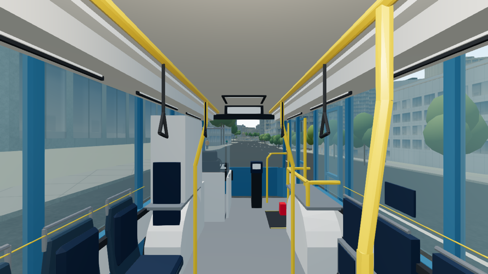
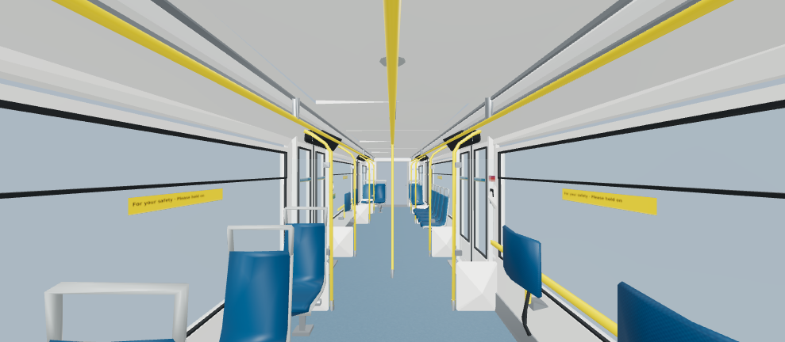
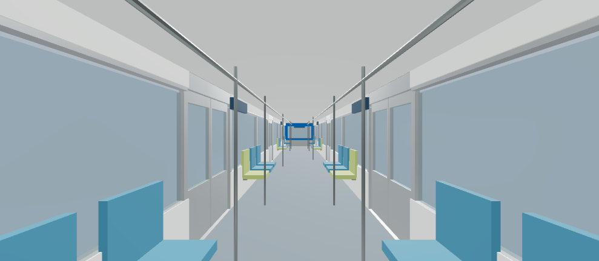

# Stage 2 公車與 SkyTrain 車廂整合（2026-10-09）

本次沿用 Stage 2 已封存的 GLB 與可編輯來源，正式接入公車 v2 的預算內裝，以及獨立的 SkyTrain 單車廂展示。公車延續既有近景車流和停放參觀流程；SkyTrain 提供 Mark V A 型端車與 Canada Line 的固定視角展示。完整列車服務、車站、跨車廂步行和移動乘車仍待後續整合。

本文件記錄本次 consumer 與部署邊界。[Stage 2 原始交接](city-life-transit/STAGE2_HANDOFF.md)、各資產包 README 與 `qa/` 保留原來的離線交付狀態；其中的測試數、`not_run` 與 production 隔離結果屬當時的來源封存，不能代替本次整合驗收。[先前公車整合](BUS_INTERIOR_INTEGRATION_2026_10.md) 的 v1 數字也不再代表新版內裝成本。

## 正式入口與範圍

- **公車**：主城使用 `CityBusAssets` 的明確 `interiorVersion: 'v2'` 選項；未指定時仍保留既有 v1 行為。沿用原外殼、真實車門動畫、街道路段放置、上下車門洞與室外地面轉移。新版有 24 個座位及一個合格低地板站立視角；站立眼高沿用來源 `aisle-camera` 的 1.99 m。座位預覽只移動相機，不移動已佔用的乘客錨點。
- **SkyTrain 車廂展示**：主城按鈕開啟獨立對話框，可選 Mark V 或 Canada Line、座位／站立視角、展示品質，拖曳或方向鍵環顧並重設視角。Mark V 有 22 個座位視角，Canada Line 有 20 個；各有一個站立視角。這些是代表性固定相機，不是自由行走或上下車流程。
- **列車邊界**：metadata 明確保留 `scope: 'single-cabin-display'`，`boardingEnabled`、`serviceEnabled`、`intercarTraversalEnabled` 均為 `false`。Mark V 只載入一節 A 型端車內裝；Canada Line 展示一節車的內裝與外殼，未啟用來源中的兩節編組服務。

公車面板的預設／保存選項會以當前車廂的實際 anchors 解析：v1 的 `main-aisle` 保留，切換到 v2 時改用 `low-floor-aisle`，不會把失效的舊 ID 傳給上車操作。已上車時優先保持合法的目前預覽視角；沒有可用錨點時停用上車。此修正涵蓋首次未選座位直接上車，以及跨來源保留舊選項的情況。

公車後段抬高甲板的代表性淨高約 1.92 m，只供座位用途；台階不是站立位置。簡化輪椅保留區不代表無障礙認證。車內移動採已驗證的固定錨點；`BusCabinSurfaces` 以實際向上的 GLB 地板三角形檢查站位、台階和門檻接續，並配合保守障礙物範圍。這次沒有增加自由步行導航或移動車流碰撞。

## 來源與精確部署清單

來源作者、專案與授權資料沿用原 metadata／scene provenance：Vancouver Living Atlas by YiTaChen，Vancouver Living Atlas Noncommercial Research and Attribution 1.0。GLB 是原始來源 export 的直接複製；runtime manifest 是經驗證的 canonical projection。

| 用途／來源路徑 | 來源 revision | 來源 manifest SHA-256 |
| --- | --- | --- |
| 公車 v2：`tools/assets/boardable-bus-v2/runtime-candidate/` | `28a23c86821a7502faa7425da6e430d625d97ac1` | `84c358c33e2a76dd2274bb41cb9443c3c4e0f3d923f59b0038595ae6d6a1a413` |
| Mark V：`tools/assets/skytrain-mark-v-interior/` | `28a23c86821a7502faa7425da6e430d625d97ac1` | `cce42ba145cd6b8385eb2e3aeb8cd6fe39fa8b7a56cf0a53c096b478d42c9cb5` |
| Canada Line：`tools/assets/canada-line-stage2/` | `b18c6b591adce8f5114daab5e19e60090b80bc23` | `7522ab7691beb92c1066f4684c86d1298a06f9f39cb1cd17a7d1fd33cb6f36aa` |
| 重用既有公車外殼：`tools/assets/boardable-bus/` | `c9d184a4a176aefecf2aaf2b8341ba4f406f4ee9` | `32a35e7fdaa0f82600f8d161212b952177fae8515ca8095b2d55be118503076e` |

Mark V 座位朝向另固定到 `layout-assumptions.json` 的 SHA-256：`72273c99052fb68be38c436b76ab4663795dad452c07608826e39927b11b4538`。Canada Line 座位眼點使用來源 pelvis 錨點加 0.59 m；Mark V 使用來源 eye 錨點。兩檔 LOD 的相機錨點與朝向均經投影檢查。

以下路徑相對於 `public/models/blender/`。大小為完整檔案 bytes，三角形與 primitive 由交付 GLB 實測；primitive 數不等同 WebGL 全部 draw calls。

| 檔案 | Bytes | 三角形 | Primitives |
| --- | ---: | ---: | ---: |
| `bus-v2/city-bus-12m-interior-v2-runtime.lod0.glb` | 736,884 | 11,704 | 11 |
| `bus-v2/city-bus-12m-interior-v2-runtime.lod1.glb` | 202,492 | 2,824 | 11 |
| `bus-v2/manifest.json` | 495,627 | — | — |
| `metro/mark-v-a-car-interior.lod0.glb` | 1,179,164 | 11,016 | 10 |
| `metro/mark-v-a-car-interior.lod1.glb` | 306,220 | 2,976 | 10 |
| `metro/canada-line-shared-interior.lod0.glb` | 138,444 | 1,320 | 6 |
| `metro/canada-line-shared-interior.lod1.glb` | 103,712 | 984 | 6 |
| `metro/canada-line-endcar-exterior.lod0.glb` | 177,352 | 2,220 | 43 |
| `metro/canada-line-endcar-exterior.lod1.glb` | 164,856 | 1,964 | 43 |
| `metro/manifest.json` | 23,928 | — | — |

新增精確 **10 檔**：8 個 GLB 共 **3,009,124 bytes**，兩份 manifest 共 **519,555 bytes**，總計 **3,528,679 bytes**。其中公車 v2 共 1,435,003 bytes，metro 共 2,093,676 bytes；總計不包含先前已部署的公車外殼。每檔 SHA-256、來源路徑與 revision 保存在 [adopted inventory](../public/models/blender/adopted-manifest.json)，並由 [公車投影](../tools/project-bus-v2-runtime.mjs) 與 [metro 投影](../tools/metro-projection.mjs) 從 pinned 原始來源重新驗證。

公車 v2 與 Mark V 的 B-CAB 上限相同：LOD0 ≤ 12,000 三角形／1,572,864 bytes，LOD1 ≤ 3,000 三角形／393,216 bytes。Mark V 原始貼圖的不同 maps 按 RGBA8 加完整 mip chain 估算，合計低於 16 MiB；這是來源貼圖估算，實際 renderer 數字另記於 GPU 證據。

公車詳細 master 的兩檔仍為 30,200／14,984 三角形及 2,634,280／1,449,360 bytes，超出 B-CAB，且保留原始門口 10 cm 支撐缺口。正式採用的是獨立 `runtime-candidate`：兩塊與車門齊平的支撐板補上缺口，每檔新增 24 三角形，已包含在表列成本內。Mark V 高細節 study、Canada Line 外殼 LOD2、component sidecars、Blender 來源和預覽均未部署。

## 畫質、成本與資源生命週期

主城原本的 Auto／手動平衡、高、Ultra 品質仍由既有控制器管理；既有旅行與快速移動的細節抑制策略保留。沒有改寫來源 PBR 色彩、roughness、metalness、透明度、貼圖或玻璃設定。共用材質需要頂點色彩時，只對缺少 `COLOR_0` 的 mesh 補中性白色。

| 公車場景 | 使用與上限 |
| --- | --- |
| 遠景、未載入、失敗或近景超額 | 沿用原廉價 instanced 公車；冷遠景不請求 manifest／GLB |
| 近景車流 | 原外殼 LOD1 + v2 內裝 LOD1；最多 4 台，相容模式 2 台；80 m 進入、110 m 退出 |
| Auto 快速旅行 | `allowNew` 暫停新細節載入／加入；既有合格車輛可保留 |
| 停放參觀 | 原外殼 LOD0 + v2 內裝 LOD0；最多一個 live owner，模板最多 4 個 |

公車以完整 `shared_surface_id` 與 PBR surface identity 共用至多 15 個材質批次，保留不同坐墊／外殼材質差異。玻璃可能需要額外 pass，不能把 15 當作實際完整 draw calls。關閉參觀釋放 instance 與 mixer，保留有界模板供重用；城市 dispose 時釋放模板、共用材質與幾何。失敗或晚到的來源載入按原生命週期回收。

SkyTrain 只載入目前選擇的 cabin／LOD：Mark V 為一個內裝，Canada Line 為同檔 LOD 的內裝和外殼。模型或 LOD 切換取消舊 owner；配對載入以 `allSettled` 回收成功但未採用的 sibling。不可取消的貼圖解析晚到結果依 generation 回收。關閉後沒有全域保留的 geometry／texture cache。

展示品質「沿用城市」在城市平衡時選 LOD1，其餘選 LOD0；「輕量」選 LOD1，「細節」選 LOD0，相容模式一律 LOD1。展示使用城市當下實際 Auto／手動 pixel ratio，另限制輕量／相容模式 ≤ 1、其他 ≤ 2、總實體像素 ≤ 1,800,000、單邊 ≤ 4096。展示選項不改寫城市品質偏好。

展示 renderer 採變更時 invalidation：固定畫面只排一個 RAF，隱藏時保留 dirty 狀態而不排 frame。開啟對話框暫停城市 RAF 與 simulation clock，清除持續按鍵／相機飛行；關閉重設 FPS 和 Auto timing 基準，不追趕經過的時間，僅排一次恢復 frame。BFCache 的 `pagehide`／`pageshow` 與 active cabin 狀態共同決定是否恢復。

展示 renderer 完整釋放 geometry、material、texture／ImageBitmap、mixer、renderer、PMREM／environment、ResizeObserver、事件與 RAF；共享資源只 dispose 一次。建構途中失敗會反向回收已取得資源。Portal canvas 使用 callback ref 確認掛載後才建立 renderer。載入／建構失敗或 `webglcontextlost` 顯示錯誤；「重試」更換 canvas 並新建 renderer，不沿用失效 context。展示專用 exposure 0.9、environment intensity 0.5 與降低後的光強只調整展示照明，未改來源材質或城市夜景。

## 原始來源保留與下一階段

Stage 2 `release-inventory.json` 的 **303 個檔案**逐一核對 bytes、SHA-256 與 Git blob SHA，全部相符。詳細 master、`.blend`、原 GLB、來源 manifest、CPU 預覽和既有 QA 報告均保留；本次 consumer 不覆寫已公布的公車／metro／站點原始介面。

七站 Waterfront、Burrard、Granville、Stadium–Chinatown、Main Street–Science World、Vancouver City Centre、Yaletown–Roundhouse 仍完整保留於 `tools/assets/skytrain-stations-stage2/`，未掛入城市或部署。Waterfront 具有分開的 Expo／Canada 空間；離線契約為 7 站、16 stops、167 surfaces、156 門介面、184 anchors。其高度、地下深度與入口開口仍屬代表性資料，不能直接宣稱已與現有地形接通。

四個互動人物及 `interactive-renderer-candidate.ts` 仍離線，沒有掛載、沒有取代既有街道行人，也沒有新增人口 selector。服務 5／6 公車、七站旅程、Waterfront 轉乘、GTFS 班次、月台橋板部署／收回互鎖和 moving-service boarding 均未交付。

下一階段需建立與驗證 Mark V 專屬編組／平台 profile。其來源 floor Y=0 是內裝基準，約 16.335 m envelope 的單 A 型端車不是舊 Expo 四節模板；既有站點不能直接套用。兩節 A 車 yaw π 的來源 QA mock-up 只驗證貫通幾何，不是 C 車或完整五節列車。Canada Line 另有兩節 41.512 m profile 與 rail-datum floor Y=1.10 m；第二節 yaw π 會翻轉 car-local 門側，不能混用 Expo 門間距／平台設定。

## Blender roundtrip 的版本邊界

來源封存的 25 個可編輯來源重開與 byte-identical reexport 證據，使用 **Blender 4.3.2**。本次獨立複查以本機 **4.5.12 LTS** 開啟現存 `.blend`，經各包 `export.py --output /tmp/...` 輸出副本；沒有重跑 builder、覆寫來源或更新已封存報告。

25 個均成功重開／匯出，但新版本輸出 **0／25 byte-identical**。其中 22 個保留相同三角形、頂點、primitive 與 bounds；Mark V 的三個 export 因新版評估／匯出結果出現細小差異：LOD0 11,016 → 10,994 三角形／1,176,788 bytes，LOD1 2,976 → 2,986 三角形／307,300 bytes，study 131,102 → 131,056 三角形。兩個 runtime LOD 的 bounds 差異不超過 4.8×10⁻⁷ m，仍在原預算內。

正式交付沿用上表原始 export 雜湊；4.5.12 結果只證明來源可開啟與再輸出，不能擴張為跨版本 byte identity。後續確有資產編輯時，先固定 Blender 版本，再重新量測、驗證來源與 GLB、更新 provenance／projection 和驗收證據；不要直接以重匯出檔替換目前 pinned payload。

## 驗證與部署閘門

- `npm run check`：通過；預設上車選項修正後的最終 `npm test` **989／989**，0 fail／skip／cancelled。
- 新增／修改的 runtime、投影、guard 與 regression tests scoped oxlint：通過；不宣稱既有全 repo lint 已清零。
- 針對 `bus-visit-selection`、`bus-v2-runtime`、`skytrain-cabin`、`engine-lifecycle`、`stage2-transit-adoption` 的獨立複查：**34／34** 通過。含實際 v1／v2 預設上車選項、真 GLB loader／PBR／anchors、support、取消／晚到、一次性 dispose、建構失敗回收、重試新 canvas、context loss 與城市暫停／BFCache。
- 來源獨立 Python 契約測試：人物 11、公車 master 23、budget derivative 39、Mark V 30、Canada Line 19，共 **122** 通過；station validator 與 10 個負例另通過。七站橋板另驗證 9,828 支撐樣本、5,616 sampled poses 與 3 個碰撞 fixtures；這是離線樣本檢查。
- `npm run build:firebase`：通過。既有 `verify-bus-adoption.mjs` 繼續保護原公車 6 檔；新增 [Stage 2 guard](../tools/verify-stage2-transit-adoption.mjs) 由 `verify-firebase-build.mjs` 無條件執行，確認精確新 10 檔／3,009,124 GLB bytes／**187 個不同來源雜湊**。

Stage 2 guard 不相信公開 manifest 自述：它從 pinned source manifest、GLB、`.blend` 與 Mark V layout 重建 canonical metadata，再核對完整 inventory、檔案 bytes／SHA-256 和 metadata。詳細 master、station、未掛載人物、預覽、可編輯來源及移到其他路徑的相同來源 bytes 仍禁止進 production；`InteractiveRendererCandidate`、`interactive-skin-v1`、`/__offline-assets/` 也不得出現在正式輸出。舊 `tools/stage2/verify_isolation.py` 的零採用封存結果保留作來源歷史；本次核准例外的正式部署政策由新 guard 管理。

可重複執行的核心檢查：

```sh
npm run check
npm test
node --test tests/bus-visit-selection.test.mjs tests/bus-v2-runtime.test.mjs tests/skytrain-cabin.test.mjs tests/engine-lifecycle.test.mjs tests/stage2-transit-adoption.test.mjs
npm run build:firebase
# build:firebase 已包含；也可對完成的 dist/client 再檢查：
node tools/verify-stage2-transit-adoption.mjs
```

## 最終 GPU／viewport 證據

[原始 checkpoint、JSON 與選定 PNG](qa/stage2-transit-20261009/) 與 [操作紀錄](qa/stage2-transit-20261009/browser-acceptance.json) 由實際頁面的 opt-in QA 按鈕保存，並逐張檢視。被測 parent revision 是 `c3b66985d7ac1612b4cf54aeb6574214ea113f3b`，當時尚未提交的新 consumer 以完整 visual source fingerprint `f27b3f38ad3e44e45208c715e311558a48f02d37a59492429ec31903e441200c` 識別；本次提交包含該凍結版本。GPU 為 ANGLE Metal AMD Radeon Pro 560X，城市桌面 viewport 1280×720，展示 canvas 989×432，pixel ratio 1。

| 真實展示 checkpoint | LOD | Draw calls | 提交三角形 | Geometry／texture 數 |
| --- | ---: | ---: | ---: | ---: |
| Mark V 站位 | 1 | 11 | 3,146 | 10／5 |
| Mark V 站位 | 0 | 11 | 11,534 | 10／5 |
| Canada Line 站位 | 0 | 46 | 3,408 | 46／2 |
| Canada Line 後側座位 | 1 | 17 | 2,000 | 46／2 |
| Canada Line 窄螢幕重開站位 | 1 | 46 | 2,880 | 46／2 |

以上是實際相機剔除、玻璃 pass 後的單張成本，不能與來源總三角形或整座城市互換。重開後 Canada Line geometry／texture 計數維持 46／2。畫面靜止不持續排 RAF 的行為另由 frame unit tests 驗證。

公車首次不選座位直接上車成功，預設為 `low-floor-aisle`；24 個座位均出現在選單，實際操作低地板站位、後段 seat-24、23:00 前段 seat-01，並驗證下車恢復 ready、關閉恢復 idle。checkpoint 所見 owner=1、materials=15、templates=4、errors=[]。51／37／39 FPS 是同一台機器不同視角的即時值，不能宣稱相對舊版的效能提升。

展示實際切換兩款模型／兩檔 LOD，操作座位、方向鍵與重設視角，關閉後 canvas 移除且焦點回到入口，城市恢復更新。375×812 的 responsive viewport 中，對話框寬 351、canvas 327×365、document scrollWidth=375，未發生橫向溢出；Escape 關閉並恢復焦點。測試期間 console error／warning 均為空。建構失敗、網路取消、context loss／Retry 與 BFCache 的失敗路徑由回歸測試驗證，沒有把這些 unit tests 標示成手動 GPU 測試。

Responsive viewport 使用桌面 GPU，尚未代替實機手機或其他 GPU 驗收；完整旅程、移動列車、車站和長時間服務效能亦不在本次展示驗收範圍。






