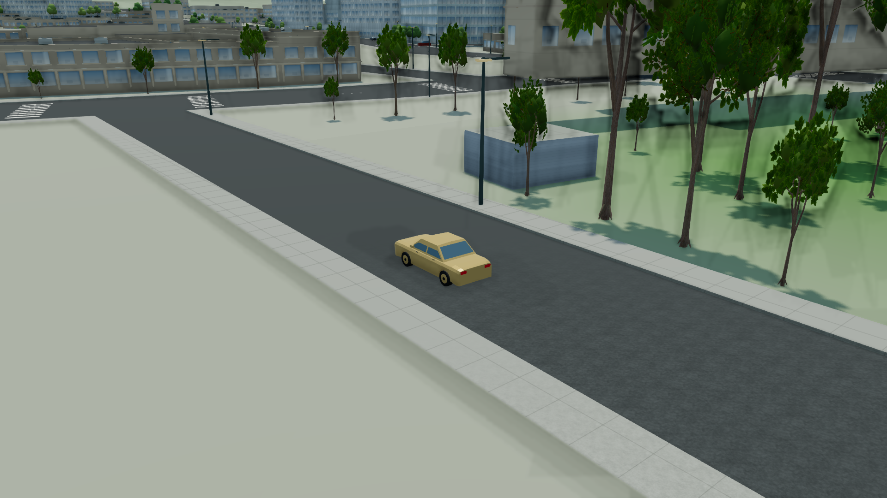
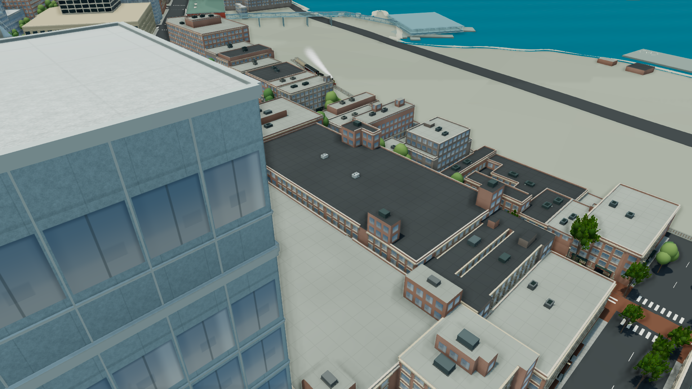

# Blender 城市 consumer 驗收摘要（2026-10-03 交付）

[acceptance.json](acceptance.json) 記錄原始 JSON/PNG 路徑、bytes、SHA-256、實際 quality/count、相機、RAF 與來源指紋。它是樣區採用決定的可追溯摘要；最後check、完整718/718 tests、production build/isolation及QA修復後release reverify均已通過；post-commit狀態連結PR。來源為 `assets/development-backlog-oct3` 的 `dc6e6b5dd14ed83b1909e677d611d8c2eba3b559`，共同城市基準為 `5574d55719f10d1575127d8b92cbd23ff71e446f`。

原始 capture 的 `revision=dc6e…` 是當時 checkout 的交付父 commit。實際 bundle 含未提交的整合修改，不能把它說成已提交 release；各組 `sourceFingerprint` 區分真正的 build。最終整合commit不預寫；post-commit狀態沿PR連結追查，不能只由父commit推論main merge或部署。

## 採用範圍與界線

| consumer | 正式限額 | 已做／未做 |
| --- | --- | --- |
| 一般車流 sedan/SUV | 三 LOD；近64／中192車，其餘LOD2；最多18 material batches，常見遠景6；453,244 bytes，零新 maps | 保留287個來源route actors與速度／phase。不是可搭乘、可進入或使用者駕駛車艙。 |
| 三型 HVAC | 兩cells；High24／Ultra48組；camera到來源cell bounds 550m；同cell共享LOD，80m進入／95m退出；149,912 bytes，零新maps | 成功模板只替換完整來源設備群，未成功模板保留fallback。四光照實測是High24，不能當獨立Ultra48性能驗收。 |
| maple/alder成年闊葉 | **僅Ultra，45m內最多8棵**；High/Balanced為0；四batches、兩LOD0 GLB 1,557,564 bytes＋四共用maps | source樹高、位置、seed與總量保留；實測有畫質／RAF成本取捨，沒有FPS提升。 |
| 新針葉 | 拒用正式近景geometry | Root真實canvas視覺審核認為不透明綠色層片更明顯。保留原consumer；不是CPU hash驗證失敗。 |
| bus/metro | 正式consumer及搭乘延期 | 有獨立模型WebGL外殼／內裝inspection；門輪合批、lazy interior、service、collision、乘客／相機及上下車狀態仍未接合。 |

四張新樹maps完整RGBA8 mip-chain估計約6.333MiB，屬估算新增貼圖而非實測VRAM，不扣仍保留的原材質。從Ultra切回High時候選count0證明視覺slot回復，沒有宣稱GPU貼圖立即回收。public逐檔清單共19個payload、**2,664,657 bytes**（含衍生metadata，不含adopted-manifest自身）。正式文件與逐檔清單見 [整合報告](../../BLENDER_INTEGRATION_REPORT_2026_10.md)、[adopted manifest](../../../public/models/blender/adopted-manifest.json)。

## 真正配對樣區

正式consumer四光照採晴14h、陰14h、黃昏19.8h、夜23h，同相機1920×1080，5秒warmup＋8秒RAF。所有24筆配對row的 `valid=true`，實際quality與sourceFingerprint按組一致；數值保留完整精度於JSON。硬體為ANGLE Metal／AMD Radeon Pro560X。

| 樣區 | 光照 | baseline → Blender FPS | 觀測變化 | 實際quality |
| --- | --- | --- | --- | --- |
| 一般車流 | clear | 22.29 → 22.17 | -0.52% | high |
| 一般車流 | overcast | 22.79 → 22.11 | -3.01% | high |
| 一般車流 | dusk | 22.44 → 21.80 | -2.83% | high |
| 一般車流 | night | 22.53 → 21.27 | -5.57% | high |
| 來源屋頂設備 | clear | 26.67 → 26.77 | 0.36% | high |
| 來源屋頂設備 | overcast | 26.94 → 26.62 | -1.18% | high |
| 來源屋頂設備 | dusk | 26.91 → 26.84 | -0.27% | high |
| 來源屋頂設備 | night | 26.91 → 28.14 | 4.56% | high |
| 近景闊葉0→8棵 | clear | 25.62 → 19.18 | -25.14% | ultra |
| 近景闊葉0→8棵 | overcast | 26.02 → 19.06 | -26.75% | ultra |
| 近景闊葉0→8棵 | dusk | 25.97 → 19.11 | -26.42% | ultra |
| 近景闊葉0→8棵 | night | 25.62 → 19.10 | -25.45% | ultra |

這些是**整場景RAF**，不是GPU frame-time或單一模型timer。calls/triangles包含多render passes。車流持續移動，LOD分配／phase與其它scene counters會變；小幅差值不宣稱可重現速度增益。單機短樣本不能外推手機、所有顯卡或長時間thermal表現。

真正Ultra樹來自 `blender-accepted-oct3/tree-ultra-{baseline,blender}-*`，實際 `quality=ultra`、candidate count 0／8。近景FPS約25.6–26.0→19.1–19.2，明列成本。30m／65m、Ultra→High、保留針葉另以四筆smoke記錄距離／quality，沒有把不同相機FPS組成配對。65m是到一棵source probe的距離，aggregate pool仍count8可能屬其它45m內的樹；它不能單獨證明該棵樹的admission。

`blender-ultra-oct3/broadleaf-ultra-*` 名稱含Ultra但實際都是High/count0，全部列為excluded no-op，**不使用其FPS證明Ultra**。較早 `blender-adopted-oct3/adopted-broadleaf-10m-*` 的High8配對保存為拒用High的preliminary成本證據，不是目前High的結果。

## 外觀與未採用模型inspection

`blender-release-oct3/source-traffic-{baseline,blender}` 是既有route0 sedan的實際近景，25m側後、地面＋10m相機、兩次可見RAF後截圖。交通與300×天鐘繼續走，兩張畫面的route phase與相機位置不同；僅證明來源物件的外觀／接地，沒有 matched-phase FPS。

以上兩張複本逐byte保留原PNG，來源／副本SHA在JSON中。其餘raw `work/` 檔案是本機原始證據，不宣稱全部已提交或發布。

目前generic inspection包含bus外殼、metro lead外殼、cedar框晴天，及bus／metro內裝top四光照，共11筆。每次只持有一個原GLB模型，2.5秒warmup＋5秒RAF、實際城市renderer、靜態idle與明確maps readiness；所有記錄valid。Top相機是framing smoke，不能代替walkable內裝的可讀性、門動作、碰撞或搭乘驗收。其後 `blender-final-oct4` 增加bus／metro **interior camera四光照8筆**、roof-mineral-grain 2m coupon與Waterfront capital晴天2筆，generic總計21筆；逐筆SHA與相機都已追加。Root檢視實際PNG：座椅、扶手／rails、地板與天花板可見，每次僅內裝、未載外殼；夜間只有emissive sign，**沒有cabin illumination**。因此維持staged/non-boardable，不能說通過搭乘或完整內裝照明。Roof coupon沒有鋪入城市roof shader，capital沒有完成具名source assembly替換。

## 行進smoke與未通過項目

最後High Robson walk60s原始row `valid=true`／`environmentValid=true`／continuous／inputsHeld成立，走238.472m、59.618simulation秒、collisionFrames0。2400×1350、只按W，沒有重播位置或heading；這是該來源路線的streaming／navigation樣本，不等於所有模式或設備通過。

同批drive60s走538.409m，但**overall valid=false**：inputsHeld=false、stalled=true。environmentValid與measurement.valid雖為true，不能覆蓋continuity失敗；collisionFrames0也不等於成功駕車。trace約32.9645秒起不再出現held W；raw未記traffic-stop state，根因未證實，不將此row標成passing asset gate。兩次原JSON/PNG hash、trace摘要及RAF分佈各自保存。Root當時未觀察到browser error/warn；沒有宣稱另存完整log檔。

## 離線證據與最後驗證

初始common contract 21/21；11類special CPU/source/alpha/fit validator在補依賴及明示歷史consumer契約後通過。原失敗／retry logs均保留，沒有把缺NumPy/Pillow算成素材錯誤。HVAC六份、樹十二份來源另以Blender4.5 source-preserving重匯出至新work目錄；來源hash不變，正式採原交付GLB。跨exporter版本byte不同與UV公差、tree逐vertex未驗的界線均在JSON及整合報告保留。CPU pass不能取代WebGL。

| 最後關卡 | 狀態 |
| --- | --- |
| npm run check | 最終Pass，exit0；check-release-oct4.log完整SHA已記錄 |
| 本機instrumented QA build | Pass；qa-build-final-oct4.log；不可部署 |
| npm test | **最終718/718，fail0／skipped0，117373.831164ms，exit0**；full-tests-release-oct4.log完整SHA。首輪715/718失敗與QA修復後定向11/11均保留 |
| npm run build:firebase／production isolation | 最終Pass，exit0；adoptedFiles19／protectedCandidateHashes176；firebase-build-release-oct4.log完整SHA |
| 正式本機UI smoke | Root重新載入production：ready、QA region absent、browser error/warn空，初始10:00、300×；不宣稱另存browser log |
| commit／push／main merge／部署 | [PR #5即時post-commit狀態](https://github.com/YiTaChen/vancouver-living-atlas/pull/5)；不從父commit推算發布 |

[來源PR #5即時狀態](https://github.com/YiTaChen/vancouver-living-atlas/pull/5)以GitHub頁面為準；發布欄位不由父commit推算。本摘要不預先指定尚未建立的integration commit hash。
