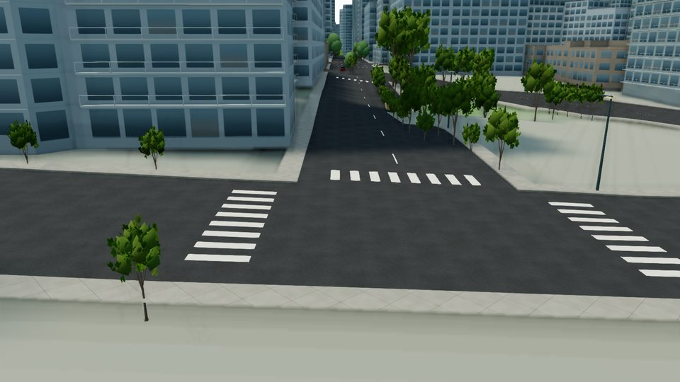

# Vancouver-style buses

Original blue/yellow low-floor model based on the [official TransLink exterior photograph](https://buzzer.translink.ca/2023/02/translink-begins-new-era-of-bus-electrification/). The procedural model adds dark windows, two right-side doors, amber destination pixels, roof equipment, mirrors, rear ventilation and wheels. No downloaded model or photo texture.

26 eligible major-road segments currently receive buses in place of ordinary-car slots, capped at 28. This is illustrative traffic, not a transit route/timetable reproduction. A shared vertex-coloured mesh costs one instanced draw when visible; instances beyond 1 km are omitted, including when zoomed out. The existing traffic toggle controls buses too. Real animation time remains independent of the day/night clock. Ground height and longitudinal grade come from the existing road relief.

Actual browser inspection confirmed moving buses, door-side appearance and distance-based visibility (14 nearby instances at the inspected view). Snapshot provenance is in measurement.json. Two new tests cover shared geometry, range packing, actual position advancement and uphill pitch. TypeScript and all 344 tests passed; the instrumented static production build passed. Final normal Firebase build and long-travel acceptance follow in stage 10.
