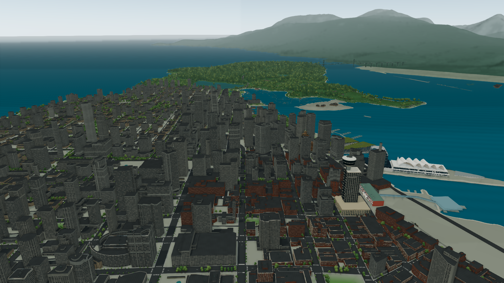
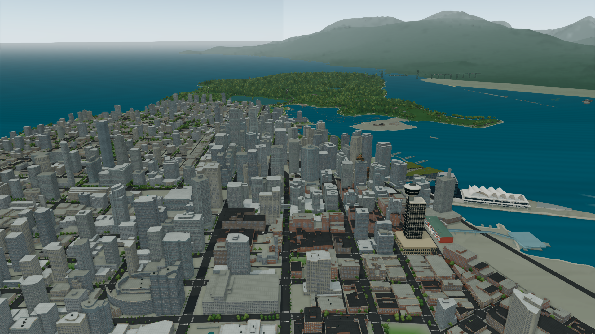
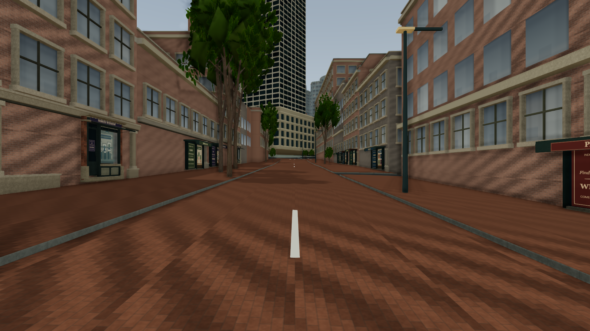
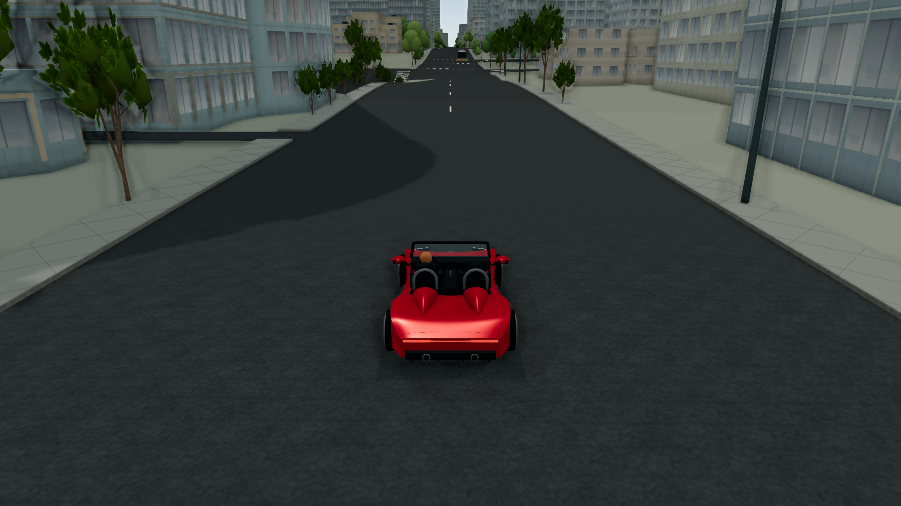

# 2026-10 城市材質明亮度對照

完成 **20 組前後配對、40 份有效 renderer JSON**。採用改良的代表性平屋頂／外牆與玻璃；這是外觀修正，短測沒有 FPS 提升證據。完整原因與實作規格見 [CITY_READABILITY_2026_10.md](../../CITY_READABILITY_2026_10.md)。

## 擷取與版本

實際 Codex in-app browser WebGL、ANGLE (AMD, ANGLE Metal Renderer: AMD Radeon Pro 560X, Unspecified Version)。High、固定 1920 × 1080 drawing buffer、可見頁面至少 5 秒 warmup、來源建築細節 ready，再量測 8 秒未插入 CPU instrumentation 的 RAF。每組 camera／target／mode／quality／atmosphere／hour 均逐欄相等，maxPoseError=0。晴天14h、陰天14h、晴天黃昏19.8h、晴天夜23h。城市時間固定；既有交通、波浪與天空動畫仍會隨渲染時間前進，所以總 draw counters 有少量差異。

全景先於任何 QA 視點控制，使用新載入的正常 overview、距離8700m、FOV42／near2；downtown 用 Upgrade preview atlas-aerial，gastown 與 gastown-roofs 用相應 Upgrade preview，drive 用 burrard-drive。後四者依既有 QA 控制定義相機。textbox Asset checkpoint name 設為 baseline-/candidate-加view，勾選 Capture four lighting conditions，按 Save asset checkpoint。全景既有距離門檻關閉 SSAO/shadows，downtown 近景則開啟；本輪未改門檻或光照。

基準實際 bundle 在修改前從 dfbd80d32a81a8c611ee6a4835e3cf78898d053d 建置，見 [baseline-bundle.json](baseline-bundle.json)。基準 server 啟動時 clock/palette 的工作來源修改已開始，JSON sourceFingerprint 並不代表該舊編譯來源；本輪用獨立、修改前保存的編譯檔 hash 清單識別基準，沒有把 server fingerprint 當成 bundle 證明。候選完成修改並建置後重啟 server、重新載入頁面，見 [candidate-bundle.json](candidate-bundle.json)。兩組 JSON revision 都是未 commit 當時的 parent HEAD；candidate sourceFingerprint 識別工作來源。

[measurements.csv](measurements.csv)、[measurements.json](measurements.json)、[原始records](records)保留全部數據。14 張代表 PNG 原檔無重採樣，[image-hashes.json](image-hashes.json)驗證內容。原40張 renderer PNG 亦保留於本機 ignored work/visual-qa；使用者實景照片沒有發布至 repo。

## 短測數據

數值順序為「原版 / 改良版」。RAF 包含 CPU、GPU 與瀏覽器排程，非 GPU timer；多 pass counters 不等於唯一模型數。未做統計顯著性、手機或長時間 benchmark，不能以單次短測宣稱效能改善。

| 視點 | 光照 | FPS 原 / 新 | p95 ms 原 / 新 |
| --- | --- | ---: | ---: |
| overview | clear | 36.5 / 33.9 | 34.0 / 34.4 |
| overview | overcast | 36.7 / 35.9 | 34.1 / 34.5 |
| overview | dusk | 37.0 / 36.7 | 34.0 / 34.5 |
| overview | night | 36.6 / 36.2 | 34.0 / 34.5 |
| downtown | clear | 24.0 / 23.8 | 50.9 / 50.8 |
| downtown | overcast | 23.2 / 23.8 | 50.7 / 51.1 |
| downtown | dusk | 23.9 / 23.8 | 50.9 / 51.2 |
| downtown | night | 23.8 / 23.8 | 50.7 / 51.3 |
| gastown | clear | 22.8 / 22.9 | 50.9 / 51.0 |
| gastown | overcast | 22.9 / 22.4 | 50.8 / 51.2 |
| gastown | dusk | 23.1 / 22.7 | 50.8 / 51.3 |
| gastown | night | 23.0 / 22.9 | 50.8 / 51.2 |
| gastown-roofs | clear | 29.5 / 29.1 | 49.0 / 48.8 |
| gastown-roofs | overcast | 29.5 / 29.2 | 34.3 / 48.9 |
| gastown-roofs | dusk | 29.6 / 29.1 | 34.3 / 49.2 |
| gastown-roofs | night | 30.1 / 29.0 | 34.2 / 49.0 |
| drive | clear | 30.9 / 30.1 | 34.3 / 48.5 |
| drive | overcast | 31.1 / 30.3 | 49.0 / 49.2 |
| drive | dusk | 31.1 / 30.7 | 34.2 / 34.8 |
| drive | night | 31.0 / 30.6 | 49.1 / 48.4 |

## 陰天代表畫面

[verification.json](verification.json)保存 660/660 tests、42 項定向測試、TypeScript、正式 build／QA 隔離及 landmark worker protocol 的完成結果與本機 log hashes。極光另有 [auto 模式紀錄](aurora-auto.json)與[實際畫面](aurora-auto.png)：23:00、朝北、2400 × 1350，這是額外的視覺檢查，不列入 40 份配對或 FPS 表。極光沿用正常 auto 設定，沒有固定動畫時間或強制 always 模式。

獨立重建正式版後，另以正常 UI 驗證載入中10:00、300×預設及流動開關，未手動改時即觀察到19:37再跨午夜00:48。接著為近景檢查手動固定15:00／海岸陰天，使用 Gastown 步行與 Burrard 駕車快捷入口。[正式UI紀錄](production-ui-smoke.json)包含零QA controls與空 warning/error；[步行畫面](production-walk.jpg)和[駕車畫面](production-drive.jpg)為1280×720正常介面截圖，另列於配對benchmark之外。126秒／156秒的精確時序由clock regression驗證，UI的間隔觀察並非逐秒測時。

市中心原版：

市中心改良版：

Gastown 步行改良版：

駕車改良版：

