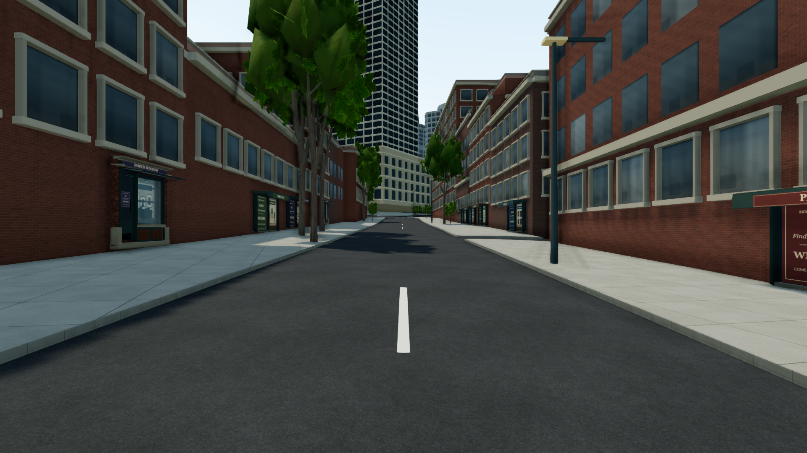
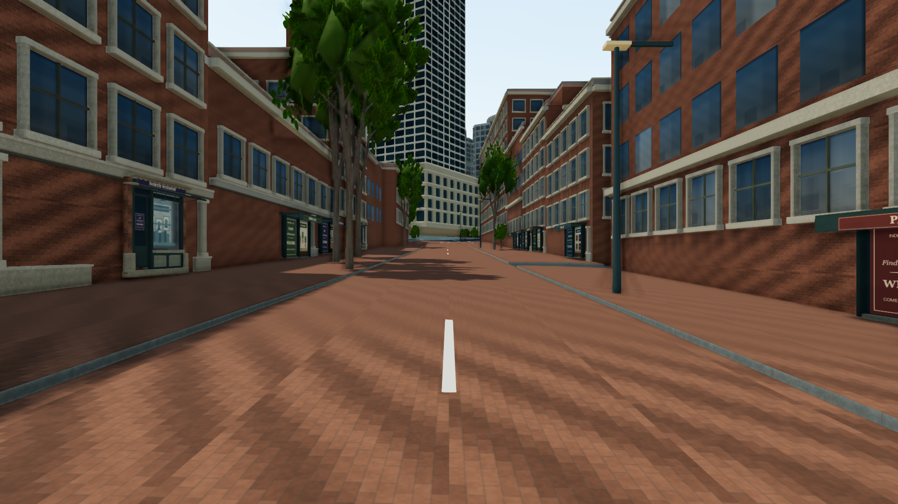
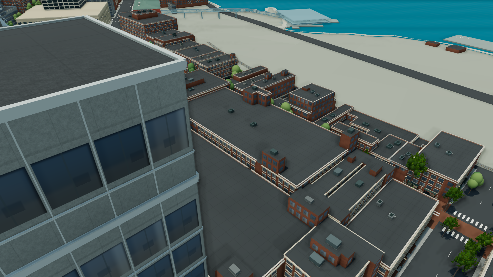
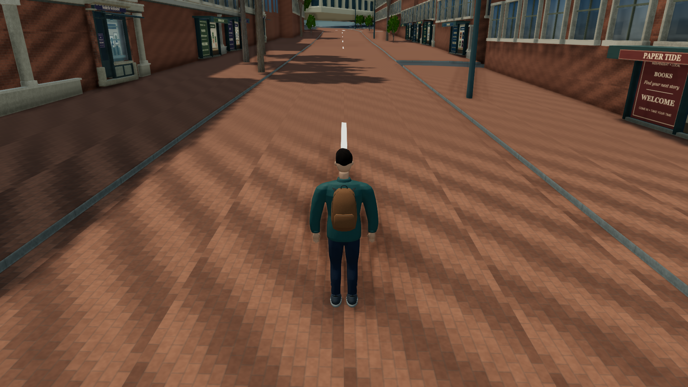
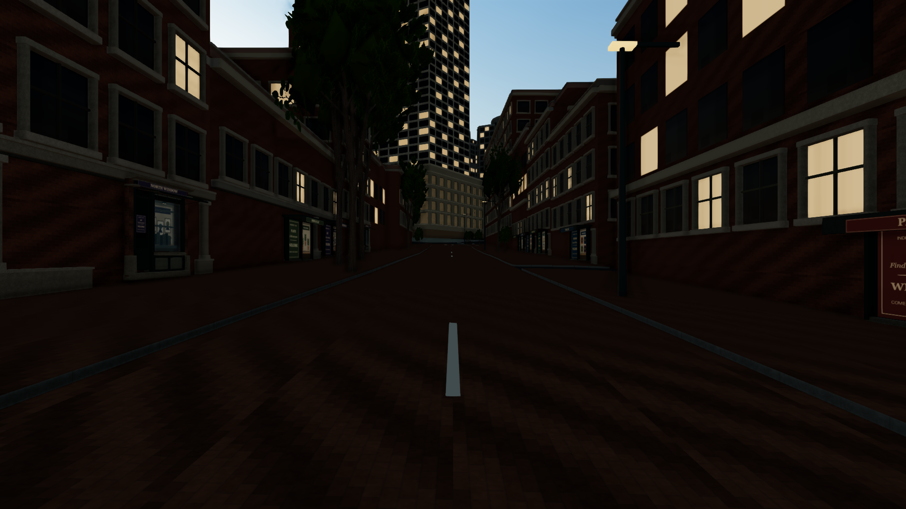
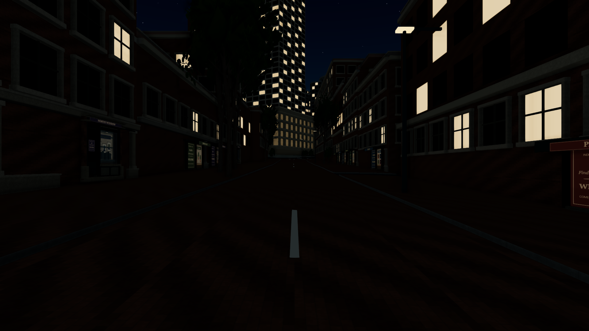
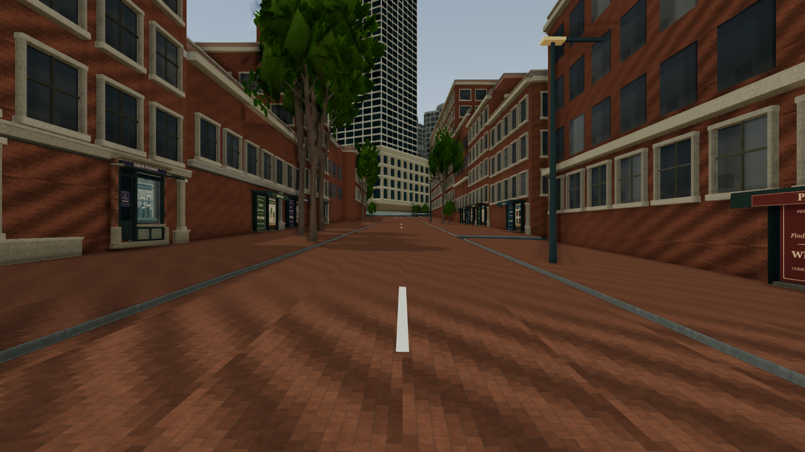
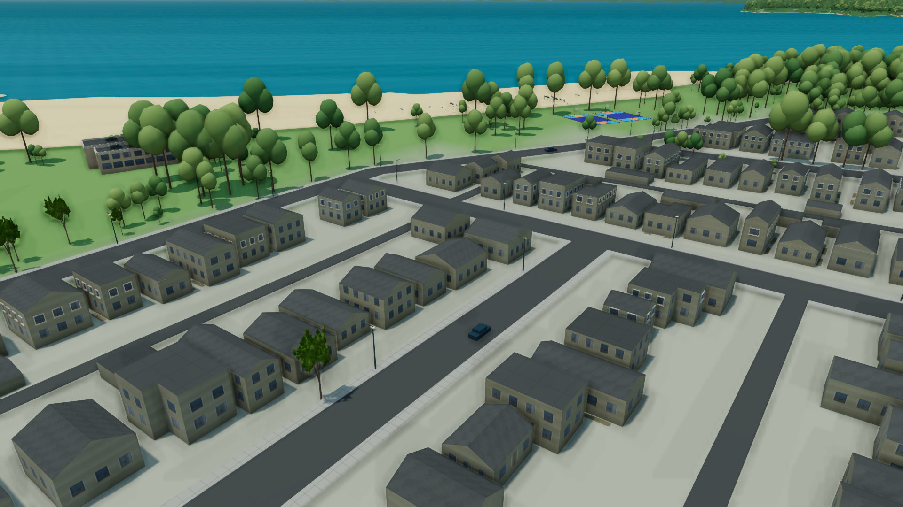
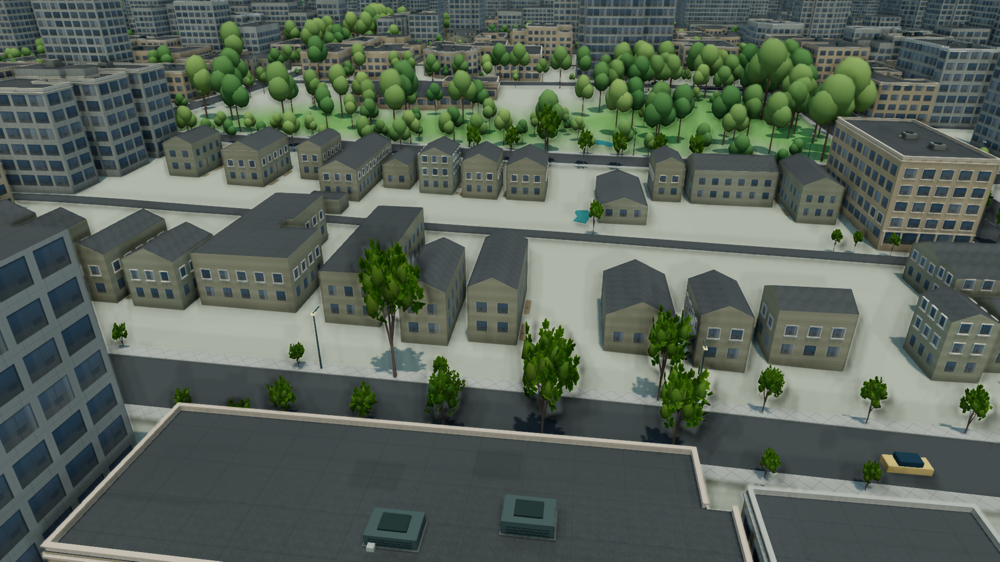
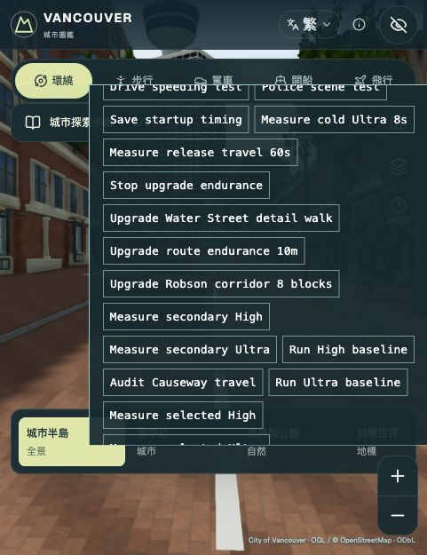

# 共用材質與城市畫質驗收 — 2026-10-01

本輪把八種建材建立成共用 PBR 材質庫，連接 GIS 建築、屋頂、街面細節、道路及兩種既有 Blender 店面模組，並補上可保留手動材質節點修改的匯出流程。固定視角可看到 Water Street 街磚、石材基座／飾邊和窗格細節；完整物件盤點、製作方式及未涵蓋範圍見[城市材質與 Blender 流程](../../MATERIAL_PIPELINE.md)。

**畫質與製作流程有進展；本次資料不支持全面效能提升的結論。** 人物視角由 17.9 降至 15.0 FPS，街面 p95 frame time 也上升。住宅重複感、大片單調地面、遠景樹冠及夜間地面偏暗仍可見。本階段沒有達成穩定 30、50 或 60 FPS，也沒有證明寫實城市或高階遊戲品質已完成。

## 證據與版本

[measurements.json](measurements.json) 保存 25 組最終擷取、10 組 baseline 原始記錄、比較數據、來源 hash、資產驗證與檢查狀態。最終來源目錄為 `work/visual-qa/city-materials-acceptance`，baseline 為 `work/visual-qa/cohesion-baseline`。場景擷取保存九張代表性 renderer 原圖及一張行走 QA 瀏覽器畫面；production UI 另存四張截圖，共十四張原始圖片（9 張 PNG、5 張 JPEG），均逐位元複製原圖，未裁切、調亮或修圖。檔案 hash 與原始路徑列於 JSON 的 `images`。瀏覽器截圖來源雖命名為 `.png`，實際編碼為 JPEG；歸檔僅把副檔名修正為 `.jpg`，沒有重新編碼。

兩次擷取記錄的 parent HEAD 都是 `95feaa7b0ff48f6b4085b020ee2e5ac2b47b9011`，當時的階段改動尚未 commit。Baseline source fingerprint 為 `18d7952345627251e7a617d512d9b9fcd93139aa41ad0cb7c293d253dcd2188a`；最終擷取為 `133f44763421c8438bff3468b82a65343924853c85ebd1a939d4cdc53fc4f4d0`。

本次擷取時使用的 `serve-visual-qa.mjs` 版本，其 fingerprint 涵蓋 `lib`、`app`、`components`、資料、舊貼圖、模型及相關設定，**未涵蓋新增的 `public/materials`**。擷取完成後，工具已補入 `public/materials`，供未來 fingerprint 使用；沒有重啟當時的 server，也未重寫既有證據。材質另以每組擷取的 `sharedMaterials.mapFiles`、實際 PNG bytes/hash 和 [Blender 驗證報告](city-materials-final-validation.json)交叉核對；全部一致。材質 manifest SHA-256 為 `0a2ba06267b2d172908e89a5ed3cc9b514f0ca398435c9c3cc31d03e9e5861f4`。Source fingerprint 本身不等同已送達瀏覽器 bundle 的完整證明。

最終擷取後，production UI 檢查發現天氣選單初始值顯示 raw `clear`，因此 `app/page.tsx` 僅補上所選值的翻譯標籤。上述 fingerprint 屬於這項 UI 標籤修正之前；3D runtime、public 材質與擷取相機不因該修正改變。Production build／UI 狀態於下方分開記錄。最終 runtime／資產／Blender 來源實作 commit 為 `c3feda26008bd7ec9544a5fd188db7a933d8fb37`，包含這項 UI 標籤修正；本文件與 main 合併另行處理。

## 固定視角與實測效能

裝置為 AMD Radeon Pro 560X，Chrome 154 / ANGLE Metal。四組比較皆為 High、14:00、1280 × 720 viewport、**1920 × 1080 drawing buffer**。各自至少暖機 5 秒，等待所選建築與適用街面／人物資產完成，最多 30 秒，再量測約 8 秒可見 RAF。兩邊均 `valid=true`、`warmupVisible=true`、`detailReady=true`；相機、target、FOV、位置、選取的 architecture 與街面配置相同。Baseline 未記錄 atmosphere 欄位，最終值為 `clear`。

這是每個視角各一次短測，沒有重複測量或統計顯著性。Draw calls、triangles 包含多 pass 提交，不能當成獨立模型數。

| 視角 | Baseline FPS | 最終 FPS | Baseline p95 ms | 最終 p95 ms |
| --- | ---: | ---: | ---: | ---: |
| Gastown 街面 | 17.76 | 18.43 | 67.0 | 83.3 |
| Gastown 屋頂 | 21.85 | 22.97 | 66.5 | 50.7 |
| 城市鳥瞰 | 19.38 | 19.43 | 66.7 | 66.7 |
| 人物視角 | 17.95 | 15.04 | 83.2 | 149.7 |

| 視角 | Draw calls，前 → 後 | Triangles，前 → 後 | Textures，前 → 後 |
| --- | ---: | ---: | ---: |
| Gastown 街面 | 1,397 → 1,199 | 8,205,883 → 8,309,687 | 54 → 51 |
| Gastown 屋頂 | 540 → 397 | 4,650,019 → 4,831,151 | 49 → 46 |
| 城市鳥瞰 | 1,190 → 1,122 | 7,215,143 → 7,473,349 | 45 → 42 |
| 人物視角 | 1,328 → 1,146 | 7,394,699 → 7,501,615 | 58 → 55 |

四個視角 calls 與 textures 都減少，但 triangles 都增加。人物 FPS 下降約 16.2%，p95 上升約 79.9%；街面平均 FPS 小幅上升，同時 p95 由 67.0 增至 83.3 ms。這些觀察不能簡化為「共用 atlas 讓遊戲變快」，也尚未隔離人物視角 frame-time 退步的原因。

Baseline：原本的街面與樹木，固定 14:00 相機。

最終：同一相機，街磚、石材基座／腰線與窗格變化可辨識；原有門店位置、街道與建築主體仍可直接對照。

屋頂：牆體、屋面與飾邊使用共同表面來源；大片港區地面及簡化幾何仍明顯存在。

人物：這是既有角色在本輪材質場景中的對照，不能算作本輪重新製作人物。此視角的效能退步保留在上表。

## 時間與天氣

16 組照明擷取涵蓋街面／屋頂 × 晴天／陰天 × 14:00、19:00、19:48、23:00，全部 `valid=true`、1080p，材質 ready 且三張 atlas hash 一致。既有 14:00、19:00、23:00 六組晴天視角可與 baseline 對齊；19:48 與陰天是新增覆蓋，沒有本輪對應 baseline。Lighting 記錄有固定姿態及材質狀態，未獨立記錄 architecture/detailReady 欄位，因此不把它們當成額外的 streaming readiness 實測。

19:48：窗戶與街燈開始主導畫面，天空仍可辨識；街道、店門和石材細節已有明顯變暗。

23:00：發光窗格清楚，路面和行走空間仍偏暗。這張原圖保留這個限制，不能視為夜間可玩性或照明品質已完全解決。

陰天 14:00：天空與日照對比減弱，材質顏色和街面細節仍可辨識。這是預設氣氛驗收，沒有宣稱對應當日真實天氣。

## 區域與住宅接地

四組區域視角皆為 High、1080p、clear，全部有效且所選 architecture 無 pending/building cell。Kitsilano／West End 的坡屋頂類型來自 `cov-2009`；坡度與屋脊方向仍是代表性推導。

| 視角／來源 | 90 m 內來源坡屋頂 | 90 m 內住宅 plots | 模組檢查 |
| --- | ---: | ---: | --- |
| Kitsilano，`134681` | 42 | 25 | 來源支援的住宅屋頂 |
| West End，`145450` | 25 | 14 | 來源支援的住宅屋頂 |
| West End modern bay，`140475` | — | 2 | Ready，3 primitives，1 LOD0 bay |
| Yaletown modern bay，`143422` | — | 2 | Ready，3 primitives，1 LOD0 bay |

這些是地理範圍內的數量，不是畫面可見數量。住宅接地系統實際建立 500 plots、977 土床、1,954 株矮植栽、20,174 triangles、140 batches，低於 38,000 triangles 的硬上限；全部數量不等於同時繪製量。新土床是代表性補充，不是實測庭院還原。現代 bay 是來源邊緣上的原創入口模組，不能解讀成真實可進入的大廳。

Kitsilano 原圖仍可見重複的住宅輪廓、遠景樹冠與大片淺色地面。

West End 的近景樹木與房屋材質較明確，但地表過渡和住宅個體差異仍不足。

## Water Street 持續行走

一段真實 W 輸入完成 **60.031 秒、232.447 m**，只有測試前的一次 initial placement，量測期間沒有重寫位置或朝向。1,770 次 movement update 的 blocked move、ground rejection、protected-surface rejection 均為 0；stalled windows 為 0，無隱藏、context lost、離開來源走廊或未觀測位移旗標。原始 leg 與 13 筆 trace 保存在 `measurements.json`。

這次 drawing buffer 是 **601 × 781**、viewport 481 × 625，與上面的固定 1080p 完全不同。其 29.48 FPS、p95 50.9 ms 只描述這一段低解析度行走，不能用來宣稱 1080p 達到 30 FPS。既有 controller 的 simulation time 為 58.112 秒，setup 距離與時間不納入 walking metrics。

14 次資源觀察中，architecture cache 固定 38／38；streetscape cache 6 → 8，低於 12 上限；textures 固定 60；geometries 範圍 788–791、最後 790。JS heap 受 GC 影響，約 686.6–739.1 MB，末值比初值多 0.33 MB。這支持本路段短期持續操作與快取有界，並非全城碰撞或無記憶體洩漏證明。[瀏覽器診斷](browser-diagnostics.json)沒有記錄到 console entries。

## Blender、匯出與資源驗證

- [共用材質驗證](city-materials-final-validation.json)：8 種材質、3 張 1024 × 512 atlas；PNG CRC、尺寸、wrap padding、encoded average、normal／ORM 通道及 hashes 通過。三張 PNG 共 833,505 bytes；以 RGBA 加 mipmaps 估算約 8 MiB 僅代表共用材質庫，不包含人物、店面 GLB、樹木、陰影或其他場景資源。
- 同份報告實際開啟 5 個可編輯 `.blend`，檢查 packed source maps、色彩空間、ORM 接線與公尺 UV；4 個出貨 GLB 的嵌入 PBR maps／LOD 尺寸通過。GLB 被覆蓋法線有效比例至少 0.999989，未把 atlas 空白區當成表面。
- [四組 GLB roundtrip](streetscape-roundtrip-comparison.json)：兩種模組 × 兩個 LOD 的 counts/bounds、vertex attribute bytes、embedded image bytes 相等。這不是整個 GLB container byte-identical 的聲明，也不代表任何任意幾何編輯都已測試。
- [手動材質節點匯出](artist-export-validation.json)：實際 Blender 基準及受控編輯烘焙通過。Linear `[0.18, 0.36, 0.72]` 正確輸出 sRGB `[118, 162, 221]`；ORM 為 `[255, 51, 153]`；tangent normal 為 `[153, 115, 252]`。只有指定磚材的 color/normal/ORM 與 cedar 的 Noise→Bump normal 改變，其餘六個 slot 不變；原始 `.blend` hash 保持相同。這驗證指定節點路徑、通道隔離與原檔保留，不代表所有任意節點圖或接縫都已自動驗收。
- [歷史街面成本盤點](frontage-costs.json)：較早的 source-based CPU inventory，涵蓋所有潛在 opaque cells，排除獨立 path mesh 與非道路地標地墊。Potential batches 200 → 26、materials 9 → 1；triangles 1,427,604 → 1,534,932；instance color／matrix buffers 合計增加 2,107,348 bytes。此報告早於最終共用 PBR 屬性整合，不能當作最終 GPU 記憶體總額或實際 camera-frame draw calls。Eligible heritage／modern bays 維持 108／18。

遠距 course fallback 仍依 `manifest.pattern` 的固定布局：brick 8×24、paver 8×16、shingle 4×8、cladding 8 rows。當前出貨材質符合這個規格；若手動編輯改變磚列／瓦列排列，需同步更新 metadata／fallback 規則並做近遠距驗收，不能只更換近景貼圖。

## 程式與 production 檢查

[檢查摘要](validation-summary.txt)記錄 **563／563 tests 通過**、0 failed，以及 `tsc --noEmit --incremental false` 通過。涵蓋共用材質、曲面／UV、每 cell relief 屬性、fallback 所有權、atlas LOD、鋪面與既有城市功能回歸。

最終天氣選單標籤修正後，`npm run build:firebase` 與 TypeScript 檢查均通過。[Production build 輸出](production-build.log)確認靜態頁面、英文 HTML、十語言 UI、地理資產及 emitted landmark worker 無 Window/DOM 初始化與 protocol 檢查；build verifier 同時排除 instrumented QA marker。[最終 type-check 輸出](type-check.log)與早先 563 項測試分開保留。 歸檔的兩份日誌只移除行尾空白及檔尾空白行，保留單一結尾換行；`measurements.json` 分別記錄原始日誌 `sourceSha256` 與整理後檔案 `sha256`，訊息內容未更動。

[Production UI 記錄](production-ui.json)驗證初始選中值為翻譯後的「晴朗」、可切換「海岸陰天」、面板捲動、關閉／重開，以及 compatible 渲染模式。Compatible 頁面記錄 `qaPanels=0`；本次 UI console 記錄為空。

| 檢查 | Viewport | 原始畫面 | 結果 |
| --- | --- | --- | --- |
| Desktop 天氣選單 | 1280 × 800 | [原圖](production-desktop-weather.jpg) | 初始翻譯及陰天選擇通過 |
| Portrait 天氣選單 | 390 × 844 | [原圖](production-portrait-weather.jpg) | 捲動、關閉／重開及選擇通過 |
| Landscape 天氣選單 | 844 × 390 | [原圖](production-landscape-weather.jpg) | 捲動及選擇通過 |
| Compatible 天氣選單 | 844 × 390 | [原圖](production-compatible-weather.jpg) | 實際 compatible 模式、陰天選擇及無 QA 面板通過 |

這四項使用桌面瀏覽器 viewport overrides，並非實體手機 GPU、觸控效能或新增 gameplay interaction 測試。它們在 UI 翻譯標籤修正後完成；前面的 3D 定點與行走數據仍對應該修正前的 capture fingerprint。此證據檔未評定外部部署狀態。

後續優先處理人物視角的 frame-time 退步、夜間道路照明、住宅地表與部件多樣性，並逐步集中既有 Gastown bounding-box 選擇規則。下一階段應沿相同 camera／time／weather／resolution 重複量測，再擴大資產配置；本輪結果不能取代低階裝置、真實手機或長時間全城遊玩的測試。
