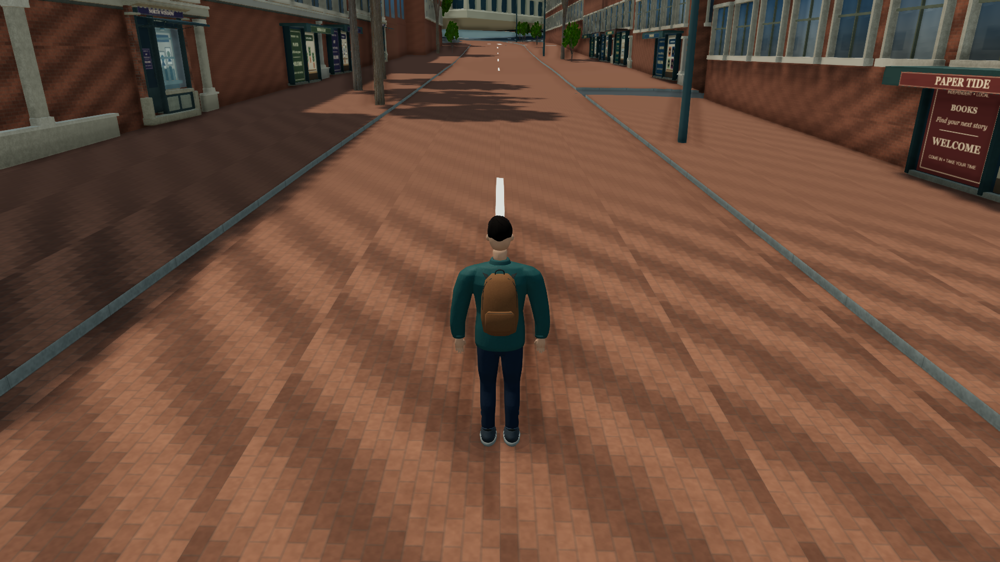
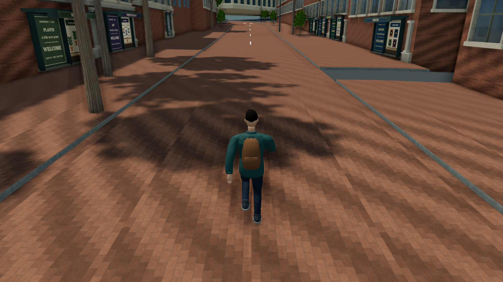
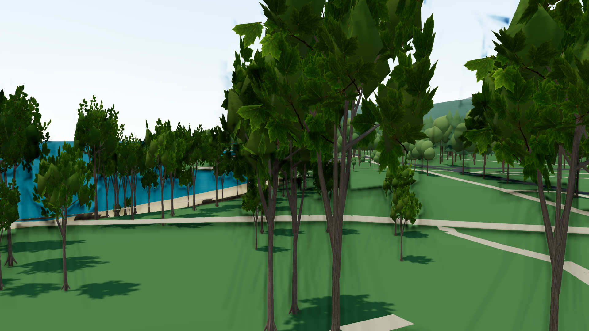
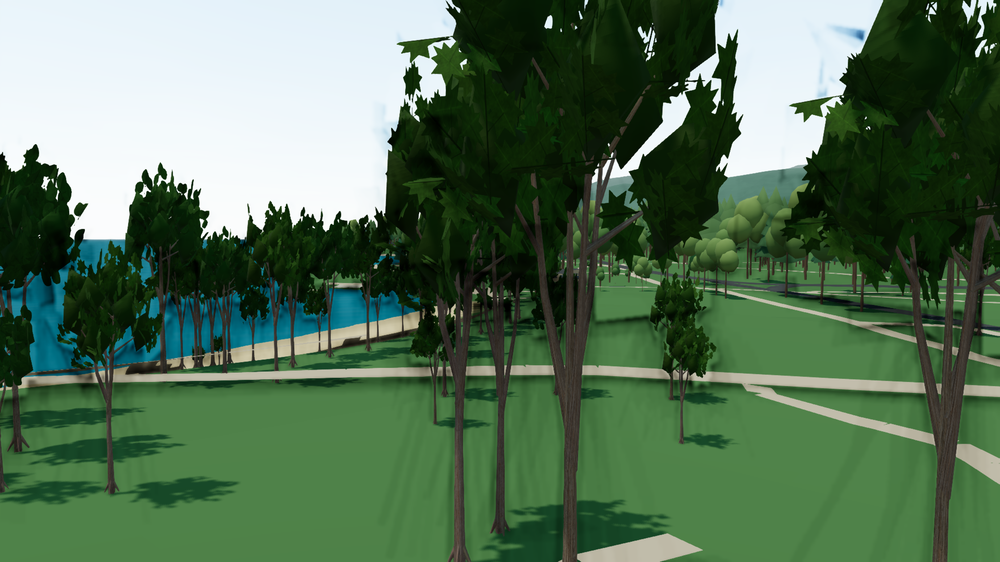
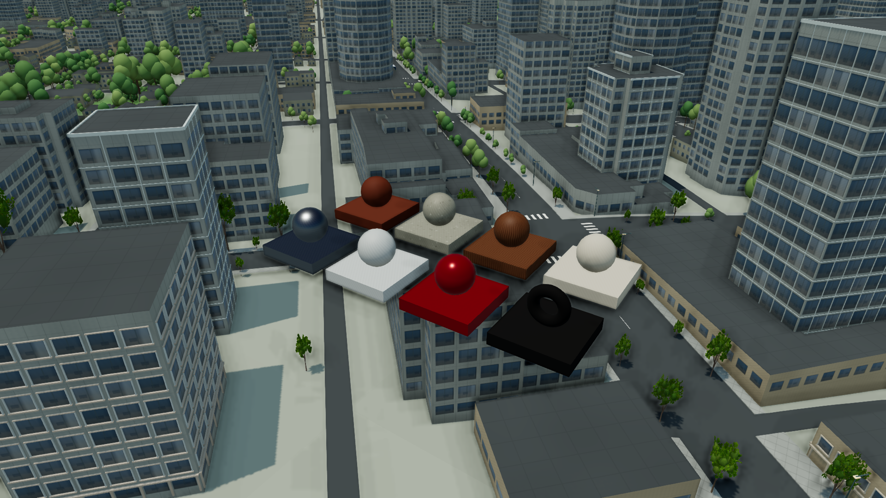
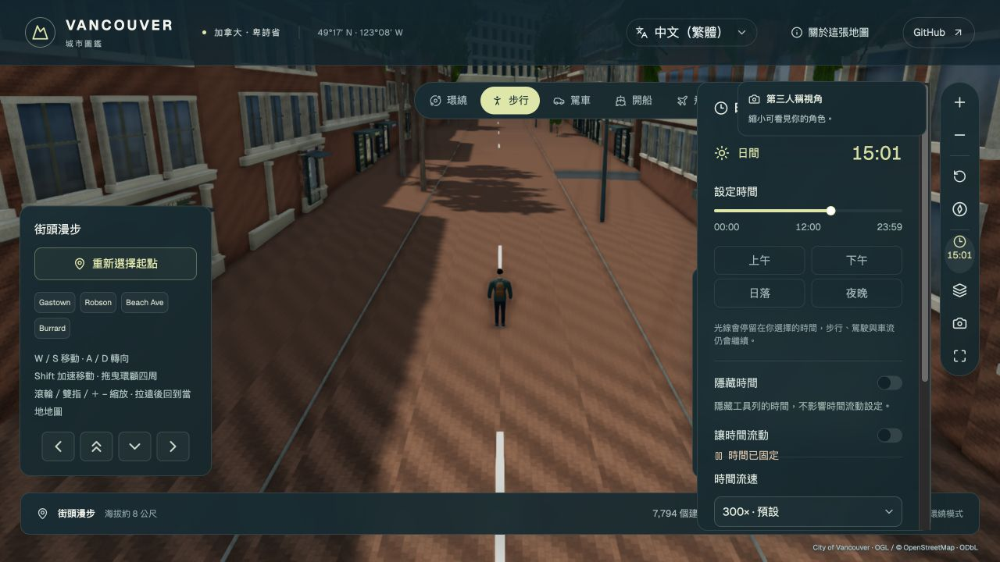

# 2026-10 離線素材的實際城市比較

本輪在 Codex in-app browser、ANGLE Metal／AMD Radeon Pro 560X 上執行。**43 份有效 JSON、13 張代表圖與完整測量 CSV**保存於此；正式 UI smoke 另有畫面與紀錄，不算入 43 份 QA。完整決策見 [素材整合規格](../../OFFLINE_ASSET_INTEGRATION_2026_10.md)。

## 結果與範圍

| 類別 | 完成比較 | 決策 |
|---|---|---|
| 市民 | 原 2048／1024 LOD0 的 High 1080p 四光照；2／4／8 秒真實 W 導航 | 採用 1024 完整幾何；下載 −47.5%、貼圖估算 −75%；FPS 約 25，沒有改善證據 |
| 建築 | 現代 24／雪松 8 個既有窗台；原 box 晴天、LOD0 四光照、LOD1 晴天 | 保留來源邊 QA；尚未建立通用尺寸契約，不全城啟用 |
| 葉片 | 同一公園 broadleaf 10 m 四光照；broadleaf／conifer 30 m 晴天 baseline／candidate | 新葉片較簡化，維持現有預設；65 m 與 conifer 四光照未測 |
| 八角色 PBR | 實際 renderer 的晴／陰／黃昏／夜試片 | 素材可載入且閱讀性可檢視；車輛／室內仍缺公尺 UV 與正確角色分組，延後正式套用 |
| 預設載入 | `promoted-citizen-clear` 由正常 citizen loader 載入新預設 | 確認 adopted 版本可載入；單獨約 28 FPS，不能和另一次約 25 FPS 作收益比較 |

[measurements.csv](measurements.csv)保留所有原始 FPS、p95、calls、triangles、texture count；[records](records)另含相機、source seed、ready、材質／shadow map 一致性及候選替換數。[verification.json](verification.json)記錄 651/651 tests、TypeScript、正式 build 與 log hashes；[source-integrity.json](source-integrity.json)保存 273 檔完整性結果。正式版的 [UI smoke 紀錄](production-ui-smoke.json)另記錄畫面、QA controls=0、可見頁面與空 console warning／error。

## 擷取方式與限制

資產 checkpoint 固定 1920 × 1080 drawing buffer、High、實際既有來源物件及相機。clear 14h、overcast 14h、clear 19.8h、clear 23h；至少 5 秒可見 warmup、所有來源／atlas ready，接著 8 秒 RAF sample。不得相機漂移、隱藏頁面或未顯示候選。角色材質試片是 2.5 秒 settling 後截圖，不提供 FPS benchmark。真實 W 移動由原導航處理，2／4／8 秒截圖不合成相同世界位移；實際兩版 8 秒距離為 32.976／32.888 m。

JSON 的 `revision` 是擷取當時 base HEAD `4967c72`，完整工作來源由 `sourceFingerprint` 識別。初次人物／建築配對為 `ce82fd515ecd4c0228e266832763f5015e2bc9e3698d8ca82c0f373002c0fcdb`；最後公園、近景 PBR 試片及預設人物為 `1d4d32351062b2fc80a26aa1e7964ef9fb7007079f2f7671f3bc922d5412ebb0`。只有同一來源版本和相機的配對才比較數值。最後 production fetch gate 修正不改變 QA=true 行為，修正後完整 regression／正式 build 均通過。

RAF frame gap 包括 CPU、GPU 與瀏覽器排程，不是 GPU timer；draw counters 包括多 pass，不能當唯一模型三角形。貼圖 MiB 是 RGBA8＋mips 規劃估算，不是實測 VRAM。沒有執行 mobile device benchmark，也沒有建立短測 FPS 的統計顯著性。

## 排除的紀錄

[excluded](excluded)保留四份 Gastown 葉片 JSON：技術 ready 有效，但目標樹被建築遮擋，不能驗收可見葉片；改用可見公園來源重跑。`initial-unsettled-citizen-clear.json` warmup 相機尚未穩定，valid=false，重新擷取後排除。較早的遠景 PBR 試片未列入最終代表圖，採用最後近景四份 valid 紀錄。

## 代表畫面

原人物／採用候選：

實際導航中的候選：

葉片 baseline／candidate（同一 broadleaf、30 m）：

城市 renderer 的八角色試片：

正式版步行與時間控制：

