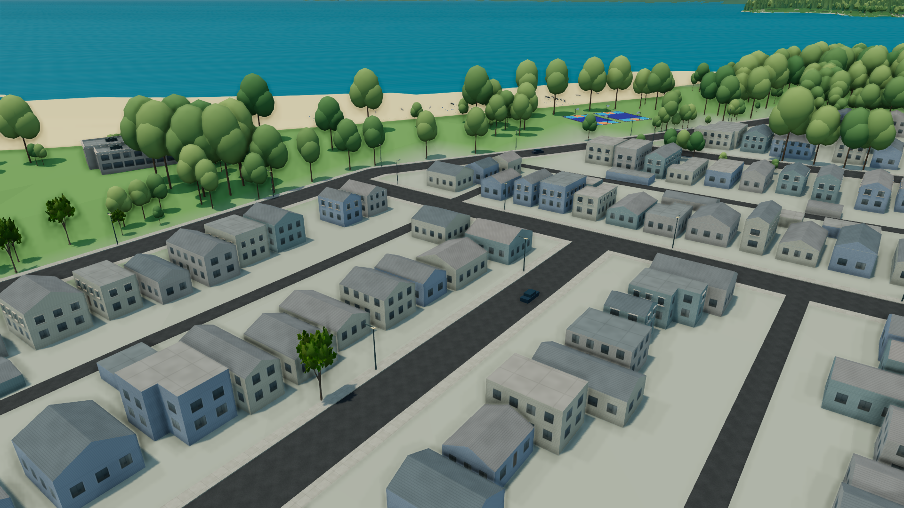
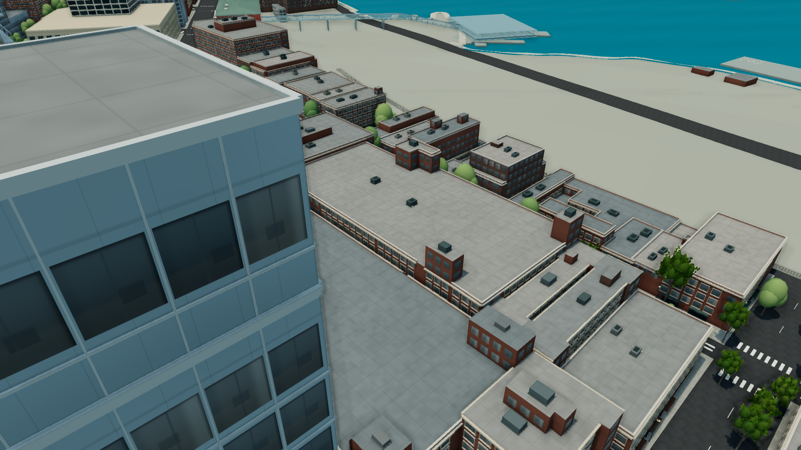

# Vancouver Living Atlas：本輪畫質升級

本輪延續原有城市資料與導航，完成可重用建築細節、原創街邊模型與角色、光影校正，再把建築類型擴展到住宅街區。這是實際 WebGL 畫面，截圖沒有經過影像增強。

## 已落實的改變

| 階段 | 改變 | 證據 |
| --- | --- | --- |
| P0 | 同裝置、同鏡頭、同 1920×1080 畫布的比較基準 | [八個基準畫面](upgrade-baseline/README.md) |
| P1 | 建築材質、窗框深度、屋頂表面、女兒牆與設備；附近細節分批載入 | [建築階段](upgrade-architecture/README.md) |
| P2 | Blender 原創店面與現代入口、兩級模型細節、具骨架及動作的原創市民 | [模型與角色實測](upgrade-assets/README.md) |
| P3 | 依鏡頭距離分配陰影解析度、修正傍晚屋頂條紋、動態追蹤玻璃與樹葉的環境遮蔽排除、改善屋頂細節分配 | [八個比較畫面及六個日夜畫面](upgrade-render/README.md) |
| P4 | 住宅立面、來源支持的坡屋頂、沿建築方向排列的屋頂接縫、增加合適的現代入口配置 | [街區與效能證據](upgrade-regions/README.md) |

住宅樣式適用於 1,352 棟小型建築；其中 676 棟有明確坡屋頂標記並通過保守幾何條件。屋脊保留原資料高度，新增 2,704 個三角形，共用原有建築網格。這些坡屋頂標記來自市府 2009 年資料；簡化山牆形式及方向是代表性重建，不能當作最新測繪。

原創街邊模型共有 108 個合適的歷史店面配置、18 個現代入口配置；實際可見數受距離與細節預算限制。模型不是每一棟建築的實測複製品。角色使用原有移動與碰撞系統，以實際行走距離驅動動畫；相容模式保留輕量角色。

## 可以直接比較的畫面

同一個 High 屋頂視角：[升級前](upgrade-baseline/high-gastown-roofs.png) ／ [目前](upgrade-regions/high-gastown-roofs.png)。

同一個 High 街道視角：[升級前](upgrade-baseline/high-gastown-street.png) ／ [目前](upgrade-regions/high-gastown-street.png)。

同一個 High 角色視角：[升級前](upgrade-baseline/high-citizen.png) ／ [目前](upgrade-regions/high-citizen.png)。

## 與參考影片仍有的差距

本輪改善了資料擠出方塊、空白屋頂、扁平立面與簡易人物造成的落差，但仍是程序化城市，尚未等同參考畫面的寫實程度。缺少逐棟高品質立面資產、完整街道物件、細緻遠景植被、更多建築輪廓變化，以及經過整體美術調整的材質與光照。這些差距不能只靠提高陰影解析度或更換城市名稱消除。

目前在同一台 Radeon Pro 560X 的八秒 1080p 比較中，High 約 19–27 FPS、Ultra 約 20–24 FPS。這是短樣本，不能視為所有裝置的效能承諾。相容模式的桌面檢查也不能代替實體手機測試。

再往寫實程度提升，應先處理實際畫面中仍顯眼的低細節樹冠、住宅周邊地表／庭院、重複立面與遠景城市背景，並持續受同一套視角與效能預算約束。高成本的新資料或外部資產應另列來源與授權；本輪沒有匯入參考作品的模型或程式。

完整實作與資料限制：[技術紀錄](UPGRADE_2026_09.md)。

## 實際行走與驗證

471 項測試、TypeScript 檢查與正式 Firebase 建置通過；正式版本不包含測試控制面板。Robson 從 Burrard 到 Denman 的八個街區完整走完：1,347 公尺、6 分 19 秒、零阻擋。另完成十段各 60 秒的交替路線測試，共行走 1.96 公里，零阻擋與零停滯區間；建築快取最多 38 格，街邊模型快取最多 6 格，符合上限。

第一次十分鐘測試發現測試起點的延長直線會碰到 Harbour Centre；碰撞是正確的。已保留失敗紀錄，並僅修正測試到經來源資料與即時預檢確認的長路段，再完整重跑通過。沒有放寬碰撞或通過條件。

長時間行走的各段平均約 16–22 FPS，仍有長幀。這證明所測路段可連續導航且細節快取受到控制，不能等同於穩定 30／60 FPS，亦非全市所有路線的驗證。相容模式在桌面 Chrome 正常運作，保留輕量角色，沒有警告或錯誤。

[原始路線、效能、快取與失敗修正紀錄](upgrade-regions/README.md)。
