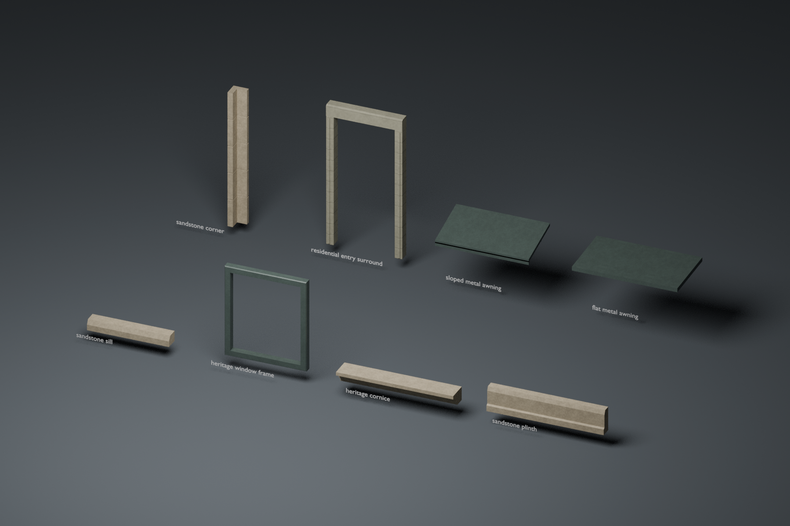

# Original architectural detail modules

Phase C **offline integration candidate**, 2026-10-02. These are actual Blender
meshes and self-contained GLBs, not metadata stand-ins. They are not loaded by the
city. Production street coverage, population, source footprints and collision
remain unchanged. **Phase C street integration and performance acceptance are
still pending.** Browser measurements were unavailable in this execution
environment; asset checks do not establish frame-time improvement.



## Inventory and budgets

All dimensions are metres. All eight modules have independently editable LOD0
and LOD1 `.blend` scenes under `source/`, one joined GLB mesh/material/primitive
per exported LOD under `assets/`, and an origin on the attachment plane at the
local ground datum. glTF is **Y up, +Z toward the street**. Authoring is Blender
Z up, -Y toward the street. Axis conversion is applied once by glTF export.

| Module | Size / functional detail | LOD0 / LOD1 triangles | Shared surface |
| --- | --- | ---: | --- |
| sandstone-sill | 1.40 wide × 0.18 high, sloping weather face and underside drip groove | 32 / 16 | sandstone |
| heritage-window-frame | 1.40 × 1.60, mitred rebated surround; actual 1.20 × 1.40 empty opening | 40 / 32 | painted-metal |
| heritage-cornice | 2.00 × 0.24, continuous moulded section | 32 / 24 | sandstone |
| sandstone-plinth | 2.00 × 0.42, chamfered cap and projecting foot | 24 / 20 | sandstone |
| sandstone-corner | 2.40 high, continuous L-plan core and shallow course joints | 212 / 20 | sandstone |
| residential-entry-surround | 1.30 × 2.50, open cedar jambs/lintel; **1.04 × 2.30 clear opening** | 128 / 40 | cedar |
| sloped-metal-awning | 1.60 wide, 0.85 projection, folded hem and side brackets | 48 / 40 | painted-metal |
| flat-metal-awning | 1.80 wide, 1.00 projection, drainage slope and tapered ribs | 36 / 28 | painted-metal |
| Total, one of each | No runtime population implied | **552 / 220** | 3 existing families |

Corners use the external-corner datum rather than the centre of their width.
Awning geometry starts at 2.37 m / 2.48 m above the local datum and remains clear
of the 2.30 m pedestrian zone. Only for the inspection board, the two awnings
are lowered by 1.60 m so their shapes are readable alongside the smaller parts.
The board uses an isolated neutral backdrop and is not an integrated city image.

The entry is an **open surround**, without a door slab, threshold or ground
plane. It does not cut an opening in a GIS wall, create an interior, authorize
access or add walkable floor. The corner trim likewise is not a new building
footprint. Bounds and opening volumes are recorded in `manifest.json`.

## Blender authoring and real material scale

Built and verified with **Blender 4.3.2** and Python's standard library. This is
separate from the older streetscape generator's documented Blender 4.5+ path.
No third-party meshes, photographs, textures, packages or external services are
used. Shape profiles are original authored cross-sections; the repository's
existing shared city surface maps and their physical repeat dimensions are reused.

- `build_architecture_details.py` creates actual geometry: open ring topology,
  continuous moulded profiles, drip relief, shallow corner joints, manufactured
  edges and separate canopy supports. Authoring parts remain individually
  editable in each LOD scene. LOD1 is independently generated, not a runtime
  decimation modifier or a reference to the LOD0 source.
- Source `UVMap` is dominant-axis **world metres**, with material node scaling
  from the existing catalog. All used maps are packed into the `.blend`.
- Export copies convert metre UVs to catalog-tile repeats for standard glTF PBR;
  the source UVs and source parts are preserved. Repeats outside 0–1 are expected.
  The glTF V flip is accounted for in the audit. No per-module atlases are baked.
- Each GLB is one opaque material and primitive. Color uses sRGB; normal and
  roughness/metallic maps use non-color data; normal orientation is OpenGL +Y.
  The exported image hashes must equal the shared source-map hashes exactly.
- No animation, camera, runtime light, alpha blending or transmission is exported.
  Preview lighting is separate. No light or ambient-occlusion shadows are baked
  into the base colors.

```sh
# Generate original sources/exports and the inspection board.
blender --background --factory-startup --threads 2 --python-exit-code 1 \
  --python tools/assets/architecture-details/build_architecture_details.py

# Retain edits to geometry and metre UVs in independently edited source scenes.
# Output must differ from input and must remain outside public/.
blender --background --factory-startup --threads 2 --python-exit-code 1 \
  --python tools/assets/architecture-details/build_architecture_details.py -- \
  --from-source tools/assets/architecture-details/source \
  --output work/architecture-reexport --skip-render

# Read actual GLB bytes and open every source in Blender for an independent audit.
python3 tools/assets/architecture-details/validate_architecture_details.py \
  --report tools/assets/architecture-details/validation.json
python3 tools/assets/architecture-details/audit_reexport.py \
  --candidate work/architecture-reexport \
  --report tools/assets/architecture-details/reexport-validation.json
python3 -m unittest discover -s tools/assets/architecture-details \
  -p 'test_validate_architecture_details.py'
node --test tests/architecture-detail-assets.test.mjs
```

The generator rebuilds original defaults; use `--from-source` after artist edits.
Sources must retain asset ID, LOD, metre UVs and semantic surface properties.
The full audit requires Blender. `--skip-blender` explicitly reports source
inspection as skipped; the fast Node regression uses this mode and is not a
substitute for the saved full validation report.

## Validation and traceability

`validation.json` records a successful audit of all 16 GLBs **and actual opened
Blender sources**: exact current file hashes, source catalog and builder hashes,
packed map content, material wiring/UV scale, bounds, origin and axis conversion,
triangle caps, one-material/primitive caps, finite normal/tangent/UV attributes,
nondegenerate indexed triangles and unobstructed opening volumes. Clearances
use a conservative triangle-AABB/open-box intersection test, not only total
asset bounds. LOD bounds differ by at most 2 cm (the entry's fine face moulding);
all other primary bounds are identical.

`reexport-validation.json` records a second full audit of a `--from-source`
re-export, plus geometric/PBR equality with this canonical kit and confirmation
that the input `.blend` files were unchanged. `cost-report.json` records the
before/after production asset costs and the additional **offline** inventory.
The production bay GLBs, manifests, material slots and instance caps are unchanged.

Ten Python tests include negative cases for corrupt containers, stale hashes,
false dimensions, underreported triangle budgets, wrong physical tile scale,
obstructed openings and accessors outside their buffers. Two repository Node
tests enforce the inventory/LOD contract and execute those corruption tests.

## Proposed integration after the performance gate

Integration has deliberately not happened. A future bounded trial should:

1. Select **existing** sill/cornice/canopy instances by a named source edge or
   source building rule, and replace eligible existing geometry rather than add
   another population. Keep source IDs, anchor, yaw, surface height and door/
   upper-window exclusions. Skip any incompatible dimensions.
2. For linear sills/cornices, tile or trim only the horizontal length and keep the
   authored cross-section in metres. Do not nonuniformly stretch the entry,
   window opening or rain protection to force a fit.
3. Extract and pool geometry, binding the existing city material atlas. Do not
   retain every GLB's embedded preview textures. At 480² RGBA plus mipmaps, all
   16 standalone LODs would duplicate approximately **56.25 MiB** of textures if
   naively loaded independently; those textures are currently **not loaded**.
   Metre UV conversion back from standard glTF repeat coordinates must be tested.
4. Retain existing cell, instance, per-frame construction and cache caps. Keep
   box fallback while a candidate loads and for incompatible/failed/compatible
   paths. Preserve disposal and late-result behavior. Set an explicit
   draw/triangle budget before increasing per-instance geometry.
5. Re-run same-camera High/Ultra/compatible and clear/overcast/dusk/night checks,
   slope/entry/first-upper-window clearance and LOD switching, then measure cold
   and warm startup, median/p95/max frame gap, draw calls, triangles, texture
   objects/bytes and cache growth on the actual target hardware. Do not call this
   whole Phase C complete until the street integration and measured gate pass.

## Provenance and license

Original representative architectural parts for Vancouver Living Atlas by
YiTaChen. These are not surveyed replicas of named Vancouver buildings. Material
provenance is the existing [shared city library](../city-materials/README.md).
Geometry source, generator, maps and exports inherit the repository's Vancouver
Living Atlas Noncommercial Research and Attribution License 1.0. Existing notices,
source attribution and third-party data terms remain unchanged.

## Opt-in runtime candidate

A separately gated [Robson sill integration candidate](runtime-candidate/README.md)
now replaces 56 already-emitted upper sills on two exact source frontages in local
QA builds. It has fitted real Blender LOD sources, capped full-city placement and
failure/disposal tests. Normal production builds exclude its loader/UI/assets.
The original eight-module kit remains offline; the browser visual/GPU gate and
broader Phase C production integration are still pending.
