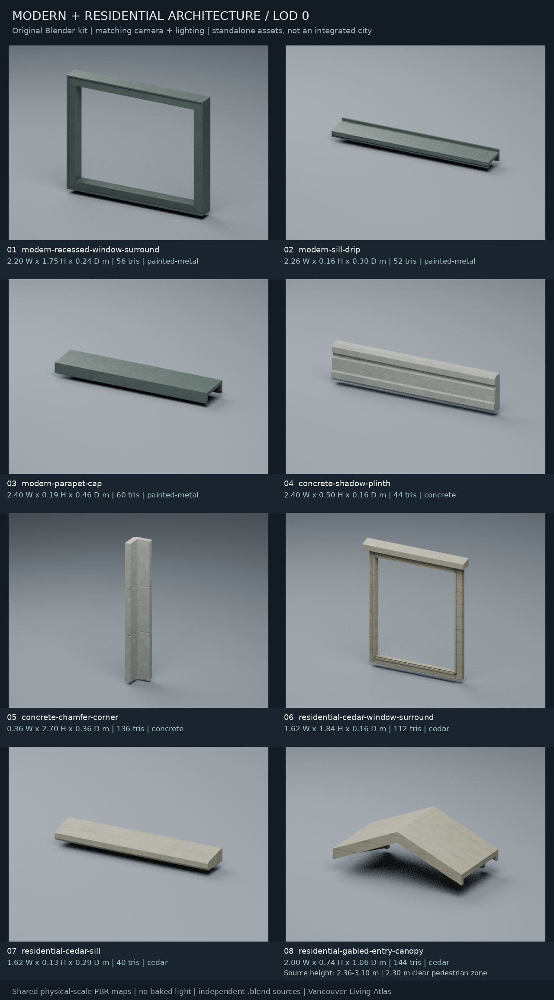
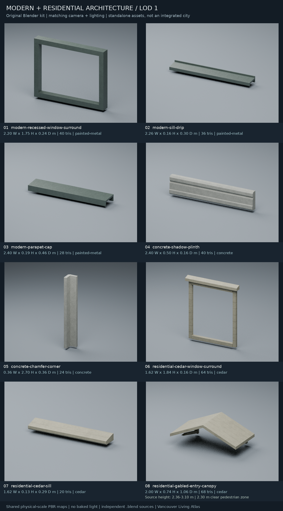

# 現代與住宅建築部件擴充包

**2026-10-02 · Blender 資產已製作；全部尚未接入 runtime。**

本包補足既有 [architecture-details](../architecture-details/README.md) 以歷史街面為主的庫存，新增 8 類具實際功能剖面的現代／住宅模組，每類有獨立 LOD0／LOD1 `.blend` 和 GLB，共 **16 個 Blender 編輯來源 + 16 個匯出檔**。不是更名複製舊模型，也不是完整建築、實測溫哥華建築或新增地理資料。

建築主體仍由 GIS 資料建立。本包沒有改 `public/`、`lib/`、配置規則、碰撞、場景人口或正式載入器；供後續獨立整合。單體驗證通過不表示階段 C 街段驗收、瀏覽器 GPU 效能或全城覆蓋已完成。

## 資產清單

尺寸為 **寬 × 高 × 深，單位公尺**，均為實際 GLB bounds。每個 GLB 只有 1 個 opaque 材質、1 個 mesh、1 個 primitive。編號對應預覽，精確檔案列表也見 [INTEGRATION_INVENTORY.csv](INTEGRATION_INVENTORY.csv) 和 [manifest.json](manifest.json)。

| # | ID／中文名稱 | 實際尺寸 | LOD0 / LOD1 三角形 | 共用表面 | 功能與整合對象 |
| --- | --- | --- | ---: | --- | --- |
| 01 | `modern-recessed-window-surround` 現代深窗洞框 | 2.20 × 1.75 × 0.24 | 56 / 40 | painted-metal | 深折返窗洞、內縮玻璃止口、正面折邊；現代窗格／幕牆不透明框 |
| 02 | `modern-sill-drip` 現代折板滴水窗台 | 2.26 × 0.16 × 0.30 | 52 / 36 | painted-metal | 薄折板斜面、後端上翻、前端下折滴水；不是實心石材窗台 |
| 03 | `modern-parapet-cap` 現代女兒牆壓頂 | 2.40 × 0.19 × 0.46 | 60 / 28 | painted-metal | 中空倒 U 形、排水斜度、雙側折邊；須對齊既有女兒牆 |
| 04 | `concrete-shadow-plinth` 混凝土凹槽基座 | 2.40 × 0.50 × 0.16 | 44 / 40 | concrete | 近地倒角、基腳、實際水平凹槽；現代不透明基座 |
| 05 | `concrete-chamfer-corner` 混凝土倒角轉角 | 0.36 × 2.70 × 0.36 | 136 / 24 | concrete | L 形連續雙翼、寬面外角倒角、兩條淺分縫；外轉角 datum |
| 06 | `residential-cedar-window-surround` 住宅雪松窗框 | 1.62 × 1.84 × 0.16 | 112 / 64 | cedar | 分件木窗梃、搭接上帽及細止口；住宅外牆 |
| 07 | `residential-cedar-sill` 住宅雪松斜窗台 | 1.62 × 0.13 × 0.29 | 40 / 20 | cedar | 厚木斜面、外挑雙端、滴水槽及前鼻倒角 |
| 08 | `residential-gabled-entry-canopy` 住宅雙坡入口雨棚 | 2.00 × 0.74 × 1.06 | 144 / 68 | cedar | 雙坡罩棚、前後山形封邊、托架／椽條；住宅入口上方 |
| 合計 | 各類各一個，不代表場景實例數 | — | **644 / 320** | 3 組既有表面 | **全部尚未整合** |

LOD1 比 LOD0 少 **50.3%** 三角形（以整包各一個計），16 個 GLB 合計約 **3.18 MiB**、16 個壓縮 `.blend` 約 **4.10 MiB**。每個 GLB 獨立可看，但重複嵌入既有 maps 是便於交付，整合時應抽取幾何並共用材質，而非把 16 份貼圖各自常駐 GPU。

### 精確編輯／匯出入口

| ID | Blender 編輯來源 | GLB 匯出檔 |
| --- | --- | --- |
| modern-recessed-window-surround | [LOD0](source/modern-recessed-window-surround.lod0.blend) / [LOD1](source/modern-recessed-window-surround.lod1.blend) | [LOD0](assets/modern-recessed-window-surround.lod0.glb) / [LOD1](assets/modern-recessed-window-surround.lod1.glb) |
| modern-sill-drip | [LOD0](source/modern-sill-drip.lod0.blend) / [LOD1](source/modern-sill-drip.lod1.blend) | [LOD0](assets/modern-sill-drip.lod0.glb) / [LOD1](assets/modern-sill-drip.lod1.glb) |
| modern-parapet-cap | [LOD0](source/modern-parapet-cap.lod0.blend) / [LOD1](source/modern-parapet-cap.lod1.blend) | [LOD0](assets/modern-parapet-cap.lod0.glb) / [LOD1](assets/modern-parapet-cap.lod1.glb) |
| concrete-shadow-plinth | [LOD0](source/concrete-shadow-plinth.lod0.blend) / [LOD1](source/concrete-shadow-plinth.lod1.blend) | [LOD0](assets/concrete-shadow-plinth.lod0.glb) / [LOD1](assets/concrete-shadow-plinth.lod1.glb) |
| concrete-chamfer-corner | [LOD0](source/concrete-chamfer-corner.lod0.blend) / [LOD1](source/concrete-chamfer-corner.lod1.blend) | [LOD0](assets/concrete-chamfer-corner.lod0.glb) / [LOD1](assets/concrete-chamfer-corner.lod1.glb) |
| residential-cedar-window-surround | [LOD0](source/residential-cedar-window-surround.lod0.blend) / [LOD1](source/residential-cedar-window-surround.lod1.blend) | [LOD0](assets/residential-cedar-window-surround.lod0.glb) / [LOD1](assets/residential-cedar-window-surround.lod1.glb) |
| residential-cedar-sill | [LOD0](source/residential-cedar-sill.lod0.blend) / [LOD1](source/residential-cedar-sill.lod1.blend) | [LOD0](assets/residential-cedar-sill.lod0.glb) / [LOD1](assets/residential-cedar-sill.lod1.glb) |
| residential-gabled-entry-canopy | [LOD0](source/residential-gabled-entry-canopy.lod0.blend) / [LOD1](source/residential-gabled-entry-canopy.lod1.blend) | [LOD0](assets/residential-gabled-entry-canopy.lod0.glb) / [LOD1](assets/residential-gabled-entry-canopy.lod1.glb) |

## 座標、開口與配置契約

- glTF 採 **+Y 向上、+Z 朝街、X 水平**；Blender 為 Z 向上、−Y 朝街。只在 glTF 匯出時轉換一次。
- 原點在牆面附著平面 `z=0` 與當地高度 datum；大多數部件的後緣 `z=0.02 m`，保留 2 cm 貼牆間隔。轉角使用外角 datum，不能用普通中心對齊。
- 現代窗框空洞：`x = −0.96…0.96`、`y = 0.14…1.61`，即 **1.92 × 1.47 m**。實際金屬折返保留 0.24 m 深度，沒有玻璃或牆面填片。
- 雪松窗框空洞：`x = −0.64…0.64`、`y = 0.10…1.62`，即 **1.28 × 1.52 m**。搭接上帽延伸至寬 1.62 m、高 1.84 m，整合時須連同上帽留空。
- 女兒牆壓頂保留 `x = −1.20…1.20`、`y = 0…0.105`、`z = 0.056…0.444` 中空插入空間。須配合既有牆厚與高度；不能當成新屋頂平面，也沒有屋頂碰撞。
- 雙坡雨棚實際最低／最高點為 **2.36／3.10 m**，保留 **2.30 m** 行人淨空。預覽將地台放在部件附近只為單體觀察；GLB 未降到地面，也不含地板、門板、門檻或低位支柱。
- 尺寸是具體原創模組，不是每個 profile 都可直接放入。`profiles` 是建議適用類型，沒有匹配任何新地理座標或來源建築。應只替換符合條件的既有部件，保留來源 ID、入口排除、upper-window 高度與實際表面高程；不相容時保留 fallback。
- 線性窗台、基座與壓頂可在未改動剖面的前提下另做長度變體；窗框／雨棚應選適合尺寸，不可不等比拉伸開口硬塞。住宅窗框與窗台是獨立部件，放置時須對齊窗框底部並避免兩個底邊重疊。
- 本包並非結構、消防或建築法規認證設計；不能據此判定現實入口安全、建築防水性能或合法通行。

## 材質、UV 與來源編輯界線

沿用 [共同 catalog](../city-materials/catalog.json) 和既有 480 × 480 maps：`painted-metal` 重複 0.8 × 0.8 m、`concrete` 1.5 × 1.5 m、`cedar` 1.52 × 1.52 m。每個 `.blend` 打包 color／OpenGL normal／ORM 三張原圖；不新增紋理來源、不烘焙日照或 AO、不輸出預覽燈光。

來源 `UVMap` 使用 dominant-axis world metres；材質節點依 catalog 轉為物理重複尺寸。GLB 匯出副本才除以 tile metres，且處理 glTF V 軸方向。LOD 使用相同 maps 和主 bounds，不靠不同色材掩飾切換。

**`--from-source` 保留幾何與公尺 UV 編輯，不是任意 Blender 材質烘焙器。**

- 每個 LOD 可獨立編輯形體；保持 asset ID／LOD、自身 bounds 與開口契約，套用 transforms，按表面更新公尺 UV。驗證器會要求符合 dominant-axis 公尺 UV 契約。
- 匯出到另一個目錄，原輸入 `.blend` 的 bytes/hash 不變；不重建預設幾何或 UV。
- 共享材質必須保持原始 maps、實際重複比例、PBR 接線及節點參數。匯出前會拒絕改畫 packed map、更改 color space/sampler、UV multiplier、normal strength、tint／coat／sheen／transmission／emission 或任意不支援的節點，**不會默默用原材質覆蓋手改效果**。
- 材質需修改時，走既有 [city-materials 編輯／烘焙流程](../city-materials/README.md)，另做新候選輸出並驗證；本包不宣稱已保留任意來源材質改動。

## 重建、重匯出與驗證

已用 **Blender 4.3.2** 驗證。模型建造／匯出使用 Blender Python；驗證及重匯出 audit 使用 Python 標準庫；預覽文字排版使用 Pillow。執行時不依賴這些製作工具。

```sh
# 重新產生「預設原創」模型、來源與兩張相同視角 LOD 預覽。
blender --background --factory-startup --threads 2 --python-exit-code 1 \
  --python tools/assets/architecture-expansion/build_architecture_expansion.py

# 保留藝術家編輯：來源／輸出資料夾必須不同，不可直接匯到 public/。
blender --background --factory-startup --threads 2 --python-exit-code 1 \
  --python tools/assets/architecture-expansion/build_architecture_expansion.py -- \
  --from-source tools/assets/architecture-expansion/source \
  --output /tmp/architecture-expansion-reexport --skip-render

python3 tools/assets/architecture-expansion/validate_architecture_expansion.py \
  --report tools/assets/architecture-expansion/validation.json
python3 tools/assets/architecture-expansion/audit_reexport.py \
  --candidate /tmp/architecture-expansion-reexport \
  --report tools/assets/architecture-expansion/reexport-validation.json
python3 -m unittest discover -s tools/assets/architecture-expansion -p 'test_*.py'
```

- [validation.json](validation.json)：讀實際 GLB bytes，核對三角形／索引／無退化面、法線／切線／UV、bounds、原點、單材質、maps/hash、所有來源的實際 Blender 開檔及節點接線。以三角形 AABB 對開放盒的保守測試查窗洞、壓頂插入空間及行人淨空；所有 LOD 主 bounds 一致。
- [reexport-validation.json](reexport-validation.json)：另一資料夾的全量重匯出再次完整驗證，逐個比較 indexed position/normal/UV/tangent 幾何 signature 與共享 maps；輸入來源 hash 不變。
- `test_validate_architecture_expansion.py`：10 個正／負向 GLB 測試，包括截斷容器、錯誤 hash／bounds／UV scale／budget、假開口、越界 accessor。
- `test_source_workflow.py`：真正開 Blender 改兩個 LOD 幾何 31 mm，再驗證重匯出保留；亦實測新增材質節點、tile scale、coat、tint、normal strength、手畫 packed image 被拒絕，原來源不變；同路徑覆寫亦被拒絕。
- `--skip-blender` 只可用作快速檢查，報告會標示來源檢查 skipped，不能替代完整 source audit。

## 配對單體預覽

每個資產的兩個 LOD 使用相同相機、構圖、光照及物理尺寸。以下是**真正 GLB 匯回 Blender 渲染**，不是場景整合截圖；預覽標題、ID、尺寸與三角形數由 manifest 排版。

[LOD0 原圖](preview-lod0.png) · [LOD1 原圖](preview-lod1.png)




整合後還須由實際瀏覽器驗收晴／陰／黃昏／夜晚、High／Ultra／compatible fallback、LOD 切換、上層窗／入口／斜坡接地、draw／triangle／texture／frame-time／快取與生命周期。此包沒有宣稱這些測量已通過，也沒有擴大全城 population。

## 原創與授權

幾何、剖面和腳本為 Vancouver Living Atlas 的原創代表性建築部件；只讀取本 repository 既有材質與 helper，不含外部下載模型、照片、掃描或真實建築複製。與專案一樣使用 **Vancouver Living Atlas Noncommercial Research and Attribution License 1.0**（`LicenseRef-Vancouver-Living-Atlas-NC-1.0`）。原作者、既有資料來源與第三方條款保持不變。
