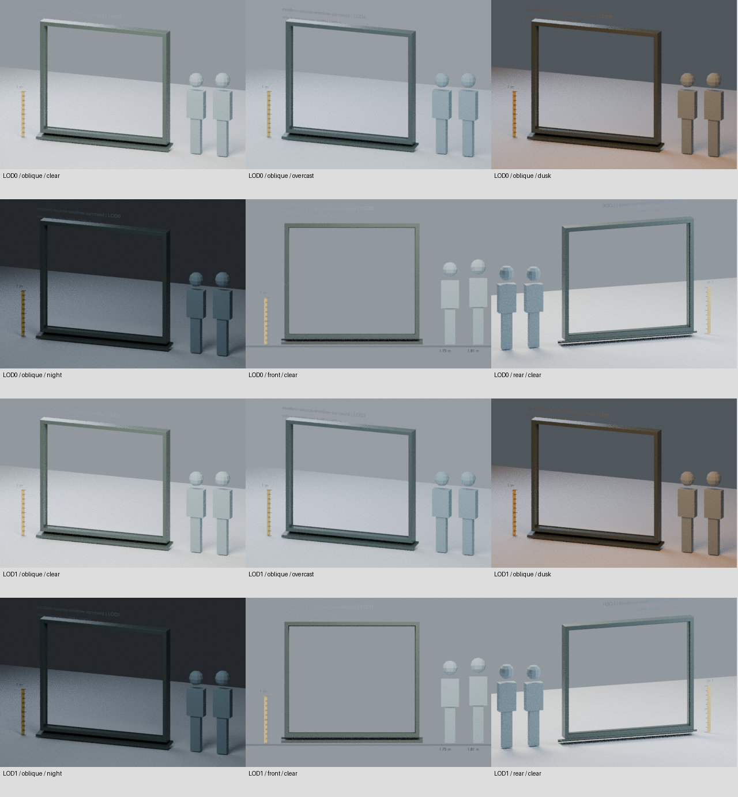
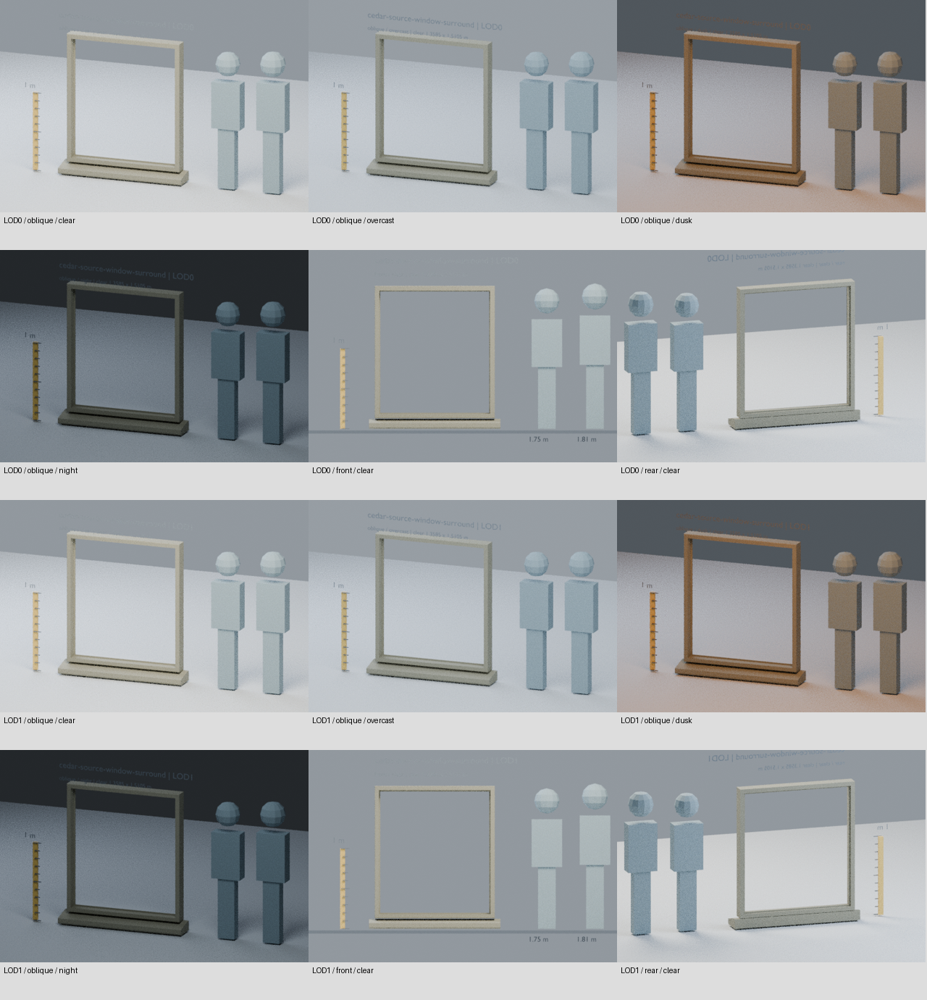
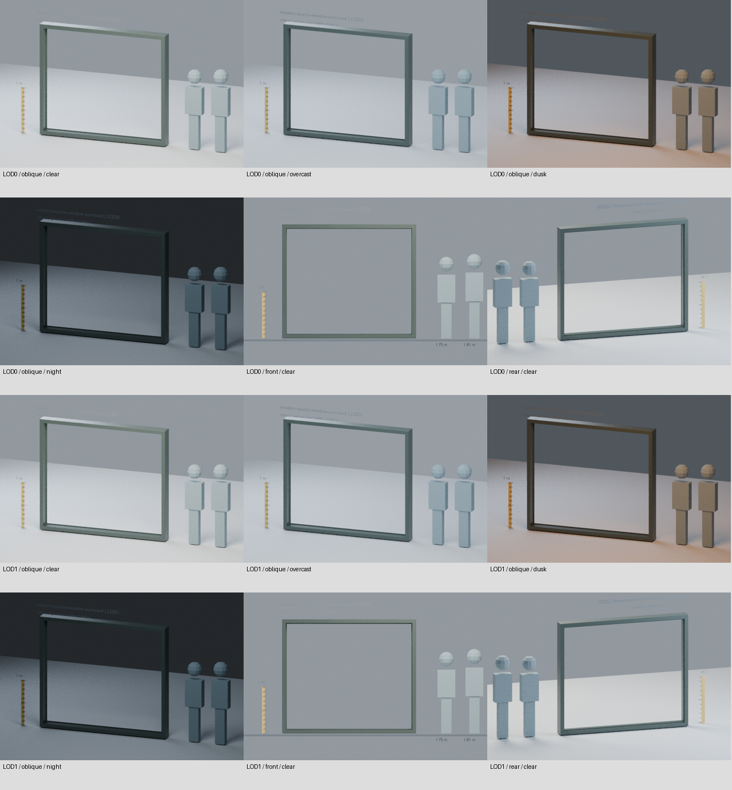
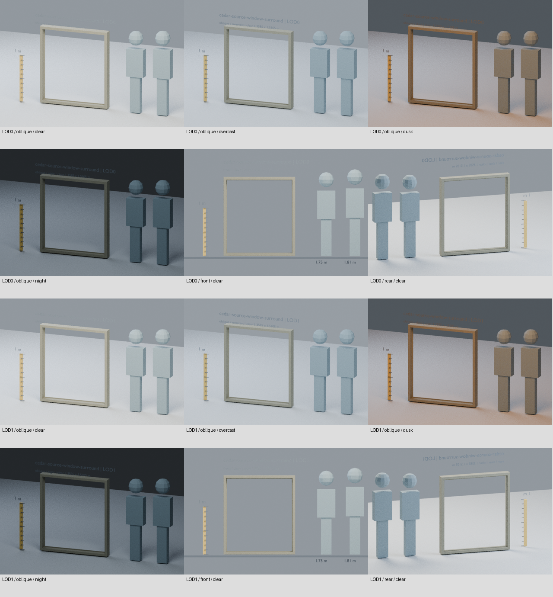

# 來源尺寸窗框變體：C02／C03

新框＋新配對窗台的離線狀態：`offline_complete`；直接疊加舊窗台仍禁止；整合：`runtime_pending_webgl`。本包只新增 `tools/assets/source-fitted-window-variants/`，沒有修改 `public/`、runtime、舊包 schema、原雪松窗台、原雙坡入口雨棚、GIS 牆或碰撞。沒有啟用任何來源建築，也沒有提交或發布。

## 這次補上的實際缺口

`facade-fit-contracts/qa/source-examples.json` 已證明舊 modern／cedar 框洞與兩個真實來源的 shader 窗格不合。本包重新從 `public/data/buildings.geojson` 經 `prepareParts → summarizeStructures → createProfile`、來源 polygon 邊投影及正式 `fitBays/windowBounds` 計算，沒有照抄報告的尺寸，也沒有把舊 GLB 非等比拉伸。

| 新穩定 ID | 任務／來源 fixture | 清開口 W × H | 外框 W × H × D | 斷面 | LOD0／1 |
| --- | --- | --- | --- | --- | --- |
| `modern-source-window-surround` | C02；structure 145639、feature 133049 | 2.6684017277 × 2.2445 m | 2.8684017277 × 2.4445 × 0.24 m | 0.10 m | 88／72 tris |
| `cedar-source-window-surround` | C03；structure 145755、feature 105546 | 1.3585170585 × 1.5105 m | 1.4985170585 × 1.6505 × 0.16 m | 0.07 m | 88／72 tris |

兩個 LOD 都是真正連續封閉的框形實體，洞內無玻璃、面板或牆。外側倒角、內縮折返及四邊 **15 mm 厚實體玻璃止口**均保留，不以 normal map 假裝幾何。LOD0 增加內側正面倒角細分，LOD1 保留主外側倒角、完整凹入及止口。來源是原創四邊形截面 mesh，可直接在 Blender 編輯；未從輸出 GLB 匯回充當 source。

每個 GLB 一個 `window-frame` mesh／opaque primitive。四個 GLB 共 **38,380 bytes**，各為 8.7–10.1 KiB；符合 B-PART 256／80 tris、64／24 KiB 上限。壓縮 `.blend` 大小及實際 accessor／bounds 成本見 `qa/measurements.json`。無新增或內嵌貼圖，新增 unique texel cost = 0。

## 新的可選配對窗台：已解決舊窗台交疊

第一輪檢查實際證明新框直接疊在舊窗台上會相交，所以新增獨立穩定 ID，不改舊檔：

| 新 sill ID | W × H × D | LOD0／1 tris | 同源配對 |
| --- | --- | --- | --- |
| `modern-source-window-paired-sill` | 3.0084017277 × 0.124 × 0.30 m | 40／28 | modern 新框 |
| `cedar-source-window-paired-sill` | 1.6385170585 × 0.124 × 0.29 m | 36／20 | cedar 新框 |

新窗台和新框共用完全相同的 root；**不把新窗台 bounds 重新置中**。最高面 local Y=−0.006 m，最低 Y=−0.13 m，與下框保留實際6 mm縫。其頂高直接來自 `windowBounds.bottom − sectionM − 0.006`。金屬款是薄折板、向外斜面和下折滴水鼻；雪松款是厚實斜面、鼻部倒角，LOD0加實體底部滴水槽。都有真實剖面，沒有任意沿舊窗台 slot Y 放置。

獨立讀兩個實際 GLB、只套用檔內 transform 一次後，所有窗台頂點都低於所有框頂點，**strict Y separating plane** 證明四組兩LOD配對完全不相交；量到6.00000005 mm間距。再對「框＋窗台」所有三角形一起做開口 clipping／rays，確保窗台不吃掉來源 aperture。組裝保留同一 frame root，沒有額外 root transform。

`fitAssembly` 只有收到 `suppressExistingSill=true` 和具名 `existingSillSlotId` 才接受。未來 consumer 僅在可選 candidate 配對啟用時，一併取代原程序框和那個已選定的舊 sill descriptor；未啟用、失敗或釋放時恢復原 detail。**不刪舊資產，不動雨棚、牆、碰撞或其他 sill**。這個離線契約本身沒有啟用／抑制 runtime 物件。

每個框及每個窗台分別符合 B-PART 256／80 tris，組裝為兩個模板／兩個 primitive：modern合計128／100 tris、cedar124／92 tris；不可把整組成本誤報成單一80-tris部件。consumer須按兩個draw候選／detail描述子的成本配置上限。

共交付 **8個壓縮原生 .blend、8個普通 GLB（合計65,264 bytes）**，所有新增maps仍為0。舊窗台的負向相交證據仍保留，不能用新配對的通過结果宣稱「舊窗台＋新框」安全。

## 原點與真實來源 datum

glTF：X 水平、+Y 向上、+Z 朝街；Blender：(x,y,z) → glTF (x,z,−y)，只轉一次。原點是「外框下緣／水平中心／來源牆面」，牆面 local Z=0，模型後緣 Z=0.02 m。兩個 LOD 的主 bounds、開口、止口、原點一致；正式 scale 必須 `[1,1,1]`。

新框原點必須使用：`實際 windowBounds.bottom − 新斷面厚度`。絕不能把既有窗台 slot 的 Y、舊框的開口底距或 bounds 中心直接搬過來。

- Modern fixture：bay 0／row 1，窗格下緣 8.2365 m，斷面 0.10 m → **root Y=8.1365 m**（相對 foundation）。來源邊 key：`-326.275,445.400|-336.041,435.450`。
- Cedar fixture：bay 0／row 1，窗格下緣 4.941 m，斷面 0.07 m → **root Y=4.871 m**。來源邊 key：`-229.513,444.825|-239.811,434.495`。
- Stop 後／前平面：modern Z=0.060／0.075 m；cedar Z=0.050／0.065 m。相應最小開口在整個厚度上保持，不讓 lip 吃掉清開口。

這些 source ID 和 edge key 只選擇可重現測試 fixture。`fit.mjs:fitWindow` 不以它們啟用場景；其他相同 profile／尺寸也能通過標量 fit。輸入為來源身份、edge length、profile、bay／row、wall extent、entry exclusions；沒有世界 XYZ 放置入口。結果再次計算正式 `windowBounds`，檢查 profile、尺寸、牆邊／高度、入口排除、合法數值及不拉伸。

## 正向 fit 的界線：不得誤稱已安裝

49 個 Node 測試包含兩個真實來源、兩個 LOD 的四份框 aperture fixture，另有四份真實可選配對 fixture，以及錯誤 profile、開口、拉伸、舊 sill datum、世界位置、牆高、入口排除等負向 fixture。`compatible=true` **只表示來源窗格與框的局部尺寸／datum 契約可相配**。

- GIS 的窗格原本是 shader mask，不是真正牆洞。本包沒有切洞、移牆、新增地板或增加可進入能力。
- 既有雪松窗台、雨棚的原 `.blend`／GLB 及 schema 全部以 hash 保留；雨棚原 ground datum／2.36 m 最低點不變。
- **新閉合下框與來源選定的舊窗台已量到實體交疊，這個舊窗台組合仍被阻擋；新版配對窗台已另行通過**。`qa/existing-sill-coexistence.json` 以實際 GLB、原 selector 的 transform 對112個下框內部點作固體內外診斷；modern有40、cedar有82個共同內部 witness，兩LOD結果相同。這是已找到交疊的證據，不是完整Boolean collision證明。保留舊窗台不代表可與新下框同時顯示。新配對以獨立窗台及明確 selected-sill suppression 解決幾何交疊；整合時仍須驗證原程序框去重、該舊sill descriptor抑制／恢復，不能直接把舊窗台、新窗台和新框三者疊上去。
- 沒有檢查 production cell admission、實際 foundation、材質共享釋放、四種城市光照、High／Ultra、LOD 切換或 GPU 效能，這些均 `not_run`。

## 共用材質與 UV

`painted-metal`、`cedar` 明確依 semantic role／surface ID 綁定，共用來源 `city-materials/catalog.json`。目前 GLB 是無貼圖檢視佔位材質：catalog averageColor 做一次 sRGB→linear，保留 roughness／metalness；不烘日照或陰影。

UV 採 dominant-axis 實體公尺除以共同 tileMeters（metal 0.8×0.8 m、cedar 1.52×1.52 m），glTF 輸出只做一次 V 翻轉。這是單一 surface UV，**不是城市合併 atlas 的 slot UV**；整合 agent 須由 role 對應共用材質，若用 atlas 再作該 slot 映射，不能直接拿這個 UV 去取完整 atlas，也不能宣稱 role 名稱本身就代表 GPU 去重已完成。

## 重現／來源編輯

在 repository 根目錄執行；Blender 4.3.2、Python 3、Node（專案依賴）及排版用 Pillow。執行時不用 Blender。

```sh
# 重新核對實際來源；只寫本包 fixture。
node tools/assets/source-fitted-window-variants/source_fixtures.mjs --write

# 重建預設原創來源；這會取代本包的預設 .blend。已有藝術家編輯時不要執行。
blender -b -t 2 --python-exit-code 1 \
  --python tools/assets/source-fitted-window-variants/build.py
blender -b -t 2 --python-exit-code 1 \
  --python tools/assets/source-fitted-window-variants/build_sills.py

# 保留藝術家編輯的正式入口：新輸出目錄必須不存在或是空目錄。
blender -b -t 2 --python-exit-code 1 \
  --python tools/assets/source-fitted-window-variants/export.py -- \
  --source tools/assets/source-fitted-window-variants/source \
  --output /tmp/source-fitted-windows-reexport-NEW

# 原生來源 reopen、相同輸出 parity、真實 geometry/UV/roughness 編輯保留證明。
blender -b -t 2 --python-exit-code 1 \
  --python tools/assets/source-fitted-window-variants/audit_source.py

# 24 張實際 GLB 匯回後的配對預覽；重跑後須重新人工視覺檢查。
blender -b -t 2 --python-exit-code 1 \
  --python tools/assets/source-fitted-window-variants/render_previews.py
python3 tools/assets/source-fitted-window-variants/compose_previews.py
blender -b -t 2 --python-exit-code 1 \
  --python tools/assets/source-fitted-window-variants/render_assemblies.py
python3 tools/assets/source-fitted-window-variants/compose_previews.py --assembly
python3 tools/assets/source-fitted-window-variants/check_sill_coexistence.py

node --test tools/assets/source-fitted-window-variants/fit.test.mjs tools/assets/source-fitted-window-variants/assembly.test.mjs
python3 tools/assets/source-fitted-window-variants/finalize_sills.py
python3 tools/assets/source-fitted-window-variants/validate.py
python3 -m unittest discover -s tools/assets/source-fitted-window-variants -p test_validate.py -v
```

`export.py` 僅在輸出記憶體中三角化 sill 的 n-gon 端蓋以輸出 tangent，原生可編輯端蓋和 UV 仍保留；其餘不重建。`export.py` 開原 `.blend`，直接匯出選定 mesh、UV 及支援的 opaque Principled factors，不重新呼叫 build、不重算 UV、不改寫來源 bytes。會拒絕不明材質／額外節點、未套用 transforms、unsupported modifiers、私有 maps、來源和輸出同路徑、覆蓋已有輸出。支援來源編輯不代表任意 node graph 都會被烘焙保留。

八個來源均實際加上 3 mm 頂點位移、單一 UV U+0.017、roughness+0.02，在 temp 資料夾另存、重開及匯出，再以獨立 GLB accessor／材質數值檢查；原始及編輯後 `.blend` 的 bytes 都沒有被 exporter 改寫。預設源重新匯出的 position／normal／UV／tangent／index 與交付 GLB 全部相同。證據見 `qa/source-edit-preservation.json`、`qa/blender-audit.json`。

## QA 證據與預覽

- `qa/validation.json`、`qa/common-validation.json`：新共通 schema、hash、實際 bounds、成本、indices、法線與 tangent、公尺 UV、來源 reopen、舊檔保留、LOD一致性及 B-PART 預算。
- 每個 LOD 對開口做 75 條三軸有限 ray、4 條實際 aperture-edge ray、4 個實心外框 probe，並做三角形與完整開口體積的精確 clipping，避免只用幾條 ray 漏掉小填片。
- 每個 LOD 的四邊止口均以射線驗證前／後兩面實際深度，缺 stop、深度錯誤及完全消失的框不能通過。
- `qa/tests.log`：25 個 CPU 正／負向測試，含小填片、整片封洞、缺止口、缺框、壞法線／UV、超出 accessor、錯 root、拉伸、預算超標及錯 hash。
- `qa/positive-fit-fixtures.json`、`qa/fit-tests.log`：49 個 source-fit 測試；兩個實際 source fixture × 兩個 LOD，另驗證具名舊sill抑制、sill-only入口排除與來源高度限制。
- `qa/preview-index.json`：兩款 × 兩個 LOD ×（四光照斜視＋晴天正視／背視）=24 張 640×440 Cycles CPU、20 samples 的真 GLB 重匯入圖，附輸入 GLB/image hashes；有1 m尺、1.75 m與1.81 m人形，QA物件不進GLB。
- 四光照是離線 clear／overcast／dusk／night 研究照明，不是城市 renderer 的實測；沒有以全域 exposure 掩飾差異。夜景較暗、少量 CPU sample 雜訊保留。背視原場景文字會反面；合輯標籤提供正向識別。

- `qa/assembly-preview-index.json`：另24張512×352、16 samples、真正新框＋新配對sill的四光照／正背視／兩LOD圖，兩份輸入GLB的hash均記錄。QA僅為比尺展示把兩成員一起抬0.13m；此共同展示位移不進GLB，也不是來源放置offset。









下一個整合入口、runtime gate 和精確來源位置定義見 `qa/handoff.json`。授權沿用 Vancouver Living Atlas Noncommercial Research and Attribution License 1.0；原創幾何、既有資料／材質歸屬保持，不含外部下載的模型、照片或紋理。

Blender 可能記錄可選 Draco library 缺席訊息；本包明確關閉 Draco，交付為可普通讀取的 glTF 2.0 GLB，沒有解碼器需求。
